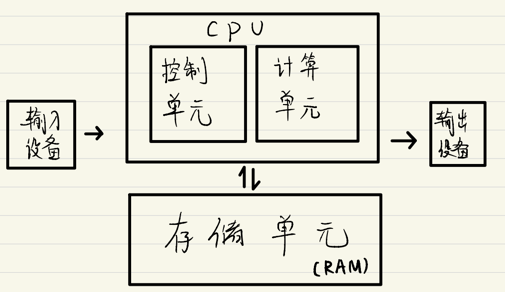
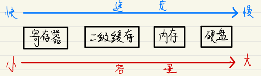
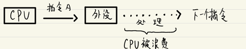
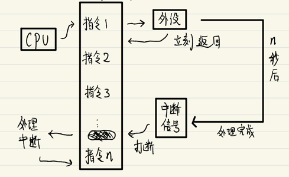
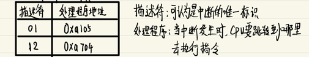
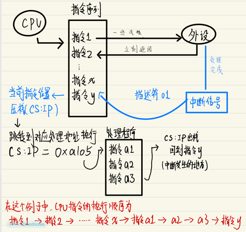
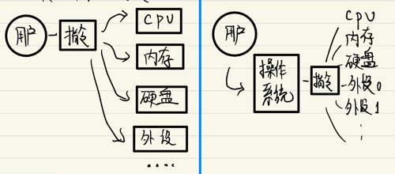

# 01 人机交互历程：从纸带到操作系统

### 计算机演变史

```
算盘(人机交互方式：算珠) --> 机械式计算机(人机交互方式：纸带) --> 电子计算机(人机交互方式：机器语言)
```

### 通用电子计算机的诞生

1946年2月14日: **ENIAC**

世界上第1台(p.s 有争议)通用的电子计算机诞生了，相比与历史上的计算机，最主要的几个不同之处:

1. 可以进行多种运算(甚至包括sin. cos等)
2. 首次引入了存储器
3. 可以进行编程

至此，人类与计算机的交互方式首次从单一的指令演变成了丰富的代码程序，开启了人机交互的新纪元。

> ENIAC诞生于二战期间，其初衷是为了更快的计算导弹轨道，冯·诺伊曼深度参与了该项目，并以此为基础建立了冯·诺伊曼式体系架构，成为现代计算机的奠基人物

### 冯诺伊曼式体系结构

1. 必须采用二进制
2. 采用程序存储方式
3. 硬件划分为五大部分



> 冯·诺伊曼式结构的一个特点是 **程序和数据共享存储**

### 计算与存储

CPU的运算是非常快的 但其存储能力十分有限，只能借助寄存器"记忆"相当小的一部分数据。

绝大多数时候, CPU的工作只是不停地从寄存器中取出指和数据, 计算完成后再写入指定的寄存器, 周而复始。


寄存器是唯一跟得上CPU运算速度的存储, 但其容量十分有限，"读写越快的存储容量就越小"，这是影响计算机构成的一个重要矛盾。

为了解决这个问题, 人们在硬件体系上进一步扩展了存储器这一分支:



### 中断：解决速度不匹配的矛盾

计算机硬件上一个非常重要的矛盾是各种硬件的速度不匹配，简而言之就是CPU的运转速度太快，其他硬件跟不上这个速度。

理想情况下, CPU应该永不停歇地执行"取数一计算"的流程，但由于其他硬件的运转速度和CPU相比太慢，如果在计算过程中需要等待其他硬件，CPU就被大大浪费了。



为了解决速度不匹配的问题, 计算机硬件上引入了中断机制, 简要来说就是: 

当需要等待其他硬件的处理结果时，允许CPU先去做别的事情, 等其他硬件处理好之后再回来继续计算。



> 中断是硬件层面上唯一一种可以打破CPU顺序执行的机制

### 完整的中断流程（示意）

**准备：中断描述符表（IDT）**



**一个实际的例子**



### 操作系统的出现

在比较⻓的一段时间里，工程师们都在使用机器语言 (顶多汇编) 来直接与计算机进行交互,这对于一些简单的计算任务来说，还是可以WORK的。

但随着硬件水平的不断提高, 人们希望计算机处理的任务越来越复杂, 这时候已经不太可能只通过个人的力量去人肉编写巨量的机器指令或汇编程序来操作计算机了。

于是，人们发现需要将一些繁琐的处理抽象出来作为一种基础的程序，（例如内存管理、任务调度等）, 后续人们只需要通过这个基础的程序就可以更轻松地控制计算机了。

这就是操作系统的诞生原因：

