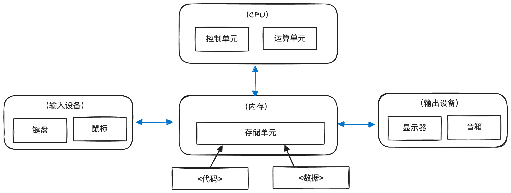
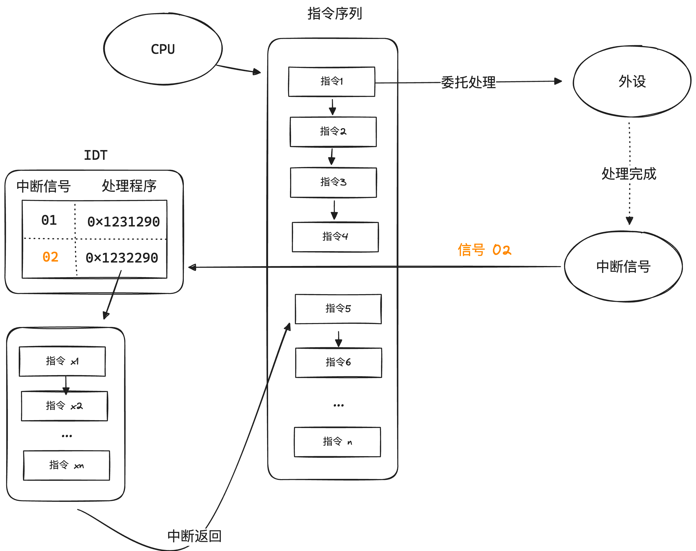

# 011 操作系统是什么

### 计算机硬件的基本构成

在介绍操作系统之前，我们必须要先了解清楚现代计算机硬件的基本构成。

#### 冯诺依曼式架构

现代电子计算机的奠基者是冯诺依曼博士，他在二战期间参与建设了世界上第一台通用的电子计算机，并从此确立了计算机硬件架构的几道铁则：

1. 计算机应该采用二进制进行运算

2. 计算机硬件的构成应该分为控制单元、计算单元、存储单元以及输入输出设备这五种不同的组件

3. 计算机的程序应当能够被存储，并且可以和数据共享存储

现代电子计算机的硬件架构就在这三道铁则下被抽象定义出来，这也就是现在大家再熟悉不过的冯诺依曼式架构：

#### 计算机的基础运行模型

计算机的基础运行模型其实简单到不能再简单，用几句话就可以描述：

1. CPU从存储单元获取代码（指令）和数据
2. CPU执行指令进行计算，并将结果写回存储单元
3. 输入输出设备和存储单元之间互相交换数据

尽管现如今计算机之上运行的程序已经复杂到令人咂舌，但追究到最底层只不过是上述几个过程的不断循环罢了。

#### 中断机制

理想情况下, CPU应该永不停歇地执行"取数一计算"的流程，但由于其他硬件（存储和输入输出设备）的运转速度和CPU相比太慢，如果在计算过程中需要等待其他硬件，CPU就被大大浪费了。

为了解决速度不匹配的问题, 计算机硬件上引入了中断机制, 简要来说就是:

当需要等待其他硬件的处理结果时，允许CPU先去做别的事情, 等其他硬件处理好之后再回来继续计算。

在实际实现上则是通过硬件上的中断信号来强制干预CPU执行指令的顺序，我们下面通过一个实际的例子来说明中断机制是如何运作的。

**中断处理程序**

首先我们需要了解中断处理程序的概念，如果你了解现代编程语言，可以把他看作是"回调函数"。简要来说，硬件上拥有很多种不同的中断信号（比如内存缺页、键盘输入等等），每种信号都会有一个与之对应的中断处理程序。当CPU接收到中断信号时，就会找到对应的中断处理程序，然后跳转到该程序的代码指令去执行。

通常会把所有的中断处理程序的代码起始地址和对应的信号存放在一个指定的内存区域中，以便CPU在接收到中断信号时可以跳转程序执行，这个区域被称为中断描述符表（IDT）

**一个实际的中断例子**

1. CPU执行到指令1时，该指令对应的操作会委托某个外设进行一些处理（比如读取磁盘文件到指定内存区域）
2. 指令1不会阻塞等待外设处理完成，而是立刻顺序执行后续的指令
3. 当CPU执行到指令4时，外设处理完成，发送给CPU一个中断信号02
4. CPU执行完指令4后不会再继续执行，而是将当前执行的位置压栈记录下来，然后去跳转到IDT中找到对应的中断处理程序
5. CPU开始执行对应的中断处理程序中的指令x1,x2,...,xn
6. 中断处理程序执行结束后，CPU从栈中取出之前执行的位置（指令4），然后恢复顺序运行（指令5，指令6，...，指令n）

> 中断是硬件层面上唯一一种可以打破CPU顺序执行的机制，地位十分重要，后续文章中会有很多的功能实现都涉及到中断的使用

### 人机交互的演进过程

### 操作系统存在的意义

### 操作系统运行的基本原理

### 操作系统设计需要考虑的问题