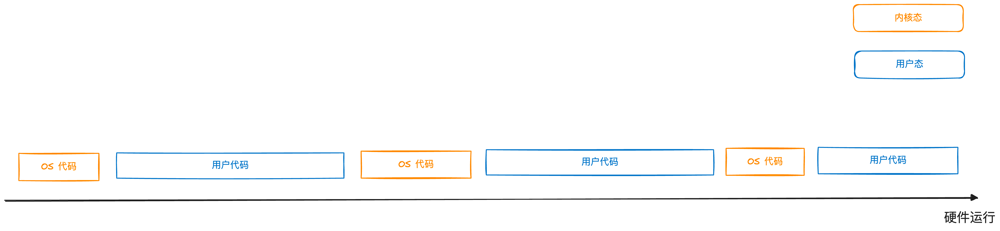

# 011 操作系统是什么

### 计算机硬件的基本构成

在介绍操作系统之前，我们必须要先了解清楚现代计算机硬件的基本构成。

#### 冯诺依曼式架构

现代电子计算机的奠基者是冯诺依曼博士，他在二战期间参与建设了世界上第一台通用的电子计算机，并从此确立了计算机硬件架构的几道铁则：

1. 计算机应该采用二进制进行运算

2. 计算机硬件的构成应该分为控制单元、计算单元、存储单元以及输入输出设备这五种不同的组件

3. 计算机的程序应当能够被存储，并且可以和数据共享存储

现代电子计算机的硬件架构就在这三道铁则下被抽象定义出来，这也就是现在大家再熟悉不过的冯诺依曼式架构：

#### 计算机的基础运行模型

计算机的基础运行模型其实简单到不能再简单，用几句话就可以描述：

1. CPU从存储单元获取代码（指令）和数据
2. CPU执行指令进行计算，并将结果写回存储单元
3. 输入输出设备和存储单元之间互相交换数据

尽管现如今计算机之上运行的程序已经复杂到令人咂舌，但追究到最底层只不过是上述几个过程的不断循环罢了。

#### 中断机制

理想情况下, CPU应该永不停歇地执行"取数一计算"的流程，但由于其他硬件（存储和输入输出设备）的运转速度和CPU相比太慢，如果在计算过程中需要等待其他硬件，CPU就被大大浪费了。

为了解决速度不匹配的问题, 计算机硬件上引入了中断机制, 简要来说就是:

当需要等待其他硬件的处理结果时，允许CPU先去做别的事情, 等其他硬件处理好之后再回来继续计算。

在实际实现上则是通过硬件上的中断信号来强制干预CPU执行指令的顺序，我们下面通过一个实际的例子来说明中断机制是如何运作的。

**中断处理程序**

首先我们需要了解中断处理程序的概念，如果你了解现代编程语言，可以把他看作是"回调函数"。简要来说，硬件上拥有很多种不同的中断信号（比如内存缺页、键盘输入等等），每种信号都会有一个与之对应的中断处理程序。当CPU接收到中断信号时，就会找到对应的中断处理程序，然后跳转到该程序的代码指令去执行。

通常会把所有的中断处理程序的代码起始地址和对应的信号存放在一个指定的内存区域中，以便CPU在接收到中断信号时可以跳转程序执行，这个区域被称为中断描述符表（IDT）

**一个实际的中断例子**

1. CPU执行到指令1时，该指令对应的操作会委托某个外设进行一些处理（比如读取磁盘文件到指定内存区域）
2. 指令1不会阻塞等待外设处理完成，而是立刻顺序执行后续的指令
3. 当CPU执行到指令4时，外设处理完成，发送给CPU一个中断信号02
4. CPU执行完指令4后不会再继续执行，而是将当前执行的位置压栈记录下来，然后去跳转到IDT中找到对应的中断处理程序
5. CPU开始执行对应的中断处理程序中的指令x1,x2,...,xn
6. 中断处理程序执行结束后，CPU从栈中取出之前执行的位置（指令4），然后恢复顺序运行（指令5，指令6，...，指令n）

> 中断是硬件层面上唯一一种可以打破CPU顺序执行的机制，地位十分重要，后续文章中会有很多的功能实现都涉及到中断的使用

### 操作系统的诞生

自打计算机问世以来，**人机交互**就是一个绕不开的话题。从几千年前算盘上的算珠、几百年前机械式计算机上的打孔纸带，再到电子计算机时代的二进制机器码，人机交互的方式一直被限定在"指令式"的框架里。即通过有限可枚举的指令来操作计算机执行各种各样的计算。

但随着硬件水平的不断提高，人们希望计算机处理的任务越来越复杂，此时再使用简单的指令来操作计算机已经变得不太现实了，计算机的使用者们（此时主要为程序员）迫切需要将一些繁琐的处理抽象出来作为一种基础的程序，（例如内存管理、任务调度等）。
后续只需要通过这个基础的程序就可以更轻松地控制计算机了，这个基础的程序就是操作系统的雏形。

可以说，操作系统是**人机交互**在电子计算机时代的解决方案，它作为一种基础的软件直接管理硬件，抽象并封装各种硬件的基础能力，让上层软件能够直接基于这些封装好的能力去运行，减少软件开发人员和计算机使用人员的负担。
当然，随着计算机技术的发展，现在的操作系统已经不仅仅是对软件开发人员的一种封装，对于普通用户来说也是至关重要的交互入口，不过本系列文章后面所探讨的“操作系统”，更多还是指对软件开发人员来说的操作系统，或者说“内核”。

让我们通过比喻的方式，再从一个更直观的角度来理解操作系统对于计算机体系的意义：

整个计算机体系最开始就像一片荒芜的大陆，大陆上存在着各种各样的资源：矿石、石油、黄金等等，这些资源就是硬件的能力（CPU运算时间、内存空间、硬盘空间等等）

最初的软件，就像新世界的开荒者一样，带着最简单的装备，在这片大陆上进行资源的开垦，在早期，整个世界只有一些简单的资源加工品，所以即便是个体户这样根据个人努力开垦和加工，也能生产出满足诉求的产品。

但是随着时间的发展，大陆上越来越多的资源被挖掘（计算机硬件发展），而前往这片大陆上开垦的淘金者也越来越多（软件开发人员的发展），原来这种原始的依靠个人手工去挖掘资源的方式，效率开始不满足生产的诉求了，于是，一群淘金者联合在一起，成立了一些组织，这些组织通过建造大型机器设备（编程语言、代码库）来增加资源挖掘的效率，其他的淘金者可以通过这些设备来加速他们进行资源开垦的效率，随着时间发展，后来的淘金者们基本都完全放弃了自我开垦的方式，转而导向使用组织提供的大型设备。

不过接着又出现了一些新的问题，淘金者们越来越多（软件膨胀），而大型开发设备的使用门槛较高、效率较低，已经影响到了整个淘金产业的进一步发展，于是拥有开发设备的组织开始指定一些规章制度和程序来管理和简化淘金者们对于设备的使用，随着时间的发展，这些规章制度和程序越来越完善，这个小规模的组织就逐渐演变成了一个类似国家政府的存在，这就是操作系统的意义所在：以强大的能力更好地管理资源，并按照规章制度将这些能力分配给独立的软件，维护整个计算机体系的高效与稳定。

### 操作系统运行的基本原理（以Linux为例）

对于计算机硬件来说，操作系统和其他的软件并没有本质上的区别，最终在运行时都是代码（指令） + 数据的组合。通常我们把硬件执行操作系统代码的时间段称为"内核态"、执行操作系统上的应用代码的时间段称为"用户态"。
从这个角度来看，计算机的硬件对于操作系统和其他的软件都是"一视同仁"的，整个硬件的运行过程也不过是在内核态和用户态之间循环往复地切换：

但对于操作系统而言，为了贯彻其"中央政府"的角色定位，维护计算机世界的爱与和平，自然需要一些"特权"，否则用户态的这些代码随随便便就可以篡改甚至干掉操作系统的程序，让中央政府的面子往哪搁呢？

这些特权在实际实现上主要体现为两点，分别对应了存储和代码两个方面：

首先是存储方面的特权，体现为内存分段机制上的特权级，即内核态的数据拥有更高的特权级；内核态的程序可以访问用户态的数据，但用户态的程序却不能访问内核态的数据，这样就可以保障操作系统的代码和数据不会被篡改。

接着是运行方面的特权，体现为代码运行上的系统调用。运行在操作系统之上的用户软件，不能直接申请硬件资源，而是必须通过系统调用函数"委托"操作系统处理，系统调用将会触发一个中断来切换到内核态代码运行，如此以来就可以保障和硬件直接相关的操作都一定发生在内核态，从而使得操作系统的代码获得对硬件资源的"唯一掌控权"。

**系统调用的实现**

系统调用本质上是强行干预了计算机运行指令的顺序性（从用户态正在运行的代码切换到内核态的代码），因此底层必然是通过中断机制来实现的。以Linux为例，操作系统会给80号中断信号注册一个中断处理程序（IDT），Linux
中所有的系统调用都会共享这个中断信号。

当用户态代码中使用系统调用时（如mmap），会把具体使用到的系统调用函数的相关信息（函数名、参数）等存储到指定的位置，然后发出一个80号中断信号，通过IDT跳转到Linux
事先已经注册好的系统调用中断处理处理程序中（进入内核态），该中断处理程序会从指定的存储位置取出本次系统调用实际的函数名，然后再转发到内核态对应的代码执行。
最后当系统调用执行完毕后，中断流程也随之结束，通过中断返回再次跳回之前的用户态代码指定位置继续执行。

### 操作系统设计需要解决的问题

最后来探讨一下一个成熟的操作系统，到底需要提供哪些功能，解决哪些问题。我们上面也看到，操作系统最核心的设计目的是为上层软件封装整合硬件资源，因此我们可以从冯诺依曼式硬件架构出发，推断出操作系统应当提供的核心功能：

1. CPU资源的封装 - 对应CPU调度，即运行多个任务时，决策和控制每个任务能在CPU上运行多少时间
2. 存储（内存）资源的封装 - 对应内存的管理和分配，即诸多程序同时运行时，如何将有限的内存资源进行合理分配
3. 输入输出资源的封装 - 对应外设管理，即磁盘、显卡、键盘、鼠标这些众多的输入输出设备如何统一进行管理和封装

对应在Linux操作系统的实现中，就是进程调度、内存管理和文件系统这三个大的功能模块：

从下一篇文章开始我们将开始讨论Linux系统中这三个模块具体的设计思路和实现原理，敬请期待。