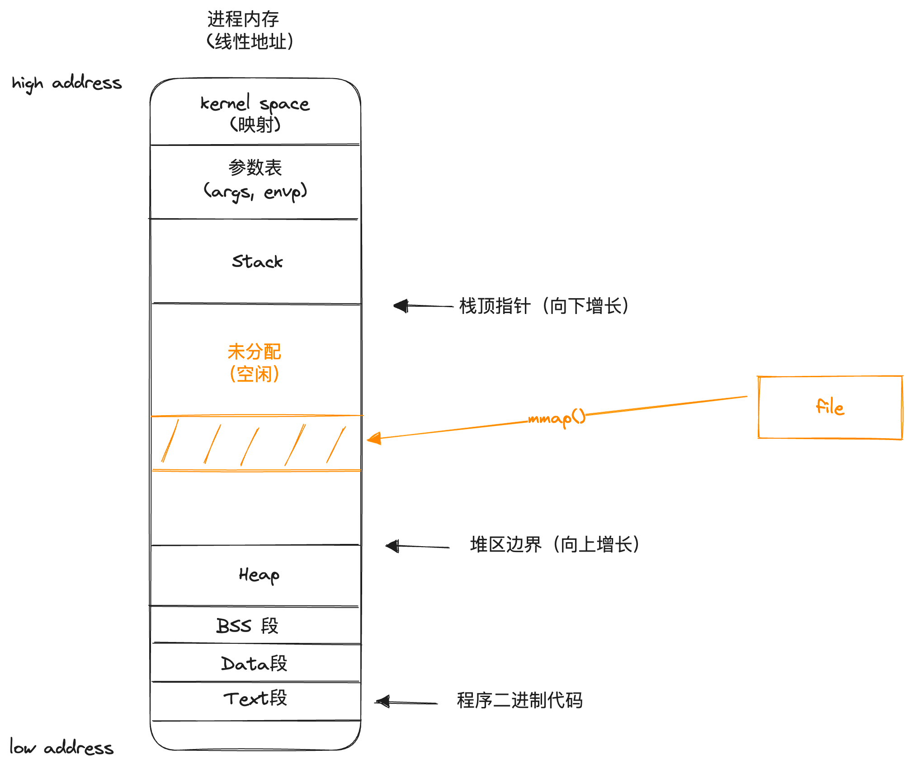
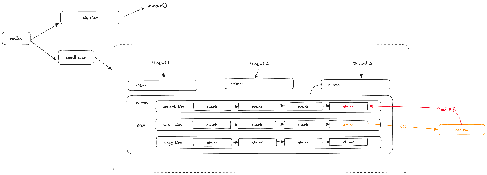

# 04 Linux的设计哲学：内存管理

### 内存管理要解决的问题

这一节我们来讨论一下操作系统的内存管理实现，我们可以先思考一下内存管理需要解决哪几个方面的问题。

首先是保证不同进程之间内存使用的**隔离性**，这是最为基本的要求，操作系统给不同的进程分配的内存空间应该相互独立，否则就可能出现进程之间读写内存时相互干扰的问题。

其次是尽可能提升物理内存的**利用率**，换句话说就是要尽可能保证物理内存没有被浪费的空间，比如空闲时间过长的，或者是已经不被使用的内存。

除此之外还需要保证内存分配和回收的**效率**，因为在计算机的实际运行过程中进程的内存分配请求是非常频繁的，如果内存分配耗时过长就会导致进程运行变得十分卡顿。

接下来的篇幅我们就从这几个考量点出发来看看操作系统（以Linux为例）是如何解决这些问题的。

### 从物理内存到分段分页

在开始讨论具体的实现之前，我们需要先阐明一些基本的概念：

#### 原始的物理内存

先从原点出发，假设没有操作系统的存在，那么所有的程序就都需要直面原生的物理内存，从程序视角看物理内存就是一段连续的内存空间，并且被分隔成数个小单元，每个区块拥有一个独立的编号，这个编号被称为内存单元的地址：

#### 内存空间隔离：分段机制

由于在冯诺依曼体系架构下，数据和代码共享同样的存储，也就是存在同一份物理内存里。为了方便代码的编写和CPU的运行处理，一个很自然的想法就是把一块连续的物理内存空间分隔成两块，一部分用来放数据，一部分用来放代码，这就实现了两部分数据的隔离。

比如对于一个1G大小的物理内存，我们可以人为将其分隔为两段，其中0～512M的部分用来存储数据，512M～1G的部分的部分则用来存储代码（指令）：

为了实现这种分隔逻辑，我们不再用一个单一的物理地址来表达内存单元，而是将其拆分为【基址】+【偏移地址】两个部分，以上图为例，为两个独立的内存区域分别设定不同的基址（一个为0代表从0开始，一个为512M代表从512M开始），
而在后续程序编码和CPU读取时，都只关心【偏移地址】，当需要使用数据时就用数据段的基址加上对应的偏移地址得到最终地址，反之当需要使用指令时就用指令段的基址，这样便自然将两个段隔离开来了。

打一个更通俗易懂的比方，分段机制好比是给一本书引入了章节目录的概念，在没有章节时我们需要说查找到"第233页"和"第4000页"，而有了章节后只就变成了"第一章第30页"和"第七章第40页"，从而在不同的章节之间天然形成隔离。

#### 提高内存利用率：分页机制

假设我们使用分段机制来给不同的程序划分内存空间，最容易想到的做法就是均分，比如1G的内存空间下如果操作系统需要支持最多同时运行4个程序，那么就需要设立4个段，每个段空间大小为256M。

这时候就会出现很多问题，首先，每个程序对内存的需求是不同的，也许有些程序需要比256M更大的空间，而有些程序则只需要几KB，这种均分法势必会导致空间的浪费。

那么我们可以考虑给不同的程序不同的段长度，比如程序A可能需要的内存比较小，于是我们只给它分配一个1M的段，而程序B可能需要的内存比较大，于是我们给它分配一个100M的段：

但很可能程序A随着运行的时间变化，1M的内存逐渐不够用了，而程序B可能在很长的一段时间里只用了10M左右的内存，导致这段时间里其他的90M都被空闲浪费掉了，这种方式还是会存在分配不合理和内存资源浪费的问题。

也许你会说，如果在运行时动态调整分段的界限呢？很不幸，分段基址一旦设立就无法修改，除非将对应段里已经使用的内存全部进行迁移，这个性能的开销过于巨大，显然是不现实的。

为了解决上述这些问题，计算机科学家们引入了虚拟内存和分页机制，下面让我们一点点展开

**虚拟内存**

既然我们无法动态预估一个程序到底会使用多大的内存空间，那不如就直接给每个程序都分配一个足够大的空间，保证够用，比如在上面的例子里我们给四个进程都分配1个G的内存空间，这需要将一个4G的连续的内存地址分为4个段来得到。

但问题来了，我们的物理内存只有1个G，怎么搞出来这多余的3个G空间呢？别急，我们现在先假设就是有这么一个连续的4G的内存空间，暂时先管这个内存空间叫做虚拟内存，并且它的地址叫做"线性地址"（因为这段空间的地址从0～4G是线性连续的）

很显然大部分时间，进程其实都不会使用掉那么大的内存空间，也就是说绝大多数时间这块4G的虚拟内存里**真实被使用**的内存很有可能都是小于1G的：

所以我们只需要把这部分真实使用到的内存动态映射到物理内存里，就实现了1G内存支持4G内存的效果，并且这时物理内存空间里的存储更加紧凑，不会有浪费，而对上层的程序来说，逻辑上仍然是使用一个独立的连续段。

在物理内存和虚拟内存的映射关系上，通常会以一个较小的内存单元为单位做映射，一般大小为4KB左右，这样的一个单元就被称为内存"页"（Page）

**分页置换**

现在我们再继续考虑，也许随着时间的流逝，各个程序所使用到的实际内存空间总和最终真的突破了1G的物理内存大小，这时候又该怎么处理呢？

这种情况下由于已经没有完全空闲的物理内存空间，那就只能从已经在用的空间里想办法"压榨"一些空间出来了
。实际上在程序运行中总会出现一些内存处于"长时间没使用"的情况，尽管不能将它们直接回收，但是可以考虑把它们先移动到空间更大的磁盘上（这一过程称为淘汰），
然后把这部分物理内存的空间腾出来，这样就可以在尽可能不影响程序运行的情况下让物理内存装得下更多的数据，这就是分页机制下的置换思想：

> 如果已经被淘汰的页被程序访问，会由操作系统触发一个缺页中断，然后再尝试淘汰其他的页来腾挪出物理内存空间，将对应的页重新加载回物理内存中

### 分段与分页机制的运行原理

现在来看一下实际的分段分页机制是如何运行的，这里我们主要讨论Linux系统下的实现

#### 分段机制

分段机制的运行和CPU上的段寄存器息息相关，由于在冯诺依曼体系结构下将数据和代码的存储做了合并，所以通常CPU会有两个段寄存器，分别存储**当前**数据段和代码段的段基址。

在取指令时就用指令的偏移地址结合代码段的基址来在内存中查找，在取数据时就用数据段的基址结合偏移地址赖在内存中查找。而所有的程序代码中则不需要考虑分段机制的存在，在程序代码中一切的地址都是偏移地址（逻辑地址）。

在分段机制的具体实现上，又有两种方式。

首先是实模式：由段寄存器直接存储段基址实现寻址，这种是最直观的分段机制

其次是保护模式：段寄存器中不再直接存储基址，而是存储指向**段描述符**的地址，再由段描述符决定基址，相当于多了一道中转，这样做的好处是可以通过段描述符来给对应的内存段增加属性（比如之前讲的内核态的内存特权级）

在保护模式下需要在内存中开辟一块指定的空间来存放段描述符，这就是段描述符表。在Linux下内核态所使用的段描述符表被称为GDT（Global Descriptor Table），用户态下每个进程使用的段描述符表则被称为LDT（Local Descriptor Table）

#### 分页机制

在分页机制中，需要以页为单位维护虚拟内存（线性地址）到物理内存（物理地址）的映射关系，这些映射关系被称为页表项。初次之外还需要

1. 地址转换

2. 页表装载

在定位到具体的页表项后，有可能此时对应的⻚并没有装载到物理内存中（尚未创建or已被逐出了），这时就需要MMU来执行物理内存的分配:

### Linux下的内存布局与寻址方式

1. 物理内存被划分为3个区域: 内核程序、缓冲区和主内存

   

2. 分段机制：在内核态无效，在用户态仅用于进程间隔离逻辑地址

   在Linux中，将GDT的基址直接设置为O，所以分段机制不生效；LDT上则是为每个进程分配了一个64M的独立空间：

   

3. 分页机制：正常生效

最终寻址转换方式：

### 内存分配的系统调用形式

Linux为进程的内存分配提供了两种最基础的系统调用，分别对应两种不同的内存分配方式。

1. `sbrk`: 调整进程线性地址中，堆区的边界（扩容=向上移动，回收=向下移动），这种方式较为少用

2. `mmap`: 将一个文件映射到进程内存中的指定地址范围中（扩容=映射，回收=取消映射），后续通过文件的API就可以实现内存写入，这种方式较为常用

### 常见的内存管理手段

通常开发者很少会直接调用原始的`sbrk`和`mmap`系统调用去为进程分配内存，主要原因有两点：

1. 两种系统调用提供的能力都过于原始，需要自己计算和维护已经分配的内存边界，极易出错
2. 实际场景中内存分配往往是动态的，操作非常频繁且细碎，如果每次分配内存都进行系统调用，会导致很大的性能开销

基于上述两个出发点，在实际应用中通常都会使用一定的内存管理工具来协助实现进程的内存管理，这类内存管理工具通常会预先通过系统调用申请到一块（或数块）较大的内存空间，后续进程发起内存的申请&回收时都是通过内存管理工具来对这部分预先从操作系统分配出来的内存进行操作，这样就可以保证内存分配/回收的流程基本只在用户态进行。

常见的内存管理方式大致分为以下几种风格：

1. C风格，即malloc和free函数，前者分配一定大小的空间并返回地址（指针），后者则用于释放指定空间，较为原始，是Linux系统编程下默认的内存管理方式（由glibc库提供）
2. 内存池风格，将内存提前划分为若干个有生命周期的池子，分别用于程序不同的阶段，程序对内存的使用转变为从池中获取/归还指定大小的内存单元，主要用于有明确固定阶段的应用（典型应用：数据库连接池）
3. 引用计数风格，属于对C风格的一种改进，所有分配出的内存区块的引用都会单独保存被引用的次数，当引用次数归零时认为对应内存已不再使用，自动回收（典型应用：C++智能指针）
4. GC风格，每隔一段时间或达到一定条件时就对整个内存空间进行一次扫描，检测出没有再被使用的内存区域并自动回收（典型应用：Java）

### malloc式内存管理的大致实现

malloc式内存管理有许多不同的具体实现，但不论是哪种实现，都遵循一个大的基本思路，那就是预先通过系统调用从操作系统中分配出一块（或数块）内存空间，后续具体但内存申请/回收都在这个内存空间中进行，以避免频繁的系统调用。

可以认为malloc在整个内存管理过程中起到一个"二道贩子"的作用，预先从操作系统大量进货，然后再按需零售给进程。malloc中用于具体进行分配内存的空间（即malloc自己的库存）通常被称为arena。

下面以glibc默认提供的ptmalloc实现为例说明malloc式内存管理的大致实现：

首先，如果是非常大块的内存申请，会直接转换成mmap去进行分配（大订单，超出零售范围）；中小块的内存申请则会在arena中分配，每个arena中有多个链表（bin），每个链表下有若干个大小接近的chunk，当进程申请分配一个具体大小的内存时，会根据size找到对应的bin，再从bin中找到空闲的chunk，然后完成分配标记并将实际内存的线性地址返回。

回收内存（free）时，则是将对应的chunk归还到unsorted bin中，经过一系列的合并整理操作后再根据大小分配到small或large bin中供后续分配使用。

为了保证线程安全，线程在arena上分配内存的时候需要对整个arena加锁，为了避免多线程并发分配下频繁发生锁抢占，ptmalloc会为一个进程开辟多个arena，以减少锁竞争。

> 在arena中分配出的内存，即便调用free释放也只是回收到arena中，并不会真正的归还给操作系统，这也是为什么有的时候进程明明没有分配多少内存，但操作系统却显示实际使用内存（RES）很大的情况