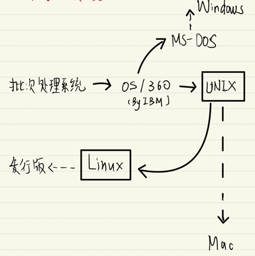
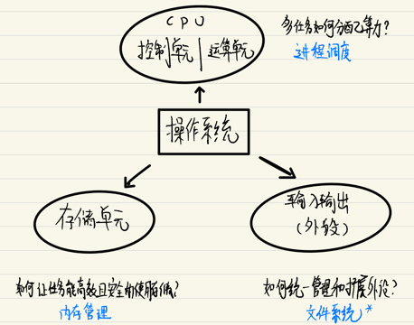
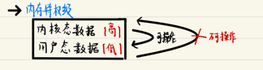
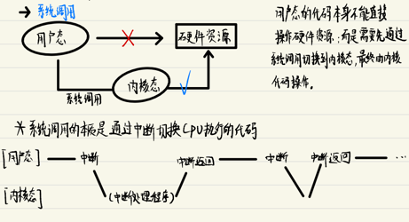
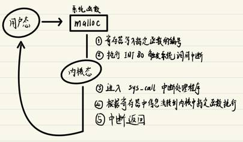

# 02 现代操作系统的雏形

### 操作系统的发展历史

### Linux系统的核心设计

操作系统要解决的主要问题是 **封装对硬件的管理**。

就依冯·曼体系而言，操作系统主要需要考虑以下几个方面的问题：

### 内核态与用户态

操作系统本质上也是程序代码。 对于硬件来说, 运行操作系统的代码和运行操作系统上的用户的程序代码并没有任何不同

当CPU正在运行的是操作系统的代码时, 称为处于"内核态"; 反之当CPU正在运行的是上层用户程序的代码时，就称为处于"用户态"。

不难想到, 为了保证对资源的掌控, 内核态是需要拥有一些特权的：

1. 保护操作系统自身的代码和擦数据不被修改：内存特权级

2. 保证对硬件资源的掌控权：系统调用

### 系统调用

用户态的程序要想进行硬件资源的操作(例如: 申请内存, 读写外没 )，就必须通过系统函数"委托"内核代码,这个过程通过中断机制来完成,大致步骤如下：

> 所有的系统调用共享同一个中断信号