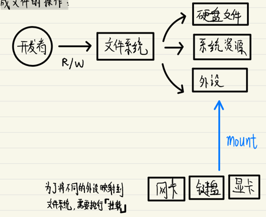
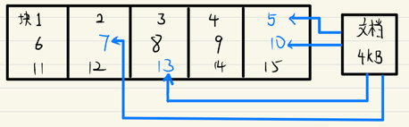
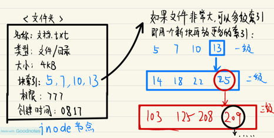
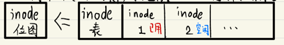
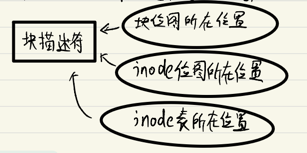
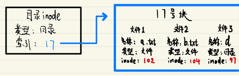
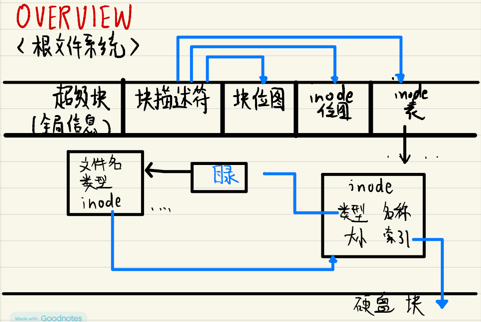

# 03 Linux的设计哲学：文件系统

### "一切皆文件"

为了方便开发人员Linux将大量的系统API，都抽象成文件的操作：

> 为了将不同的外设映射到文件系统，需要额外执行"挂载"这一步骤

### 根文件系统：推演

从实际需求出发，一步步推演根文件系统的实现

1. 文件通常大小不固定，为了提高空间利用率，所以分块进行标准化

2. 为了避免碎片化问题，不应连续存储，而应该离散存储

3. 需要有一个能够记录文件元信息的节点，这样才能更方便地找到文件（inode节点）

4. 为了知道哪些块被使用 ，哪些没有，需要用一个位图记录（块位图）

5. 需要将所有的文件头存在一张表中 同时也需要一个位图标记文件头使用情况（inode位图）

6. 虑到硬盘可以扩容,块数量和inode数量都可以增加，那么需要有一个地方记录全局数据：总块数/可用块数；总inode数/可用inode数（超级块）
   

7. 操作系统需要知道在哪里能够找到块位图、inode表、inode位图，所以又需要一个索引记录这些信息（块描述符）

8. 需要能够区别目录和文件; 目录inode需要能指向对应的文件

### 根文件系统：总览

