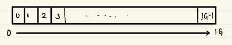
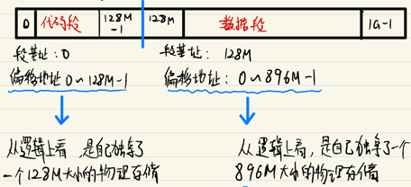
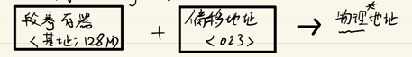
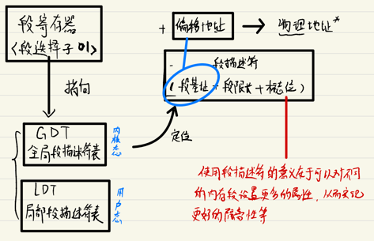
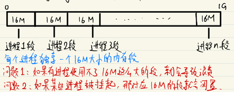
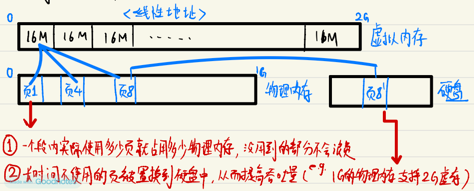
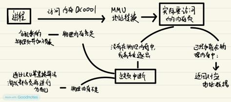
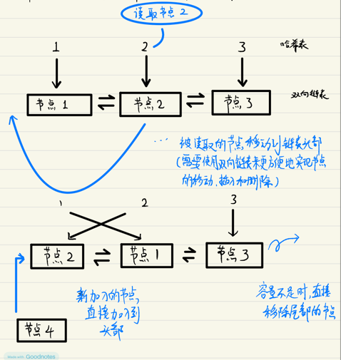
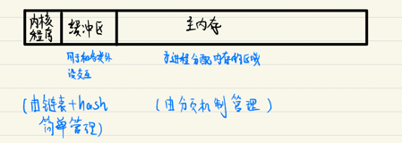
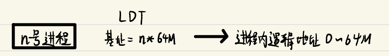

# 04 Linux的设计哲学：内存管理

### 分段机制

原始状态下，我们可以认为整个内存条是一个线性连续的空间，每一个单元都拥有属于自己的编号（地址），这就是 **物理地址**

在冯·诺依曼体系架构下，代码和数据的存储是合并的，为了在使用过程中更好地区分，便引入了分段机制，通过**段基址+偏移地址**的方式转换得到最终的物理地址

偏移地址也被称为**逻辑地址**，因为在程序中直接感知到到就是逻辑地址，不感知基址

### 分段机制的实现原理

1. 实模式：由段寄存器直接存储段机制实现寻址

2. 保护模式：段寄存器中不直接存储基址，而是指向**段描述符**，再由段描述符决定基址

### 分页机制

颁机制主要用来优化物理内存的使用效率：通常会有大量的任务同时使用内存，如果简单按照分段机制对物理内存进行分割，会导致实际使用率十分低下:

分页机制下，把连续的段空间折分成更独立的小单元：页（page）；并且引入虚拟内存机制扩大内存的吞吐量：

### 分页机制的实现原理

在分页机制中，需要通过MMU硬件来实现从线性地址到物理地址的转换，并实现真实⻚表项的管理：

1. 地址转换

2. 页表装载

在定位到具体的页表项后，有可能此时对应的⻚并没有装载到物理内存中（尚未创建or已被逐出了），这时就需要MMU来执行物理内存的分配:

### 附：LRU的算法实现

通常采用双向链表+哈希表的方式实现LRU算法

### Linux的内存布局与寻址方式

1. 物理内存被划分为3个区域: 内核程序、缓冲区和主内存

    

2. 分段机制：在内核态无效，在用户态仅用于进程间隔离逻辑地址

    在Linux中，将GDT的基址直接设置为O，所以分段机制不生效；LDT上则是为每个进程分配了一个64M的独立空间：

    

3. 分页机制：正常生效

最终寻址转换方式：

