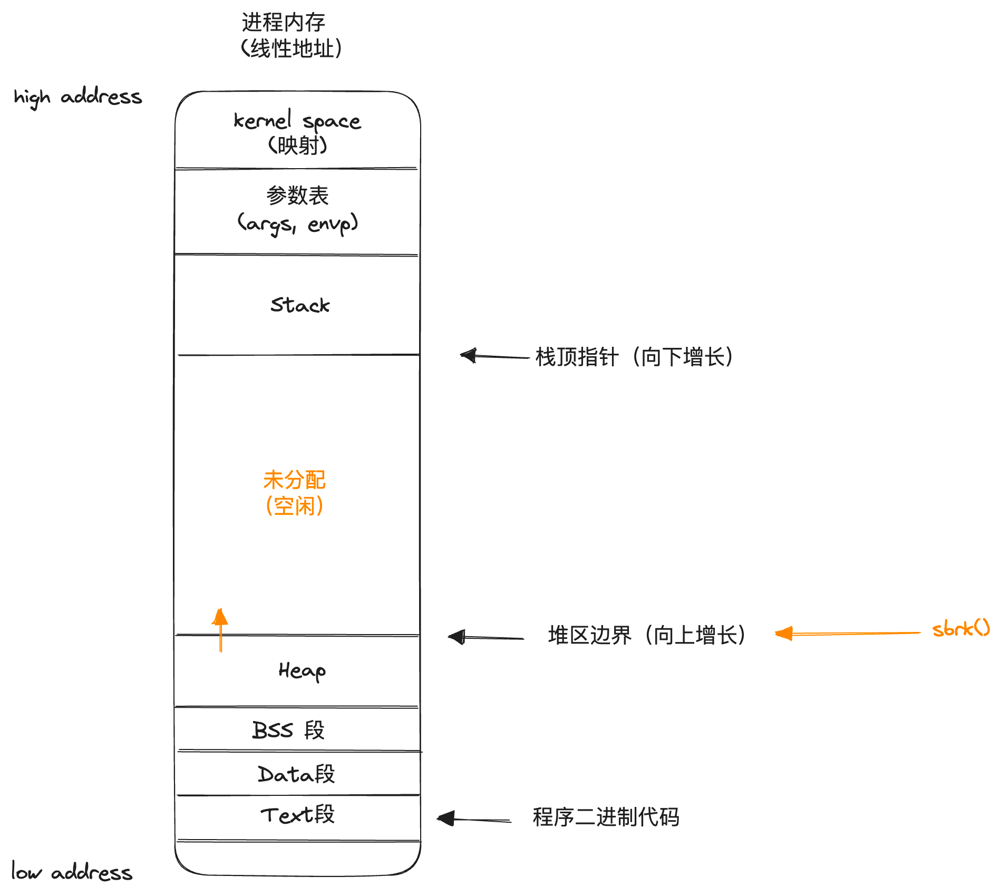
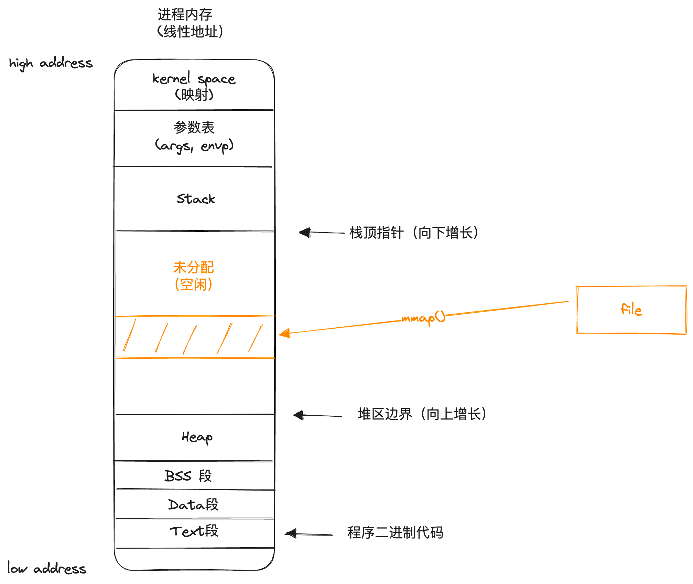
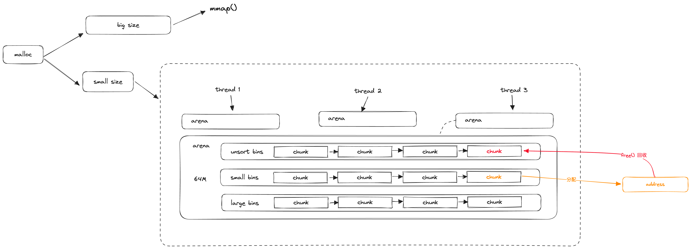

# 04 Linux的设计哲学：内存管理

### 分段机制

原始状态下，我们可以认为整个内存条是一个线性连续的空间，每一个单元都拥有属于自己的编号（地址），这就是 **物理地址**

在冯·诺依曼体系架构下，代码和数据的存储是合并的，为了在使用过程中更好地区分，便引入了分段机制，通过**段基址+偏移地址**的方式转换得到最终的物理地址

偏移地址也被称为**逻辑地址**，因为在程序中直接感知到到就是逻辑地址，不感知基址

### 分段机制的实现原理

1. 实模式：由段寄存器直接存储段机制实现寻址

2. 保护模式：段寄存器中不直接存储基址，而是指向**段描述符**，再由段描述符决定基址

### 分页机制

颁机制主要用来优化物理内存的使用效率：通常会有大量的任务同时使用内存，如果简单按照分段机制对物理内存进行分割，会导致实际使用率十分低下:

分页机制下，把连续的段空间折分成更独立的小单元：页（page）；并且引入虚拟内存机制扩大内存的吞吐量：

### 分页机制的实现原理

在分页机制中，需要通过MMU硬件来实现从线性地址到物理地址的转换，并实现真实⻚表项的管理：

1. 地址转换

2. 页表装载

在定位到具体的页表项后，有可能此时对应的⻚并没有装载到物理内存中（尚未创建or已被逐出了），这时就需要MMU来执行物理内存的分配:

### 附：LRU的算法实现

通常采用双向链表+哈希表的方式实现LRU算法

### Linux的内存布局与寻址方式

1. 物理内存被划分为3个区域: 内核程序、缓冲区和主内存

    

2. 分段机制：在内核态无效，在用户态仅用于进程间隔离逻辑地址

    在Linux中，将GDT的基址直接设置为O，所以分段机制不生效；LDT上则是为每个进程分配了一个64M的独立空间：

    

3. 分页机制：正常生效

最终寻址转换方式：

### 内存分配的系统调用形式

Linux为进程的内存分配提供了两种最基础的系统调用，分别对应两种不同的内存分配方式。

1. `sbrk`: 调整进程线性地址中，堆区的边界（扩容=向上移动，回收=向下移动），这种方式较为少用

2. `mmap`: 将一个文件映射到进程内存中的指定地址范围中（扩容=映射，回收=取消映射），后续通过文件的API就可以实现内存写入，这种方式较为常用

### 常见的内存管理手段

通常开发者很少会直接调用原始的`sbrk`和`mmap`系统调用去为进程分配内存，主要原因有两点：

1. 两种系统调用提供的能力都过于原始，需要自己计算和维护已经分配的内存边界，极易出错
2. 实际场景中内存分配往往是动态的，操作非常频繁且细碎，如果每次分配内存都进行系统调用，会导致很大的性能开销

基于上述两个出发点，在实际应用中通常都会使用一定的内存管理工具来协助实现进程的内存管理，这类内存管理工具通常会预先通过系统调用申请到一块（或数块）较大的内存空间，后续进程发起内存的申请&回收时都是通过内存管理工具来对这部分预先从操作系统分配出来的内存进行操作，这样就可以保证内存分配/回收的流程基本只在用户态进行。

常见的内存管理方式大致分为以下几种风格：

1. C风格，即malloc和free函数，前者分配一定大小的空间并返回地址（指针），后者则用于释放指定空间，较为原始，是Linux系统编程下默认的内存管理方式（由glibc库提供）
2. 内存池风格，将内存提前划分为若干个有生命周期的池子，分别用于程序不同的阶段，程序对内存的使用转变为从池中获取/归还指定大小的内存单元，主要用于有明确固定阶段的应用（典型应用：数据库连接池）
3. 引用计数风格，属于对C风格的一种改进，所有分配出的内存区块的引用都会单独保存被引用的次数，当引用次数归零时认为对应内存已不再使用，自动回收（典型应用：C++智能指针）
4. GC风格，每隔一段时间或达到一定条件时就对整个内存空间进行一次扫描，检测出没有再被使用的内存区域并自动回收（典型应用：Java）

### malloc式内存管理的大致实现

malloc式内存管理有许多不同的具体实现，但不论是哪种实现，都遵循一个大的基本思路，那就是预先通过系统调用从操作系统中分配出一块（或数块）内存空间，后续具体但内存申请/回收都在这个内存空间中进行，以避免频繁的系统调用。

可以认为malloc在整个内存管理过程中起到一个"二道贩子"的作用，预先从操作系统大量进货，然后再按需零售给进程。malloc中用于具体进行分配内存的空间（即malloc自己的库存）通常被称为arena。

下面以glibc默认提供的ptmalloc实现为例说明malloc式内存管理的大致实现：

首先，如果是非常大块的内存申请，会直接转换成mmap去进行分配（大订单，超出零售范围）；中小块的内存申请则会在arena中分配，每个arena中有多个链表（bin），每个链表下有若干个大小接近的chunk，当进程申请分配一个具体大小的内存时，会根据size找到对应的bin，再从bin中找到空闲的chunk，然后完成分配标记并将实际内存的线性地址返回。

回收内存（free）时，则是将对应的chunk归还到unsorted bin中，经过一系列的合并整理操作后再根据大小分配到small或large bin中供后续分配使用。

为了保证线程安全，线程在arena上分配内存的时候需要对整个arena加锁，为了避免多线程并发分配下频繁发生锁抢占，ptmalloc会为一个进程开辟多个arena，以减少锁竞争。

> 在arena中分配出的内存，即便调用free释放也只是回收到arena中，并不会真正的归还给操作系统，这也是为什么有的时候进程明明没有分配多少内存，但操作系统却显示实际使用内存（RES）很大的情况