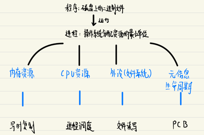
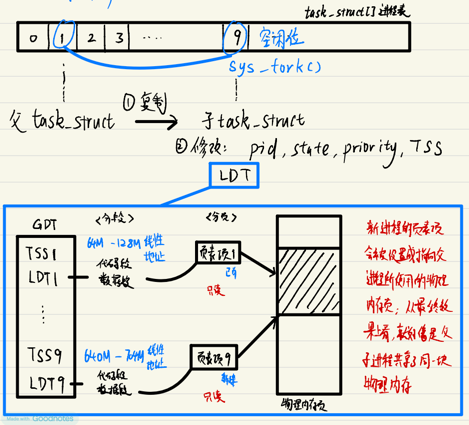
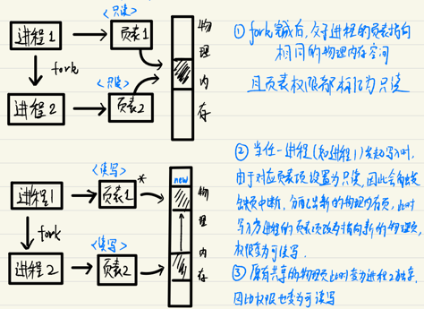
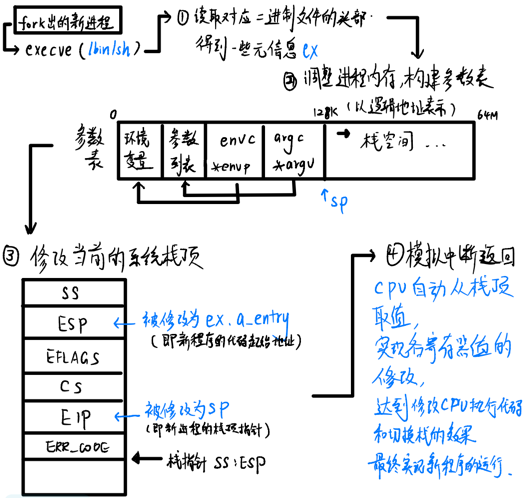
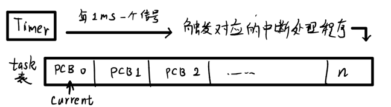
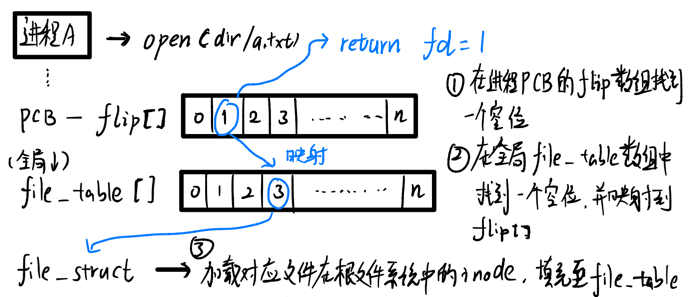
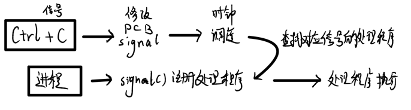
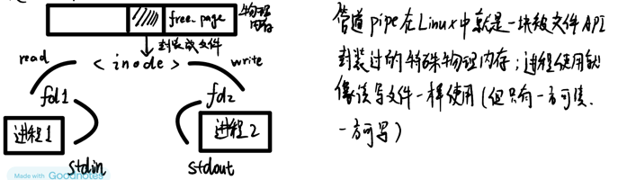

# 05 Linux的设计哲学：进程管理

### 总览: 进程管理需要考虑的方面

### 进程元信息管理：PCB

操作系统为了对进程进行管理，必须要对进程的元信息进行记录，于是就需要通过一定的数据结构来存储。 

在Linux系统中，用于记录进程元信息的数据结构是`task_struct`结构体，有时候也称之为"进程控制块"（Process Control Block，PCB）。

`task_struct`的简要构成如下：

1. state 标记进程的状态（如运行中、停止、可中断等）
2. counter 当前进程还剩余多少个时间片可用
3. priority 进程调度的优先级
4. signal 进程收到的信号
5. *executable 进程所装载的程序（可执行文件）
6. TSS 存储各寄存器值，用于上下文存储
7. LDT 存储进程的段描述符
8. flip[] 存储进程打开的文件描述符表（最终指向inode）

### 进程的诞生：fork机制

在Linux中，所有的进程都是 **由一个已存在的进程复制而得来**，这一过程被称为**fork**，由系统调用`sys_fork`实现

从本质上来讲，fork就是基于一个已经存在的`task_struct`结构复制生产另一个新的`task_struct`的过程：

### 进程的内存分配：写时复制

通过fork机制复制产生的新进程，其内存⻚表项在初始状态下指向了和父进程完全一致的物理内存空间。这是Linux的一种情性优化策略，可以减少为新进程重新分配物理内⻚的性能开销。

但很显然，当父子进程中有任一一方要对内存写入数据时，就会产生冲突和错误，所以需要在写入动作发生时，申请新的物理内存⻚结束父子进程的内存共享，这一策略被称为**写时复制**

> 由于内存的写入相比读取是更低频的操作，因此写时复制可以有效地节约性能

### 进程的任务装载：execve

通过`fork`产生新的进程之后，往往需要为其装载新的程序，从而为新进程赋予实际运行的意义，这一操作通常用`execve`系统调用实现：

### 进程的调度

进程调度要解决的是如何给众多任务分配CPU资源的问题，最基本的思路是，将CPU的运行时间拆分成无数个细小的"时间片"，然后将这些时间片尽可能公平地分配给不同的进程去使用：

实际的实现需要借助定时器外设来切割时间片：

1. 判断当前进程的时间片是否还有剩余 (PCB->counter > 0)，若有剩余就继续运行（且PCB->counter--）
2. 否则执行调度，找到整个task表中处于RUNNABLE状态且剩余时间片counter最多的进程作为next
3. 若task表中所有符合条件的进程都没有剩余时间片，就为所有进程重新分配时间片，分配逻辑为 `counter = counter/2 + priority`，然后回到步骤1重新选出next
4. 切换到next进程运行（原来正在执行的进程的TSS被存储，同时next进程的TSS被加载到寄存器，即上下文切换）

### 进程的文件读写

若进程要对一个文件进行操作 , 不论读写, 都需要先通过`open()`获取文件描述符 (file descriptor, fd)

> open() 返回的fd经过flip[] -> file_table[]，最终映射到根文件系统的inode，于是可以通过fd做进一步的读写操作

读取(read): 获取物理块地址 -> 块设备请求项 -> 加载到缓冲区指定位置 -> 拷贝到内存指定位置
写入(write): 获取物理块地址 -> 内容写入内存指定区域 -> 块设备结求项 -> 拷贝缓冲区 -> 写入物理块

**三个特殊的fd**

- fd = 0；标准输入 stdin； 例子 `open("/dev/tty0", 0)` 将/dev/tty0 作为当前进程的标准输入
- fd = 1；标准输出 stdout；例子 `open("a.log", 1)`，将进程的标准输出定向到a.log中
- fd = 2；标准错误 stderr；例子 `open("err.log", 2)`，将进程的标准错误输出到err.log中

### 进程之间的通信

**信号机制**

在进程PCB的`task_struct`结构中,有一个字段signal用于记录对应进程收到的信号标志位，通过系统调用可以修改对应的值。

进程内部可以通过系统调用`signal()`对指定的信号设置相应的绘号处理程序，随后，在每一次时钟调度时都会检查进程的信号标志位, 并执行对应的信号处理程序。

**共享内存**

更为普遍的进程通信方式是共享内存，通过一方写入，一方读取的方式就可以实现信息交换。当然，在操作系统设定的进程内存分段隔离机制下，两个进程之间不可能原生实现对同一物理内存的读写。

因此，需要操作系统提供一定的机制来实现跨进程的内存共享，一种常⻅的机制就是管道（pipe）

