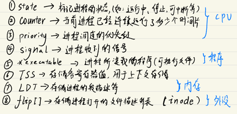

# 05 Linux的设计哲学：进程管理

### 总览: 进程管理需要考虑的方面

### 进程元信息管理：PCB

操作系统为了对进程进行管理，必须要对进程的元信息进行记录，于是就需要通过一定的数据结构来存储。 

在Linux系统中，用于记录进程元信息的数据结构是`task_struct`结构体，有时候也称之为"进程控制块"（Process Control Block，PCB）。

`task_struct`的简要构成如下：

### 进程的诞生：fork机制

在Linux中，所有的进程都是 **由一个已存在的进程复制而得来**，这一过程被称为**fork**，由系统调用`sys_fork`实现

从本质上来讲，fork就是基于一个已经存在的`task_struct`结构复制生产另一个新的`task_struct`的过程：

### 进程的内存分配：写时复制

通过fork机制复制产生的新进程，其内存⻚表项在初始状态下指向了和父进程完全一致的物理内存空间。这是Linux的一种情性优化策略，可以减少为新进程重新分配物理内⻚的性能开销。

但很显然，当父子进程中有任一一方要对内存写入数据时，就会产生冲突和错误，所以需要在写入动作发生时，申请新的物理内存⻚结束父子进程的内存共享，这一策略被称为**写时复制**

> 由于内存的写入相比读取是更低频的操作，因此写时复制可以有效地节约性能

