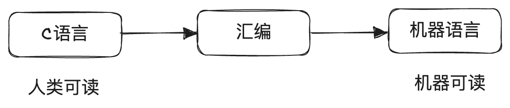
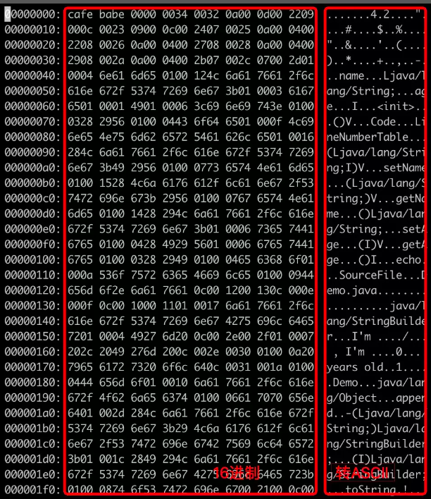
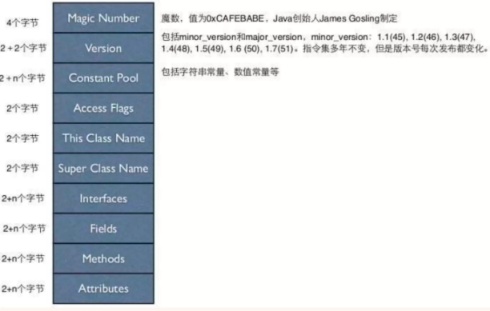

# 01 高级语言的演进之路

### 从汇编到C语言

通常来说，我们可以把与计算机打交道的人分为10类人，一类是懂二进制的（程序员），一类是不懂二进制的（普通用户）。程序员在整个计算机科学的历史长河中可算得上是十分关键的角色，而编程语言正是程序员和计算机进行交互的最关键桥梁，是程序员对计算机下达指令的"魔法咒语"。

早在ENIAC时代，程序员还只能通过非常原始的二进制机器代码与计算机硬件进行直接的交互，这也就是第一代编程语言：机器语言。

很显然，机器语言之所以被称为机器语言，是因为只有机器才能很好的理解，对于人类而言，无穷无尽的0和1是非常繁琐且难以维护的，于是很快人们就对编程语言进行了第一次抽象，将一些常用的硬件指令以特定的格式编写成人类可读的形式，在实际运行时再"翻译"成二进制的机器代码，这就是第二代编程语言：汇编语言。

```asm
mov ax, 1;
```

在有了汇编语言之后，计算机程序总算是演化成了人类可以读懂的样子，但随着人们需要用计算机处理的任务越来越复杂，动辄几千几万行的汇编语言终于也还是显得捉襟见肘了起来，没办法，它还是太原始，太贴近硬件了。

几乎是在和操作系统开始演化的同一时间，程序员们开始了对编程语言的第二次抽象升级，更加面向实际的逻辑而不是具体的硬件细节，并且加入了"函数"这一概念，使得代码的可复用性和逻辑性大大加强。于是催生了第三代编程语言：C语言。在UNIX、LINUX 等操作系统发扬广大的同时，C 语言逐渐得到了计算机领域的广泛认可，成为后续众多高级编程语言的基石。

```c
int main(void) {
  printf("Hello, world!\n");
  return 0;
}
```

当然我们知道，计算机硬件最终是只能运行机器代码的，所以C语言最终自然也是要被"翻译"成机器语言才能够真正运行，所以需要先将C语言代码先"翻译"成汇编，再将汇编"翻译"成机器代码，最终就可以得到机器能直接运行的二进制程序了，这一过程也就是**编译**。



### 高级语言的演化

C语言的诞生在计算机编程语言的黑夜中点燃了第一团火，自此之后各种不同的编程语言百花齐放般诞生，不断地适应着日新月异的计算机硬件演化和计算机软件诉求，这些基于C语言基础之上演化而来的语言通常被称为**高级语言**。

高级语言的出现最早可以追溯到C++，随着计算机软件的需求越来越复杂，C语言的原生语法表达力和代码复用性逐渐变得不够用了，于是在完全保留C语言完整能力的基础上诞生了C++语言，引入了面向对象的一系列特性，并引入了大量原生的库函数STL，旨在帮助程序员简化编写复杂程序的成本。

但C++整体的语法设计过于复杂和灵活，并且对于内存的管理完全依赖程序员手动分配，稍有不慎就会引发内存泄漏或是越界，于是便催生了将面向对象和自动内存管理作为核心理念的Java语言、C#语言，这两者都可认为是对C++语言的优化和延续。

90年代随着互联网的不断发展，程序员们迫切需要一些相比传统高级语言更简洁、更方便的工具来满足快速但简单的WEB程序开发，这一阶段解释型的脚本语言诸如JavaScript、PHP和Python开始逐渐大放光彩。

21世纪至今，高级语言更是进入了百花齐放的时期，背靠云计算茁壮成长的GO语言，严格保障内存安全的RUST等等都在各自的领域大放光彩...

不过这些高级语言最终往往还是需要借助C语言实现的编译器或是解释器才能运行，究其原因是C语言和操作系统的深度绑定，这也是为什么前文中会称C语言是高级语言的基石。

由于市面上的高级语言众多，无法一一展开去详细介绍，笔者在本章中会以自己最熟悉的Java作为例子去展开讲解高级语言的设计思路。

### 编译 vs 解释

在高级语言中，根据运行特点的不同，主要可以分为两大阵营，编译型和解释型


**编译型语言：**

- 源代码不能直接运行，需要由编译器编译为对应平台的二进制文件（机器代码），再由机器原生执行
- 优势：运行速度快，性能好；静态编译时有全局语法检查，安全系数高
- 劣势：编译速度通常较慢；跨平台能力差（不同平台需要不同的编译器编译）；灵活性差
- 典型代表：C，C++，Go

**解释型语言：**

- 源代码无需编译，直接由对应平台的解释器程序解释运行
- 优势：灵活，源代码修改即刻生效，无需重新编译；跨平台能力强，只要对应平台有解释器的实现就可以运行
- 劣势：解释执行有一定的性能损耗；代码修改过于灵活导致安全系数较低
- 典型代表：Python，JavaScript，PHP

### Java的诞生与流行

Java语言正式诞生于1996年，这门编程语言的设计的初衷主要有两点

1. 提供更简洁更规范的语法和更安全的内存管理，实现一个比C++更安全易用的面向对象编程语言
2. "一次编译，处处运行"，实现更强的跨平台能力可代码可移植性

因此Java语言整体的设计重点集中在了**安全易用**和**可移植**这两方面，随后伴随着互联网时代的到来，用户对软件的需求出现了井喷式的增长，Java语言因为易于上手、易于移植而得到了软件开发者的一致喜爱。

随后，Java语言不断发展壮大，并拥有了非常强大的生态系统，这也成为Java语言能经久不衰的重要原因之一。

### Java代码是如何运行的？

就Java代码的运行模式上来说，无法纯粹地归类为编译型语言或解释型语言，因为其同时结合了两者的特性。

首先，Java源代码需要通过`javac`编译器进行编译，但是和常规编译型语言不同的是，这一步编译的最终产物不直接是机器代码，而是一种名为 字节码 的中间产物。

字节码并不能由机器直接运行，而是需要借助 JVM 虚拟机，JVM在运行字节码时一开始是解释运行，在运行一段时间后会通过触发JIT优化，将部分高频热点的代码再真正编译成机器代码，从而提升运行效率。


这样设计的最重要目的是为了实现"一次编译，处处运行"的跨平台可移植性，借助JVM的跨平台能力，一份源代码只需要进行一次编译，得到一份字节码，最终就可以在任何拥有JVM适配的硬件平台上运行。

同时相比于纯粹的解释型脚本语言来说，由于存在前置的"源代码 -> 字节码"的编译流程，使得Java语言本身拥有和编译型语言类似的静态语法检查，安全性更高；此外由于字节码产物本身的抽象层次更低，因此JVM解释执行字节码的效率也远高于其他纯解释型语言的解释器。

因此，Java可说是一种"半编译-半解释"型的编程语言，它兼顾了两者的优点，这也是其广受开发人员喜爱的一大原因。

### 中间产物：字节码

Java语言编译的中间产物是以`.class`文件承载的字节码（ByteCode），根据Java语言的设计规范，一份字节码通常代表了一个完整的类。

字节码本身是一种抽象层级比较低的，以二进制方式存储的代码文件，下面是一个简单字节码文件以16进制展示的效果：



只要按照特定的格式就能够解析字节码中蕴含的信息：



**常量池**

用于存储类定义中的字面量和符号引用，字面量包括诸如以final修饰的常量字符串、在代码中直接用双引号声明的字符串等；符号引用则包含量类的全局限定名、字段名、方法名、描述符等使用Java语法定义的元素。

不同类型的常量会以不同的编码方式存储，每个常量都会拥有一个编号和实际存储的内容，实际存储的内容大体上分为值存储和引用两种方式，值存储通常以`tag + length + bytes`方式存储，例如：

```
01 00 2d 28 4c 6a 61 76 61 2f 6c 61 6e 67 2f 53 74 72 69 6e 67 3b 29 4c 6a 61 76 61 2f 6c 61 6e 67 2f 53 74 72 69 6e 67 42 75 69 6c 64 65 72 3b
```

其中`01`为tag表示该常量类型为字符串，`00 2d`表示字节数，后面的内容就是对应字符串编码后的二进制内容。

引用方式通常以`tag + index`方式存储，其中tag表示类型，index则是指向的常量的编号，例如：

```
07 00 2d
```

其中`07`为tag表示是类定义，`00 2d`则是说明指向了45号常量，而45号常量则是一个采用值存储方式存储的类名字符串

**Access Flags**

以二进制位方式存储类的修饰符信息（访问控制public/private，类型interface/enum，是否继承、是否抽象等）

### JVM

### JIT