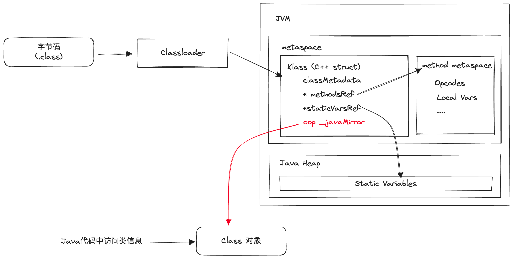
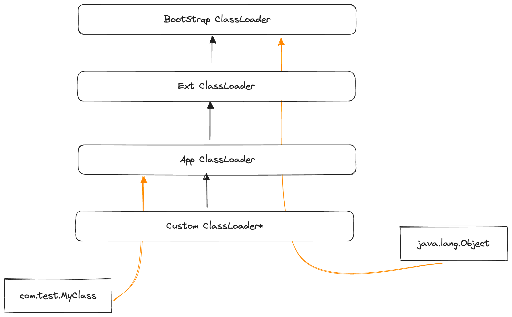
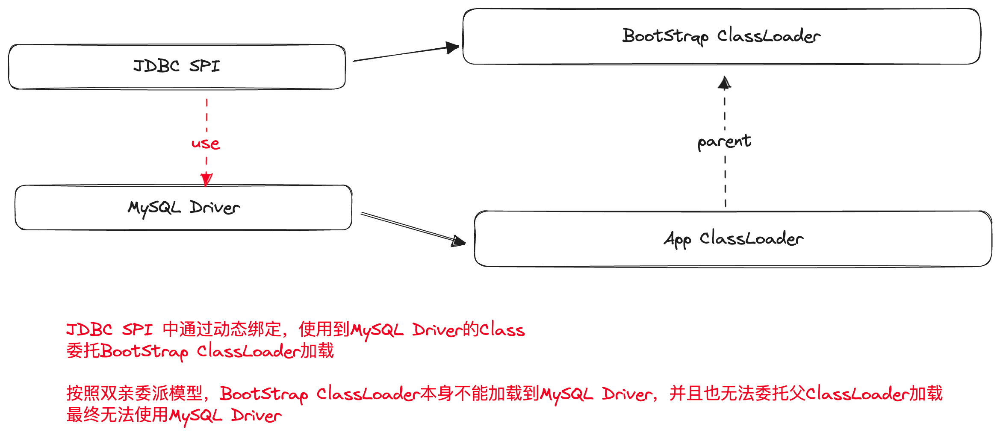
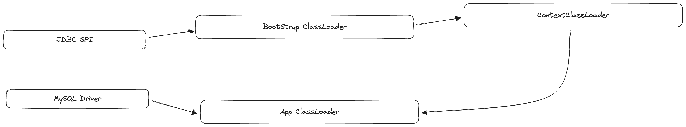
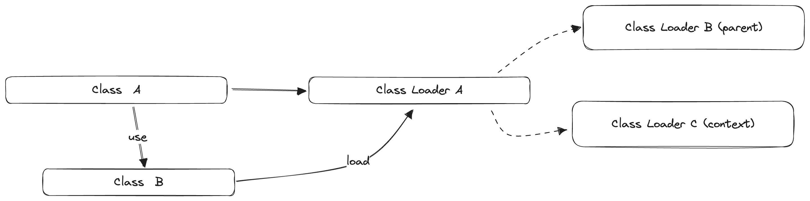

# 02 高级语言的自我修养：面向对象

### 面向对象编程思想

**类与对象**

面向对象编程是在C语言面向过程思路上的一个延展，是软件工程发展到一定规模后的必然产物（根本原因：程序设计越来越复杂，且需要更多的协同）。

面向过程思想把计算机程序视作一系列命令的集合，程序的运行就是一组函数的顺序执行，而面向对象思想把计算机程序视为一组对象的集合，程序的执行就是一系列消息在对象之间的互相传递。

在面向对象中，最重要的概念是类和对象，两者之间的关系类似于模具和元件，类是用于制作对象的模具。

**封装**

面向对象的程序设计，一大重要思路是将数据和方法组合封装在对象内部，对象面向外部只暴露必要的公共接口，而将所有具体实现的细节隐藏在内部。

这种思路的目的旨在约束程序员的编码设计，要求尽可能做到对象内部行为和对外接口的切割，从而提高复杂工程下代码的可读性、可理解性以及可协同性。

封装在Java语言中的具体体现为：面向属性和方法的修饰符（private，protected，public）

**继承**

继承是面向对象模式下实现代码复用的主要手段，继承发生在类的粒度上，当一个类继承了另一个类，对应的对象就可以直接复用父类中修饰符为protected及以上的属性、方法。

通过继承的方式实现代码复用，可以更清晰地维护"有相似行为"的代码之间的关系（在面向过程中，仅仅体现为源代码文件之间的互相引用；在面向对象中，则体现为父子类的关系）

Java中为了降低实现和理解上的复杂度，仅允许类的单继承关系，即一个类只能继承一个父类。

> 如果有多继承的需求，在Java中往往通过创建一个内部类继承其他的类的方式来变相实现

**多态**

多态是指同一类型的对象在不同的情境下表现出不同的行为，在代码设计中通常体现为统一的接口（interface）和不同的实现（class），或是子类对于父类的方法重写（Override）

多态概念的引入主要是为了增加代码的灵活性和可扩展性，一方面，上层使用者可以无需关心具体的实现，只通过父类引用或接口引用操作对应的对象，提高了代码的可读性；另一方面可以实现在运行时动态决定具体要使用的实现，提高了代码的可扩展性。

### JVM中的类是什么？

在之前字节码的章节中，已经对类编译后的结构有了一些基本的了解，在Java程序正式运行后，对应的字节码被JVM所加载，便成为运行时的class。

在运行时，JVM主要通过metaspace（1.8后）这块内存区域存储类的基本信息，使用的数据结构为`Klass`，这是一个C++的数据结构，在JVM中一个`Klass`结构唯一对应一个`Class
`对象，主要存储类的元信息（包括类名、父类、classLoader信息、AccessFlag等），而类定义中的方法信息（方法字节码、参数信息、局部变量表等）被存储在metaspace中另一块名为`method 
metadata`的区域中，通过`Klass`对象中的指针可以找到对应的方法信息；此外，类中的static变量被存储在Java的堆区。



可以说，`Klass`结构就是类在JVM中的具体承载方式，而在Java语言中，每一个类都对应类一个`Class`对象，这个`Class`对象其实就是对应`Klass`结构中的`oop`（Ordinary object 
pointer，普通对象指针）这一属性，可以认为是JVM把`Klass`的`oop`映射成了Java中对应的`Class`对象，如此一来，普通的开发者在Java代码中也可以轻松访问到类结构的信息。

### 类的加载

**类加载流程**

从一个字节码文件（或者流）到JVM中的Class对象，需要经过以下几个步骤

- 加载：通过一个类的完整限定名获取对应的二进制字节码（字节码的来源可以非常灵活）；并最终在内存中创建出对应的Klass结构和Class对象。
- 验证：校验字节流中包含的信息是否合法，包括格式、元数据、OpCode以及符号引用等检查
- 准备：为类的静态变量分配内存并设置初始值
- 解析：将常量池内的符号替换为直接引用
- 初始化：调用类的构造器方法

完成上述步骤后，一个完整的Class对象生成完毕，可以在代码中进行使用。

> Java中的类加载遵循的是惰性原则，也就是说并不会在程序运行一开始就把所有可能用到的类都加载进去，而是在具体使用到某一个类时，才进行加载。

**ClassLoader**

ClassLoader的职责主要是完成上述流程中的**加载**步骤，通过一个类的完整限定名获取对应的二进制字节码并创建出对应的Class对象，一个典型的ClassLoader实现大致如下：

```java
public class CustomClassLoaderA extends ClassLoader {

    // 重写此方法来定义加载类class文件的逻辑
    @Override
    protected Class<?> findClass(String name) throws ClassNotFoundException {
        // 1 根据类名获取到字节码
        byte[] bytecodes = new byte[];
        // 2 调用父类defineClass方法，将这段字节码加载到JVM，并生成对应的class对象
        clazz = defineClass(name, bytecodes, 0, bytecodes.length);
        return clazz;
    }

}
```

Java中所有的Class对象都必须通过ClassLoader生成，一个Class对象的唯一性由类名、字节码和ClassLoader共同决定，也就是说，即便是完全一样的类名和字节码，通过不同的ClassLoader加载到JVM
中，也会得到两个不同的Class对象。

Java的ClassLoader按层级大致可以分为以下几类：

- BootStrap ClassLoader：由C++实现，最底层的ClassLoader，主要用于加载一些JDK相关的基础类
- Extension ClassLoader：加载jdk/ext目录下的类，用于实现JRT的能力扩展（例如swing等）
- Application ClassLoader：常规情况下Java进程默认的ClassLoader，主要用于加载Java Class Path下的所有类
- Custom ClassLoader：用户自定义实现的ClassLoader

除了最顶层的BootStrap ClassLoader之外，其余的所有ClassLoader都需要通过继承父ClassLoader的方式实现。

**双亲委派模型**

双亲委派模型是Java官方提出的一种ClassLoader规范：所有ClassLoader在加载类时都应该先委托自己的父ClassLoader加载，只有当父ClassLoader无法加载的时候，才自己进行加载。

这个规范是为了尽可能维持类在JVM中的唯一性，由于Java中同一个类被不同的ClassLoader加载会得到不同的Class对象，对于JDK中的一些关键顶层类诸如Integer、String甚至是Object
等，如果被不同的类加载器加载，就可能会导致JVM中同时存在多个名为String、Object的Class，这会严重混淆整个代码的运行逻辑。在双亲委派模型下，由于必须要先委托自己的父ClassLoader
加载，所以顶层的类可以保证一定是被BootStrap ClassLoader加载，且全局仅有一份。



双亲委派模型在Java代码中通常体现为，任何自定义的ClassLoader都应该继承`java.lang.ClassLoader`基类，且重写`findClass`方法。

> 双亲委派模型只是一种规范，而不是强制要求，因此在实际应用中也会有非常多不遵循双亲委派模型的ClassLoader实现，用于实现类加载隔离等特殊用途

### 延伸1：类加载的几种常见问题

**Q1 同一个ClassLoader是否可以多次重复加载一个class，得到多个Class对象？**

不能，JVM会抛出 Class Duplicated 异常。通常ClassLoader实现都会实现一个缓存，如果识别到类已经被加载过，就返回对应的缓存对象，而不是重复调用defineClass。（由于这个缓存机制的存在，一个类如果被多次加载，实际上使用的都是第一次加载得到的结果）

**Q2 什么是ContextClassLoader？**

在Java默认的ClassLoader模式下，一个ClassLoader中只能引用到自己的父ClassLoader，在双亲委派模型下这是没有问题的。

但是有一类比较特殊的情况下会出现父加载器加载的类中依赖子加载器所加载的类的情况，较为常见的是Java的SPI机制，以JDBC为例，JDBC的SPI接口类定义在JDK中，以BootStrap
类加载器加载，而具体的实现类是在程序运行时以AppClassLoader动态引入的（例如MySQL Driver），而JDBC的SPI中又会通过动态绑定的方式绑定具体的实现类，即依赖了具体的实现类，这种情况下如果依旧按照双亲委派模型，是没办法加载具体的实现类的。



为了解决这种情况，Java只能给双亲委派模型打上一个非常不优雅的补丁，那就是`Thread.currentThread().getContextClassLoader()
`，通过这个方法可以存放/获取一个ClassLoader的引用（默认填充为AppClassLoader），这样即便是在最顶级的BootStrapClassLoader中，也可以获取和使用到下层的AppClassLoader。



*总而言之，ContextClassLoader本质上只是一个存储和传递ClassLoader引用的工具，通常用于解决父加载器需要使用子加载器的问题，具体的用法仍然由ClassLoader的代码实现决定，并不存在"优先使用ContextClassLoader"之类的默认机制*

**Q3 当被加载的类A中引用了其他类B时，被引用的类会被如何加载**

一定会调用类A的类加载器加载，但具体类A的加载器会如何加载类B，要看加载器的具体实现（比如有可能委托给父加载器加载，也有可能用ContextClassLoader加载）。



### 延伸2：使用类加载器实现的隔离机制

TODO 周四

### JVM中的对象是什么？

TODO 周四

### 反射机制

TODO 周五