# 03 高级语言的自我修养：内存管理

### JVM的内存分区

JVM所托管的内存大致可以分为5个部分：

**程序计数器**

线程私有，用于存储当前线程执行的字节码指令对应的行号。

**Java虚拟机栈**

线程私有，也就是每个线程执行时的栈区，存储Java方法执行时需要用的局部变量、动态链接、方法出口等信息。

**本地方法栈**

线程私有，和Java虚拟机栈类似，区别在于本地方法栈仅作用于JVM中的Native方法。

**堆区**

线程共享，是JVM中最重要的一块内存，主要用于存储在代码运行过程中创建的各类对象。

**元空间**

线程共享，主要用于存储类相关的数据，包括类的Klass结构、静态变量、常量等。

在Java进程中，除了上面5个JVM所托管的内存区域外，还有可能会使用到 **堆外内存**，这部分内存可以认为是Java代码跨过JVM直接进行malloc申请得到，不受JVM的内存管控，需要程序自己手动申请和释放。

### 引用

引用是Java中用于替代C语言指针的概念，可以认为是一个指向不可修改的指针，是Java代码中操作对象的唯一途径。 在Java中，引用又分为 强、软、弱、虚 四个不同的等级：

#### 强引用

最常规的一种引用方式，也就是方法new方法的返回值，被强引用持有的对象不会被垃圾回收：

```java
MyObject strongRef = new MyObject();
```

#### 软引用

当一个对象仅被软引用指向时，在JVM垃圾回收时，如果发现内存不足，就会清理回收；常用于缓存等场景：

```java
MyObject strongRef = new MyObject();
SoftReference<MyObject> softRef = new SoftReference<>(strongRef);
```

#### 弱引用

当一个对象仅被弱引用指向时，只要触发GC，就会被立刻回收。弱引用的使用场景并不多，通常用于预防内存泄漏，一个典型的case如下：

```java
Map<MyKey, MyValue> map = new HashMap<>();
MyKey k = new MyKey();
MyValue value = new MyValue();
map.put(k, value);
// ..
// value被其他地方引用
doHandle(map.get(k));
// 一系列操作后，出于某种理由，程序员将k对象销毁了
k = null;
// 此时value对象将无法被回收，除非map对象被销毁。
```

在上面的代码场景中，HashMap中某个value对应的key对象被意外销毁，导致对应的value无法被使用，也无法被回收，发生内存泄露；
为了避免这类情况的出现，可以为每个Key对象添加一个弱引用，如果对应的Key对象已经被销毁，那么该Key对象依然拥有一个弱引用，在GC时配合引用队列就可以感知到该Key已经不存在，进而清除Value避免内存泄露。

Java中的WeakHashMap和ThreadLocal实现都是以类似的思路使用了弱引用。

#### 虚引用

仅被一个虚引用指向的对象，相当于没有被引用，随时都有可能被回收，并且无法通过虚引用得到实际指向的对象（get结果为null）；虚引用存在的意义是配合引用队列实现对对象GC的消息监听：

```java
ReferenceQueue queue = new ReferenceQueue();
List<byte[]> bytes = new ArrayList<>();
PhantomReference<Student> reference = new PhantomReference<Student>(new Student(),queue);
new Thread(() -> {
    for (int i = 0; i < 100;i++ ) {
        bytes.add(new byte[1024 * 1024]);
    }
}).start();

new Thread(() -> {
    while (true) {
        Reference poll = queue.poll();
        if (poll != null) {
            System.out.println("虚引用被回收了：" + poll);
        }
    }
}).start();
Scanner scanner = new Scanner(System.in);
scanner.hasNext();
}
```

### 垃圾回收机制

Java语言采用了全自动的垃圾回收机制来协助程序员管理内存（堆区），开发人员不再需要通过指针手段管理内存的分配和释放，降低负担的同时也减少了出错的风险。

#### 垃圾的分类与检测

实现垃圾回收机制的第一步是要能够定义和发现垃圾，所谓垃圾就是在程序运行时不会再被访问到的内存空间（对象），通常有两种检测方式：

1. 引用计数
    
    通过统计对象被引用的次数来判断对象是否存活，被引用次数达到0的对象就可以认为是垃圾，但这种检测方法在出现循环引用时将无法work（即两个对象互相引用对方）。

2. 可达性分析

    从对象图中进行分析，找到那些无法从 根对象 抵达的对象，就可以认为是需要回收的垃圾。根对象是一些可以确保存活的不可回收对象，主要是执行栈中引用的对象和方法区的静态对象，在Java中，根对象也被称为GC Roots

   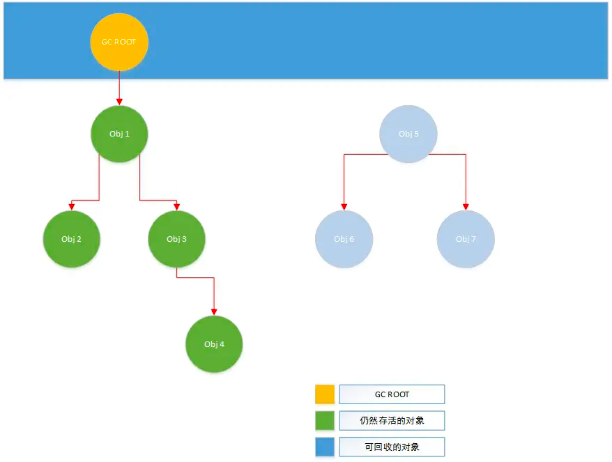

   Java中的GC Root包含以下几种对象：

   - 虚拟机栈中引用的对象
   - 本地方法栈（JNI）中引用的对象
   - 类静态属性引用的对象
   - 常量引用的对象
   - 类的Class对象

#### 垃圾回收算法

在完成垃圾检测后，就需要进行对应内存的回收，常见的垃圾回收算法有以下几种：

1. 标记-清除法

   最简单的垃圾回收算法，即直接扫描一遍内存，将被标记为可回收的对象所占用的空间清理掉，这种做法会产生大量的内存碎片，并且整体回收的效率不高（需要全局扫描）。

   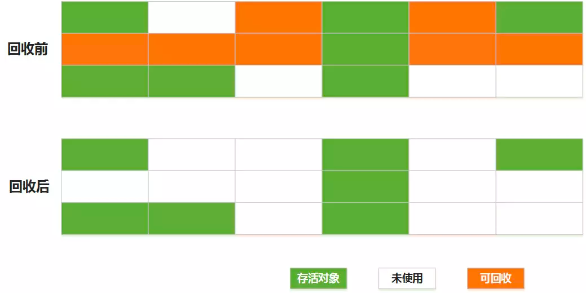

2. 复制法

   将内存划分为相等的两块，每次只使用其中一块，当这一块内存用完时，就将还存活的对象直接复制到另外一块内存上去，然后直接清理掉原有的那块内存，这个做法的回收效率很高，并且不会产生内存碎片，缺点是对内存的利用率很低，始终要浪费一半的内存空间。

   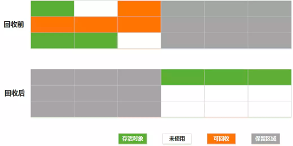

3. 标记-整理法

   对标记清除法的改进，在垃圾检测完成后不直接对可回收对象进行清理，而是让所有对存活对象都向另一端移动，然后清理掉边界以外的内存。优点是内存碎片少，缺点是执行效率较低。

   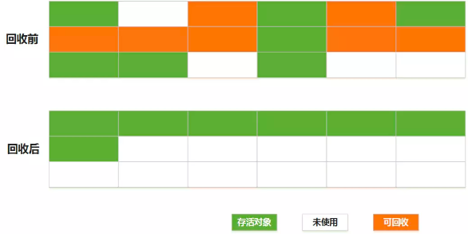
   
#### 对象分代机制

由于不同的垃圾回收算法各有优劣，为了能够提高垃圾回收的效率，往往需要通过将对象根据生命周期进行分代，并采用不同的回收算法，以实现回收效率的最大化。

在Java中根据对象的生存时间，将对象（及内存空间）分为三代：

- 新生代(Young)：存储创建没多久的对象，由于大部分对象存活时间都较短，垃圾回收会比较频繁，因此采用效率较高的复制法进行回收，对应的垃圾回收称为MinorGC/YoungGC
- 老年代(Old)：存储存活时间较久的对象，大部分对象能存活较长的时间，垃圾回收不会特别频繁，因此采用标记-整理法进行回收，对应的垃圾回收称为MajorGC/FullGC
- 永生代(Perm/Metaspace)：主要用于存储一些需要持久存活的对象，如Class对象和常量，不属于堆区，因此*不会进行垃圾回收（具体内存管理机制见后续元空间部分）*

新生代：

新生代被分为Eden区和Survivor区，其中Survivor内部是两块大小完全相同的区域（From/To），整体大小比例为8：1：1。所有被新建的对象都会被先分配在Eden区，当Eden区满的时候，会触发MinorGC
，扫描后将Eden区所有还在存活的对象直接复制到Survivor的From区；此时如果Survivor的From区满，会触发复制法进行清理，同时原有的From和To区发生置换。

通常情况下，在Survivor区连续存活超过一定GC次数（默认：15）的对象，会升级到老年代存放；但如果一个对象在新生代Minor GC后依然无法存放（Eden和Survivor都放不下），也会直接存放到老年代（有可能是Young区满，或对象过大）。

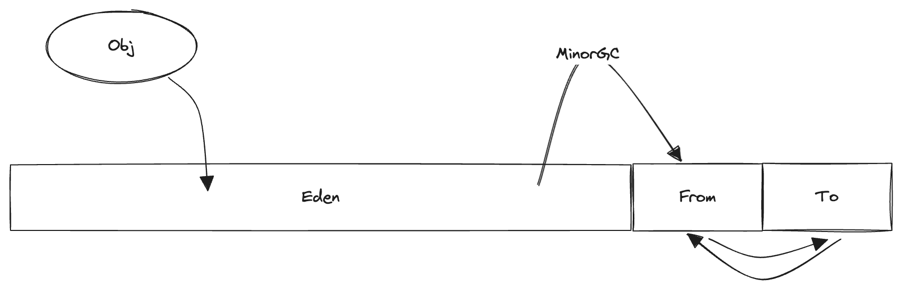

> JVM对新生代设计的基本假设是大部分对象都会"朝生夕死"，因此Survivor区只要有Eden区的1/8就足够；
> MinorGC也会触发进程的暂停（STW），但正因为大多数对象都不会存活，所以效率非常高，对进程的影响微乎其微，通常忽略不计

老年代：

老年代的内存空间相对较大，老年代的垃圾回收被称为MajorGC，但在Java中老年代触发垃圾回收时会一并清理新生代的内存，所以MajorGC也常常被称为FullGC（但本质上是有区别的，FullGC指对整个堆，MajorGC只针对老年代）。

老年代的垃圾回收采用了标记-清理算法，相对比较耗时，并且为了保证在清理过程中引用不发生改变，通常需要暂停所有其他的用户线程（STW，Stop The World），这也是为什么FullGC会对进程产生较大的性能影响。

#### 延伸1：跨代引用

在内存分代模式下，垃圾回收时需要额外考虑跨代引用的情况，既老年代对象引用年轻代对象的情况，当出现跨代引用时会对新生代的MinorGC产生一定的影响：

由于MinorGC只会扫描新生代，如果出现GC Root -> 老年代对象 -> 新生代对象的传递引用，如果只做新生代的GC Root可达性分析，就会误杀被跨代引用的对象。

为了解决这个问题，垃圾回收器需要有一定的机制来识别和存储跨代引用，常见的手段是"写屏障+卡表"

- 写屏障：可以认为就是一个Hook函数，在对一个对象引用进行写操作（即引用赋值）之前或之后附加执行的逻辑
- 卡表：一个用于标记老年代内存是否存在跨代引用的位图

整体的运行机制如下：

1. 通过写屏障注册一个在对象引用赋值发生之前（before）的钩子函数，在钩子函数中，判断这次引用赋值是否会产生跨代引用
2. 如果检测到本次引用赋值会产生跨代引用，就在卡表中，将该老年代对象所对应的内存区域标记为1（称为 Dirty Card）
3. MinorGC中进行可达性分析的时候，不仅要将GC Roots作为根对象，还要将卡表中所有被标记的老年代对象也作为根对象

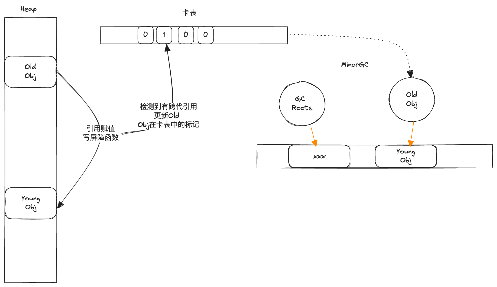

#### 降低垃圾回收对性能的影响

在垃圾回收进行的过程中，需要保障对象之间的引用关系不发生改变，否则垃圾回收的算法可能会引发错误（回收不该回收的对象、或者漏掉一些本可以回收的对象）。
为了保证引用关系不发生改变，通常需要暂停所有的用户线程（STW），这会对应用程序产生比较大的影响。通常可以使用GC时间和GC频率这两个指标来评估垃圾回收对应用的性能影响。

由于GC频率主要由应用代码决定，相对不可控，所以为了尽可能降低垃圾回收对应用性能带来的副作用，一个好的垃圾回收器应该尽可能地降低GC时间，有两种较为常见的优化思路：

1. 增量垃圾回收: 增量地标记和清除垃圾，降低应用暂停的最长时间，简单来说可以看作是将一次完整的GC拆分成好几次小的局部GC（一次GC的总时间可能会变长，但应用STW的最长时间会缩短）。

   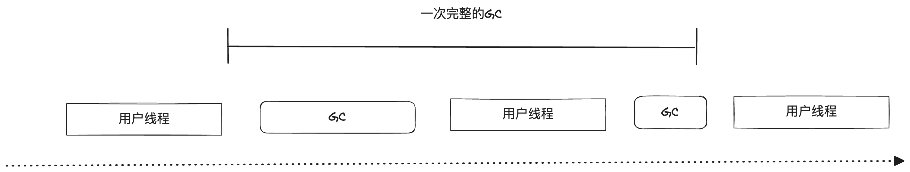

2. 并发垃圾回收：利用多核的计算资源，尽可能在用户程序执行不暂停的情况下，并发地标记和清除垃圾，Java中比较常用的CMS垃圾回收器就是基于此思路实现。

   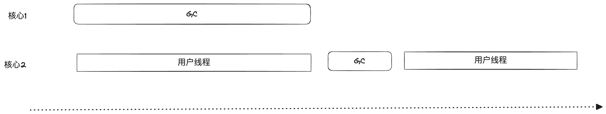

不论是增量垃圾回收还是并发垃圾回收的优化思路，都会出现用户程序和GC一起或交替进行的情况，因此对象之间的引用关系可能会发生改变，为了避免GC产生错误，需要引入额外的机制来保障GC标记时对象之间的引用关系是正确的，一种常见的方式是使用变种的三色对象标记算法。

#### 延伸2：三色对象标记

为了解决原始标记清除算法带来的长时间STW，多数现代的追踪式垃圾收集器都会实现三色标记算法的变种以缩短STW的时间。在讨论变种之前，我们先看一下原始的三色标记算法。

三色对象标记算法用于进行可达性分析，根据垃圾回收器的访问与否以及引用的扫描程度来将对象分为三种颜色分类：

- 黑色 - 对象被垃圾回收器访问过，且对象的所有引用都被扫描过，对象一定存活。
- 灰色 - 对象已经被垃圾回收器访问过，但对象的引用还没有被完全扫描过，对象一定存活。
- 白色 - 对象尚未被垃圾收集器访问过，如果扫描结束后对象仍是白色就说明该对象不可达。

三色标记的过程：

1. 在GC标记开始的时候，所有的对象均为白色（尚未被扫描）
2. 将所有的GC Roots直接引用的对象标记为灰色
3. 如果灰色对象不存在子引用，则将其标记为黑色；若存在子引用对象，则先将对象本身标记为黑色，然后再将其所有的子引用对象标记为灰色
4. 重复步骤3，直至所有灰色对象变为黑色；此时仍然为白色的对象，就是可回收的对象

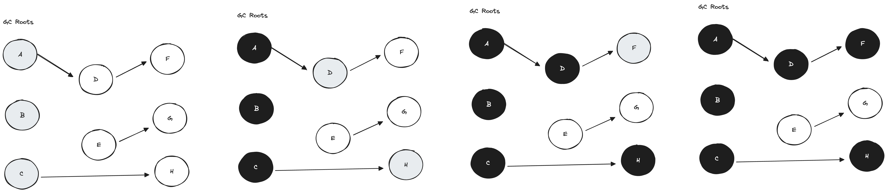

如果三色标记过程和用户线程交替并行，就可能会出现引用关系在扫描过程中发生改变的情况，这会带来两种后果：

1. 漏标：出于某些原因导致本来应该存活的对象没有被访问标记到，最终被判定为垃圾而回收，下面是一个典型的误标case
   
   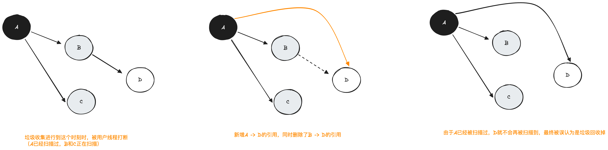

   漏标发生需要同时满足两个必要条件：

   - 条件1：赋值器插入了一条或多条从黑色对象到某个白色对象的引用（黑色对象增加了新的成员引用）
   - 条件2：赋值器删除了全部从灰色对象到某个白色对象的直接or间接引用（灰色对象的成员引用发生了变化）

2. 多标：出于某些原因导致本来应该被回收的对象被标记为存活，产生"浮动垃圾"，下面是一个典型的多标case

   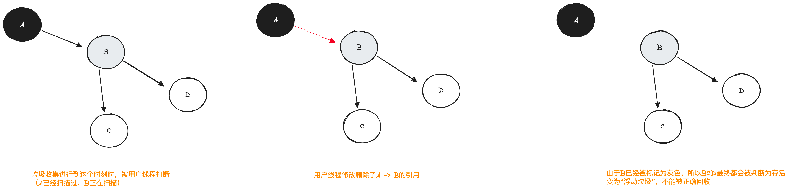

   另外，在标记过程中如果用户线程新建了变量，这些变量也会直接被标记为黑色，这也可能会产生多标的情况
 
漏标产生的后果比多标要严重许多，多标只是有部分垃圾没被回收，可以留到下一次GC时回收，而漏标会产生悬挂指针（原本能访问的对象被回收了），导致应用程序出现非常严重的错误。

#### 延伸3：解决漏标和多标

先说如何解决漏标，上面说了漏标产生的两个必要条件，要解决漏标就可以从破坏这两个必要条件来出发：

1. 增量更新（破坏条件1，写屏障实现）

   当黑色变量的引用（A）发生变化时（指向D），利用写屏障将被新增引用的对象记录下来，并等待遍历；这样可以保障被引用的对象被正确扫描到，CMS收集器采用的就是增量更新。

   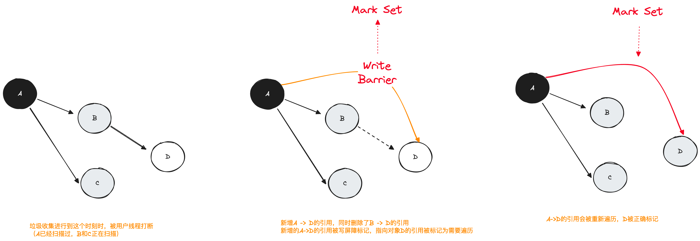

2. 原始快照（Snapshot At The Beginning， SATB，破坏条件2，写屏障实现）

   当灰色对象（B）的成员引用（指向D）发生变化时，利用写屏障将原来的引用给记录下来，即尝试保留开始时的对象图快照；后续进行垃圾收集时候仍然按照快照的对象图进行遍历，G1收集器采用的是SATB。

   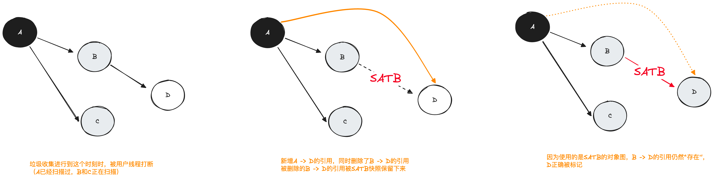

3. 读屏障（破坏条件1）

   读屏障和增量更新类似，区别在于记录并不发生在引用变化时，而是发生在成员变量被读取的时候（例如要新建A -> D的引用，必须先通过B -> D才能拿到D的引用来进行赋值，那么就在读取的时候加入屏障记录）
   
   通常来说读屏障的方式很少用（因为内存读取的操作非常频繁，读屏障会带来比写屏障大得多的负担），但在ZGC中通过染色指针可以大幅减少内存屏障的使用数量，因此ZGC中采用了读屏障的方式。

### 元空间

元空间在早期Java版本中以Perm区（方法区、永生代）的形式存在，主要用于存储类的元信息、常量数据以及方法信息，**元空间不受垃圾回收机制管理**，拥有一套自己的内存分配和回收方法，整体思路比较类似glibc的arena机制。

#### 元空间存储的内容

1. 类的Klass结构
2. 方法元信息：包括方法的字节码、局部变量表、异常表和参数信息等
3. 常量池
4. 代码中的注解信息
5. 方法计数器，用于记录方法被执行的次数，辅助JIT优化的决策

> 在1.8版本之前，类的静态变量也被存放在Perm区，但1.8版本引入元空间之后，类的静态变量被转移到了堆中管理

#### Compressed Class Space

在Metaspace中存放Klass结构的空间被称为Compressed Class Space，这部分空间有以下的特点：

1. 是一块（虚拟地址）连续的内存空间，且大小固定
2. 在JVM一启动的时候就会从操作系统申请（注意是reserved，不是committed），**并且永远不会归还**

Compressed Class Space之所以会有这样的特征，背后的主要原因是对象引用压缩，这项压缩技术旨在减少64位系统下对象的体积。

在Java中，所有的对象的对象头中都有存放指向对应类Klass结构的地址，在64系统下，如果不做压缩的情况下需要占用16个字节，但由于实际上并不会有那么多的Klass结构需要存储，所以Java在这里仅使用了4个字节来保存了一个32位的地址，
在实际使用寻址时，添加一个固定的偏移地址来转换成实际的64位虚拟地址（类似分段机制），这样可以大幅减少对象整体占用的内存空间。

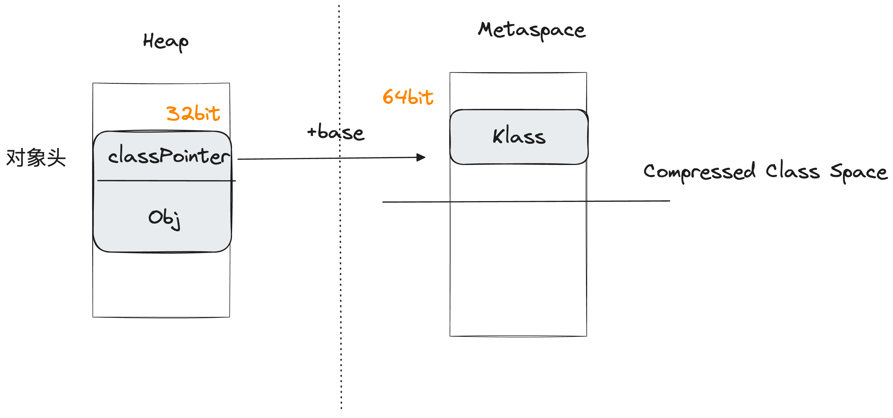

但此做法需要存放Klass结构的内存空间是连续且不可变的（基址相同），考虑到类的Klass结构数量一般不会很多且通常不会频繁地添加/卸载，JVM将Compressed Class Space设计成了一个一次性申请的连续空间（通过mmap映射），默认情况大小下是1G，可以存放上百万个Klass结构。

#### MetaSpace的内存管理方式

除去存放Klass结构的Compressed Class Space之外，剩下的空间会由Metaspace的内存管理器托管，这部分内存的管理方式比较类似glibc下malloc的arena
机制，都是预先向操作系统申请一部分内存，按照大小拆分成若干的chunk list，以零售的模式进行具体的分配和回收。和arena类似，这部分内存被申请后就不会轻易归还给操作系统，而是会被Metaspace所保留，用于后续的分配。

不妨先来讨论以下metaspace分配/回收内存的时机，由于metaspace存储的基本都是和类相关的信息，因此对应空间的分配和释放时机也和类的加载&释放息息相关。 

但需要注意的是，metaspace的空间归属单位不是类，而是**类加载器**。从分配的角度来说，当一个类被加载到JVM中时，会由对应的**类加载器**在metaspace中分配出对应的内存（包括Klass
结构、方法元信息、注解信息等）；而从回收的交互来说，只有当一个**类加载器**被卸载的时候，该类加载器所分配出的metaspace
空间才会被一并回收，这需要满足非常严苛的条件：只有当这个类加载器加载的所有类都没有存活的对象，并且没有到达这些类和类加载器的引用时，相应的 metaspace 空间才会被 GC 释放。

正因如此，metaspace内存的回收和释放是非常难进行的，而一旦metaspace达到了设定的阈值（-XX:MetaspaceMaxSize），就会触发metaspace 
OOM，此时JVM会执行FullGC来试图回收对象并卸载类加载器，以实现回收metaspace空间的目的。但由于类加载器的卸载条件非常严苛，往往FullGC也无法达到对应的效果，所以通常一旦触发metaspace的OOM
就会导致应用频繁地进行FullGC，因此不建议将MaxMetaspace设置的过小（默认情况下JVM不会限制Metaspace的大小）。

接下来看看元空间管理内存的实际数据结构：

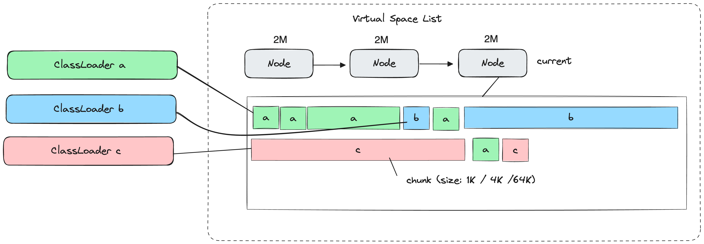

- 最底层存储数据的实际结构是chunk，分别有1K/4K/64K三种尺寸，是最终面向Classloader直接分配的内存小块（chunk中还有更细分的metablock结构，这里不展开了）。
- 中间层是Node，一个Node内包含若干chunk。一个Node的大小是2M，是Metaspace向操作系统申请/归还内存的最小单位。
- 最上层是VirtualSpaceList，也就是一个Node链表，链表最尾部是当前正在用于分配的Node（称为current Node），当currentNode空间被分配完之后，才会申请新的Node并加入到VirtualSpaceList中

如果一个ClassLoader被卸载，那么其对应的所有chunk都会被标记为已回收，并被加入到一个全局的空闲列表（Chunk Manager）中，当需要分配新的chunk时，分配器会先尝试从Chunk Manager中找到一块合适的空间直接复用，如果找不到合适大小的空间，才会去current Node中新分配chunk。

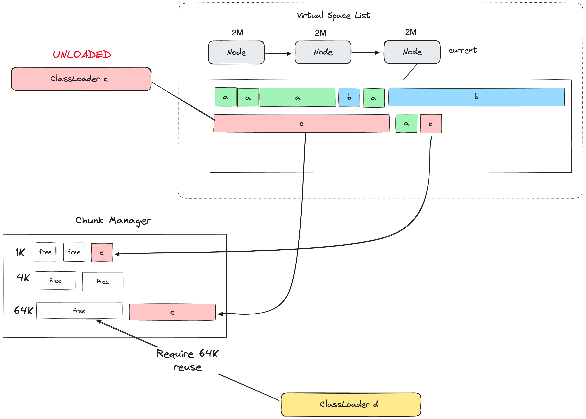

只有当一个Node下**所有的Chunk全部被回收**的时候，对应Node的内存才会被释放归还给操作系统，而一个Chunk回收的条件又是对应的Classloader被完全卸载，如果Node中的碎片率非常高，映射了非常多的Classloader，那么就会非常难以被回收释放，所以在实际代码编码过程中一定要警惕动态的类加载事件（一个典型的例子是lombok的动态类生产）。

> Metaspace的大小通常分为COMMITTED和USED两部分，COMMITTED就是整体所有Node占用的总大小，USED则是NODE中实际被分配给Classloader的chunk的总大小，Metaspace进行OOM的判断标准是看COMMITTED而不是USED

### 堆外内存

堆外内存是不由JVM虚拟机管理的内存部分，分配和回收都由操作系统来进行，可以认为是Java对操作系统内存分配函数的一层简单封装（本质上就是`malloc`和`free`）。

在Java中通过`DirectByteBuffer`对象封装了堆外内存的分配、写入、访问和回收能力（还有一种较为hack的方式是使用`Unsafe`类）。

堆外内存的使用场景不多，通常就是以下几种情况：

1. 希望数据在内存中能够稳定存在，且不受GC影响，从而降低GC带来的性能开销
2. 在IO场景下，使用堆外内存作为缓冲区可以减少一次从操作系统用户态到JVM堆区的对象拷贝，从而提高性能

其中最常见和最主要的使用场景就是第二种情况，Java中主流的高性能IO框架（如netty）都会采用堆外内存作为缓冲区来提高IO操作的性能，这里展开说下为什么使用堆外内存能够减少一次内存拷贝：

首先，在Java运行态，要进行IO的数据通常会使用byte[]数组来作为缓冲区存储，这些byte[]数组也是以对象的方式存储于Java的堆区中。
而在操作系统层面，要进行IO，需要在用户态开辟一块缓冲区（先忽略OS层面的零拷贝技术）内存，然后将这块内存的地址在系统调用（read / write）中传入，作为IO中断处理程序中DMA读取/写入数据的空间。

显然，在用户态的这块缓冲区内存地址需要是**固定**的，否则在IO中断返回时会出现错误。但Java堆区中byte[]数组对应的对象地址，是有可能随着GC而发生改变的，也就是说Java堆区的对象**内存地址是不固定**的，这就导致没法直接使用堆区空间作为用户态的缓冲区。

Java为了解决这个问题，只能在IO时，将byte[]数组对应的缓冲区数据再拷贝一份放到用户态的某块固定内存（也就是堆外内存）中去，这就是Java中IO额外拷贝的来源。而如果直接使用堆外内存来替代传统的byte[]对象作为缓冲区，就可以减少这次不必要的拷贝，从而提高IO效率。

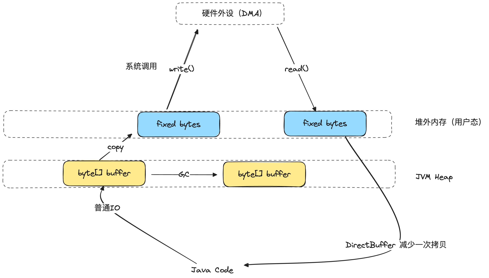