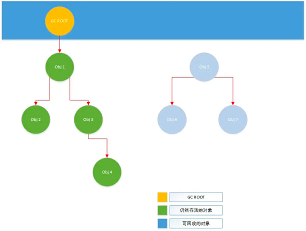
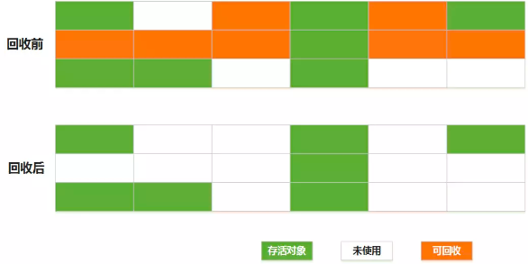
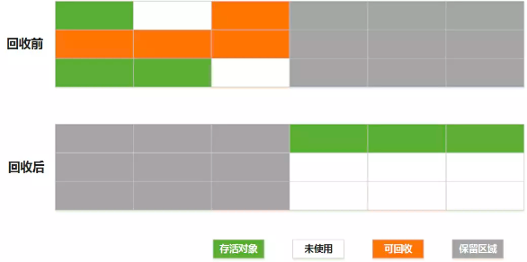
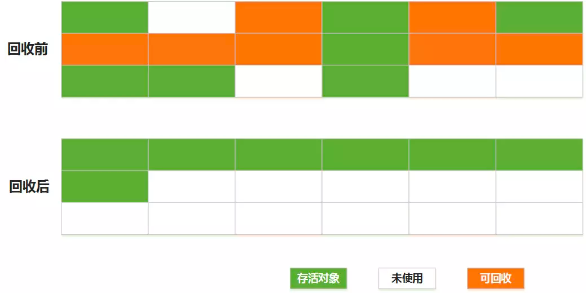

# 03 高级语言的自我修养：内存管理

### JVM的内存分区

JVM所托管的内存大致可以分为5个部分：

**程序计数器**

线程私有，用于存储当前线程执行的字节码指令对应的行号。

**Java虚拟机栈**

线程私有，也就是每个线程执行时的栈区，存储Java方法执行时需要用的局部变量、动态链接、方法出口等信息。

**本地方法栈**

线程私有，和Java虚拟机栈类似，区别在于本地方法栈仅作用于JVM中的Native方法。

**堆区**

线程共享，是JVM中最重要的一块内存，主要用于存储在代码运行过程中创建的各类对象。

**元空间**

线程共享，主要用于存储类相关的数据，包括类的Klass结构、静态变量、常量等。

在Java进程中，除了上面5个JVM所托管的内存区域外，还有可能会使用到 **堆外内存**，这部分内存可以认为是Java代码跨过JVM直接进行malloc申请得到，不受JVM的内存管控，需要程序自己手动申请和释放。

### 引用

引用是Java中用于替代C语言指针的概念，可以认为是一个指向不可修改的指针，是Java代码中操作对象的唯一途径。 在Java中，引用又分为 强、软、弱、虚 四个不同的等级：

**强引用**

最常规的一种引用方式，也就是方法new方法的返回值，被强引用持有的对象不会被垃圾回收：

```java
MyObject strongRef = new MyObject();
```

**软引用**

当一个对象仅被软引用指向时，在JVM垃圾回收时，如果发现内存不足，就会清理回收；常用于缓存等场景：

```java
MyObject strongRef = new MyObject();
SoftReference<MyObject> softRef = new SoftReference<>(strongRef);
```

**弱引用**

当一个对象仅被弱引用指向时，只要触发GC，就会被立刻回收。弱引用的使用场景并不多，通常用于预防内存泄漏，一个典型的case如下：

```java
Map<MyKey, MyValue> map = new HashMap<>();
MyKey k = new MyKey();
MyValue value = new MyValue();
map.put(k, value);
// ..
// value被其他地方引用
doHandle(map.get(k));
// 一系列操作后，出于某种理由，程序员将k对象销毁了
k = null;
// 此时value对象将无法被回收，除非map对象被销毁。
```

在上面的代码场景中，HashMap中某个value对应的key对象被意外销毁，导致对应的value无法被使用，也无法被回收，发生内存泄露；
为了避免这类情况的出现，可以为每个Key对象添加一个弱引用，如果对应的Key对象已经被销毁，那么该Key对象依然拥有一个弱引用，在GC时配合引用队列就可以感知到该Key已经不存在，进而清除Value避免内存泄露。

Java中的WeakHashMap和ThreadLocal实现都是以类似的思路使用了弱引用。

**虚引用**

仅被一个虚引用指向的对象，相当于没有被引用，随时都有可能被回收，并且无法通过虚引用得到实际指向的对象（get结果为null）；虚引用存在的意义是配合引用队列实现对对象GC的消息监听：

```java
ReferenceQueue queue = new ReferenceQueue();
List<byte[]> bytes = new ArrayList<>();
PhantomReference<Student> reference = new PhantomReference<Student>(new Student(),queue);
new Thread(() -> {
    for (int i = 0; i < 100;i++ ) {
        bytes.add(new byte[1024 * 1024]);
    }
}).start();

new Thread(() -> {
    while (true) {
        Reference poll = queue.poll();
        if (poll != null) {
            System.out.println("虚引用被回收了：" + poll);
        }
    }
}).start();
Scanner scanner = new Scanner(System.in);
scanner.hasNext();
}
```

### 垃圾回收机制

Java语言采用了全自动的垃圾回收机制来协助程序员管理内存（堆区），开发人员不再需要通过指针手段管理内存的分配和释放，降低负担的同时也减少了出错的风险。

**垃圾的分类与检测**

实现垃圾回收机制的第一步是要能够定义和发现垃圾，所谓垃圾就是在程序运行时不会再被访问到的内存空间（对象），通常有两种检测方式：

1. 引用计数
    
    通过统计对象被引用的次数来判断对象是否存活，被引用次数达到0的对象就可以认为是垃圾，但这种检测方法在出现循环引用时将无法work（即两个对象互相引用对方）。

2. 可达性分析

    从对象图中进行分析，找到那些无法从 根对象 抵达的对象，就可以认为是需要回收的垃圾。根对象是一些可以确保存活的不可回收对象，主要是执行栈中引用的对象和方法区的静态对象，在Java中，根对象也被称为GC Roots

   

   Java中的GC Root包含以下几种对象：

   - 虚拟机栈中引用的对象
   - 本地方法栈（JNI）中引用的对象
   - 类静态属性引用的对象
   - 常量引用的对象
   - 类的Class对象

**垃圾回收算法**

在完成垃圾检测后，就需要进行对应内存的回收，常见的垃圾回收算法有以下几种：

1. 标记-清除法

   最简单的垃圾回收算法，即直接扫描一遍内存，将被标记为可回收的对象所占用的空间清理掉，这种做法会产生大量的内存碎片，并且整体回收的效率不高（需要全局扫描）。

   

2. 复制法

   将内存划分为相等的两块，每次只使用其中一块，当这一块内存用完时，就将还存活的对象直接复制到另外一块内存上去，然后直接清理掉原有的那块内存，这个做法的回收效率很高，并且不会产生内存碎片，缺点是对内存的利用率很低，始终要浪费一半的内存空间。

   

3. 标记-整理法

   对标记清除法的改进，在垃圾检测完成后不直接对可回收对象进行清理，而是让所有对存活对象都向另一端移动，然后清理掉边界以外的内存。优点是内存碎片少，缺点是执行效率较低。

   
   
**对象分代机制**

由于不同的垃圾回收算法各有优劣，为了能够提高垃圾回收的效率，往往需要通过将对象根据生命周期进行分代，并采用不同的回收算法，以实现回收效率的最大化。

在Java中根据对象的生存时间，将对象（及内存空间）分为三代：

- 新生代(Young)：存储创建没多久的对象，由于大部分对象存活时间都较短，垃圾回收会比较频繁，因此采用效率较高的复制法进行回收，对应的垃圾回收称为MinorGC/YoungGC
- 老年代(Old)：存储存活时间较久的对象，大部分对象能存活较长的时间，垃圾回收不会特别频繁，因此采用标记-整理法进行回收，对应的垃圾回收称为FullGC
- 永生代(Perm/Metaspace)：主要用于存储一些需要持久存活的对象，如Class对象和常量，不属于堆区，因此*不会进行垃圾回收（具体内存管理机制见后续元空间部分）*

新生代：


**延伸1：跨代引用**

**延伸2：三色对象标记**

**垃圾回收器对性能的影响**

**延伸3：Java GC的常见处理方式**

### 元空间与堆外内存

（周五）