# 03 高级语言的自我修养：线程并发

### 线程的基本概念

#### 何为线程

线程是操作系统执行任务的最小调度单位，细化一下就是**CPU资源的最小调度单位**。

线程是进程下的一个子概念，进程是操作系统分配资源（CPU+内存）的最小单位，因此每个进程拥有自己独立的内存空间（分段实现），而线程则没有，一个进程下的所有线程共享该进程本身所持有的内存空间。


#### 用户线程与内核线程

不同的操作系统平台中线程的实现略有不同，操作系统上原生的线程实现被称为**内核线程**（例如Linux下的pthreads）。
由于Java的跨平台特性，需要由JVM为开发人员模拟出一个虚拟且通用的计算机，因此在JVM层面（也即Java进程层面）的线程并非是原始的内核线程，而是经过了一定的抽象和封装，通常被称为**用户线程**。

通常需要将用户线程映射到内核线程上以实现运行和调度，但不同的语言、不同的平台上用户线程和内核线程的映射方式会有较大的不同，一般有三种常见的映射方式：

**1:1 映射**

即1个用户线程映射到1个内核线程上，这种模式下，一个用户线程就是一个内核线程，线程之间互不影响。缺点是创建和调度内核线程的系统调用次数会非常多，效率比较差。


> 目前主流的JVM虚拟机在主流的平台上都是采用1:1映射进行用户线程到内核线程的映射

**N:1 映射**

所有的用户线程都映射到一个内核线程上，这种模式下，只需要创建一个内核线程，由编程语言自行调度该线程何时运行哪个用户线程。优点是系统调用的开销较小，缺点则是非常依赖编程语言对用户线程的调度，用户线程阻塞的风险较高。


> 采用N:1映射的编程语言也被称为"单线程模型"，比较出名的是JavaScript（Node）

**N:M 映射**

创建一定数量的内核线程，并把用户线程按照一定的策略分配到这些内核线程上，这种方式算是结合了前两者的优点，但对编程语言所提供的调度器分配策略有非常高的要求


> 采用N:M映射的典型例子是Go语言，通过复杂调度器建立起Go Routine（用户级）和内核线程的灵活映射，以实现并发效率的最大化

### Java线程的抽象

#### 基本形式

在Java中，一个线程对于开发者而言，被抽象为*一段可以感知和操作其运行状态的代码*，在实际编程中以`java.lang.Thread`对象表示。

```java
Thread t = new Thread(() -> {
    // 可执行的代码
    System.out.println("hello, world");
});

// 感知对应代码的执行状态
t.isAlive();
t.isSleep();

// 操作对应代码的执行状态
t.interrupt();
t.sleep(3000);
```

#### 线程状态

Java中为线程抽象了6种状态，下图标识了6种状态之间的相互转换关系：


- New：Thread刚被创建出来时的初始状态
- Runnable：说明当前线程处于**可执行**状态，注意可运行并不一定意味着真的在CPU上运行（细分一下的话，真实运行的状态为Running，还没调度到CPU的状态为Ready）
- Terminated：线程的代码片段执行完毕，就会达到Terminated，此时线程通常会被回收
- Waiting：表示线程需要进行等待其他线程执行，除非有外部通知/中断打破，否则线程会持续等待，处于此状态的线程**会释放所持有的锁**
- TimedWaiting：限时等待，表示线程需要暂停执行一小段时间，处于此状态的线程**不会释放所持有的锁**，暂停结束后将重新恢复到Runnable状态
- Blocked：当且仅当线程尝试抢占某个对象的锁时，会进入Blocked状态，Blocked状态的线程**不会释放已经持有的锁**

### Java线程的调度 (D2)

#### 抢占式调度 & 协同式调度

线程的两种常见调度方式分别是抢占式调度和协同式调度：

抢占式调度即传统的时间片分配调度，给每个线程分配一定的时间片，当时间片耗尽后会被强制切换到其他线程执行。

协同式调度则需要依靠线程之间"主动"互相协作，比如A线程运行到一定时间发现需要等待，就主动将时间片让给其他线程。

目前大多数的操作系统/编程语言对线程的调度采用的都是抢占式机制。

#### 线程优先级

由于Java采用了1：1的线程映射模型，最终线程的调度其实完全由操作系统来处理，Java侧只能提供一定的建议。最主要的机制就是线程优先级的设定，Java本身为每个线程提供了1～10的优先级设定范围，最终会适配到操作系统线程的优先级上进而影响线程调度。

#### 非RUNNABLE线程的处理

线程优先级 + OS调度基本解决了RUNNABLE线程的调度，但对于非RUNNABLE状态的线程，则需要Java自行处理来进行状态流转。

1. WAITING: wait() & notify()

处于WAITING状态的线程通常由wait() & notify()函数进行流转（park()、join()等也可以，但这里只展开说最基础的），wait()和notify()都是Object类的方法，通常配合在一起使用：

**wait()**：将当前线程设置为WAITING状态（同时会释放线程持有的所有锁），并加入到对应object的wait set中（一个队列）。

**notify()**：从对应object的wait set中取出一个（随机）线程，重新设置为RUNNABLE状态，如果使用notifyAll()则是将wait set中的所有线程都取出设置为RUNNABLE状态。


通过wait()和notify()机制可以快速实现线程的等待和恢复，适用于多个线程之间互相"协同"的场景，可以认为是协同式调度思路的一种体现。

下面是一个使用wait() & notify() 机制实现的简单生产者 - 消费者代码示意：

```java
// consumer
Object o = new Object();
synchronized(o) {
    while (empty) {
        o.wait();
    }
    // consume
    o.notify();
}
// producer
synchronized(o) {
    while (!empty) {
        o.wait();
    }
    // produce
    o.notify();    
}
```

> 使用对象的wait()和notify()方法之前，必须要先通过synchronized获取该对象的monitor（即同一时刻只能有一个线程对对象进行wait/notify），否则会抛出IllegalMonitorStateException异常，有关monitor的概念在下文介绍。

2. BLOCKED: synchronized & lock()

处于BLOCKED状态的线程，只可能是在抢占锁的时候出现，当一个线程（通过synchronized或者Object.lock()等方式）抢占某个对象的锁失败时，就会被标记为BLOCKED状态并被放入对应对象的blocked set队列中，此时线程不会释放它已经抢占的锁。

只有当对应对象的锁被其他线程释放后，才会从blocked set中（随机）取出一个线程，重新标记为RUNNABLE状态，需要注意的这个被唤醒的线程会立刻获取对应对象的锁，所以blocked set中其他的线程会继续等待。


3. TIMED_WAITING: sleep()

TIMED_WAITING状态的线程主要由sleep(time)调用产生，并在对应time时间结束后自动转换为RUNNABLE，线程不会释放持有的任何锁

**延伸1：一个有趣的生产者-消费者问题**

下面考虑一个非常简化的生产者-消费者模型，我们假设生产者和消费者各只需要生产/消费一次

```java
// consumer: 先wait，再consume
Object o = new Object();
synchronized(o) {
    o.wait();
    // consume
}
// producer：先produce，再notify
synchronized(o) {
    // produce
    o.notify();
}
```

如果先执行consumer，再执行producer，结果是生产和消费都可以正常进行；如果先执行producer，再执行consumer，则结果是生产成功，但消费者永远卡在WAITING阶段。

（可以按照block、wait的逻辑分别推演一遍，提示：wait会释放锁，但notify不会）

#### 线程打断机制

在一些场景下，需要能够终止某个线程的运行，在早期的Java版本中提供了Thread.stop()等方法来实现线程的终止，但如果在线程运行期间强行打断，很有可能会出现非常多的异常情况，例如数据不同步、连接未正确释放等等，风险非常高。

因此后续Java废弃了stop()等强行终止线程的方法，改为interrupt打断机制，如果希望某个线程终止时，可以调用该线程的interrupt()方法，但该方法并不会立刻中断线程，而是将是否要中断的决定交给被中断的线程本身。在被中断的线程中可以通过`Thread.currentThread().isInterrupted()`来获取当前线程是否被请求中断，然后自行处理和判断是否要中断执行。（类似Linux中的信号机制，interrupt只是传递一个信号，具体如何处理要看被中断的线程本身）

下面是线程处理interrupt的一种经典代码：

```java
Thread t = new Thread(() -> {
    try {
    while (!Thread.currentThread().isInterrupted()) {
    // do something
    }
    // handle the interrupt signal
    } catch (InterruptedException e) {
    // 当该线程处于阻塞（WAITING,BLOCKED）状态时，如果被调用了interrupt()方法，就会抛出这个异常
    // handle the interrupt signal
    } finally {
    // clean up
    }
});
```

#### 线程池

操作系统一般会对内核级别的线程进行数量限制，这是因为同时调度过多的线程会带来非常大的上下文切换开销以及性能损耗。在日常编码过程中一般也不应该创建过多的线程，对于一些任务并发非常高的场景，通常会采用线程池的方法复用有限的线程来实现并发处理。

在Java中通常使用JUC包提供的ExecutorService工具来创建和维护线程池，下面是ThreadPoolExecutorService的基本参数和工作原理：

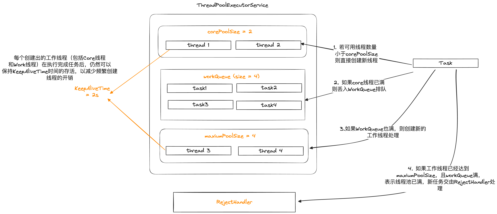

### 线程安全问题

由于线程之间共享完全相同的内存空间，因此当多个线程"同时"对同一块内存进行读取/访问时，就可能会出现冲突，这会带来很多不符合程序预期的问题，例如：

- 原子性问题：并发场景下，所有非原子性的操作都可能会收到其他线程的干扰，例如：A线程想要修改变量i的值加1，但同时B线程又对i赋值，由于线程A的操作不是原子性的，就可能会导致预期外的结果 
- 可见性问题：并发场景下，所有被多线程共享的变量，可能被任意线程修改，例如：B线程在A线程"不知情"的情况下修改了某个共享变量的值，导致A线程拿到了不符合预期的错误的值
- 顺序性问题：并发场景下，由于线程的执行顺序存在一定的随机性，因此很多时候无法预测最终代码任务实际执行的顺序

为了避免出现多线程时的这类异常问题，Java中的很多数据结构会通过加锁或CAS等机制来确保多线程操作时不会产生预期之外的冲突问题，这类数据结构通常被称为"线程安全"的（反之，不能避免多线程并发问题的数据结构被称为"线程不安全"的）。

> 并发场景下两个最大的问题是互斥（同一时刻只能有一个线程访问共享资源）和同步（线程之间的互相通信），下文中所介绍的所有机制都是围绕这两个问题的解决而展开

### CAS

CAS(Compare And Swap)是计算机硬件层面对并发问题最基本的处理手段，由CPU指令来确保原子性，CAS操作的原始语义如下：

```text
CAS(value, expect, new) = true / false
```

- value表示要修改的内存值
- expect表示当前线程期望的这个内存值是多少
- new表示当前线程希望修改value为多少

CAS操作会对比value和expect的值，如果一样，则将value对应的内存值修改为new并返回true，否则直接返回false，底层是CPU的一条汇编指令，整个操作过程可以保证是原子性的，不会被其他指令所打断。

CAS的特点在于引入了"预期值对比"这一流程，进而可以由调用方自行判断是否出现并发修改的情况。

**ABA问题**

原始的CAS存在一个缺陷，这个缺陷也被称为A-B-A问题：

CAS只对比value的当前值和expect是否**相等**，在大多数情况下，这可以说明本次线程的操作并没有受到其他线程的干扰，但存在一种例外，那就是value对应的值被多次修改后，又回到初始值的情况：

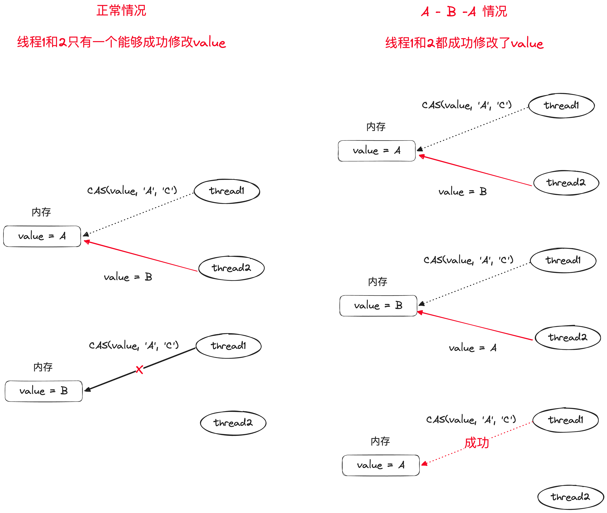

解决A-B-A的方法是引入**版本号**，每当对应的value值修改时，版本号就+1，通过对比value值的版本号就可以精确地判断对应值是否有发生过修改了。

**基于CAS的乐观并发控制**

利用CAS可以实现乐观的并发控制，"乐观"指的是假设内存资源不会有较多的并发竞争，在这种假设下，线程使用CAS修改数据时出现并发冲突的概率很小，所以只需要在出现冲突的时"多尝试几次"，就可以解决冲突了。

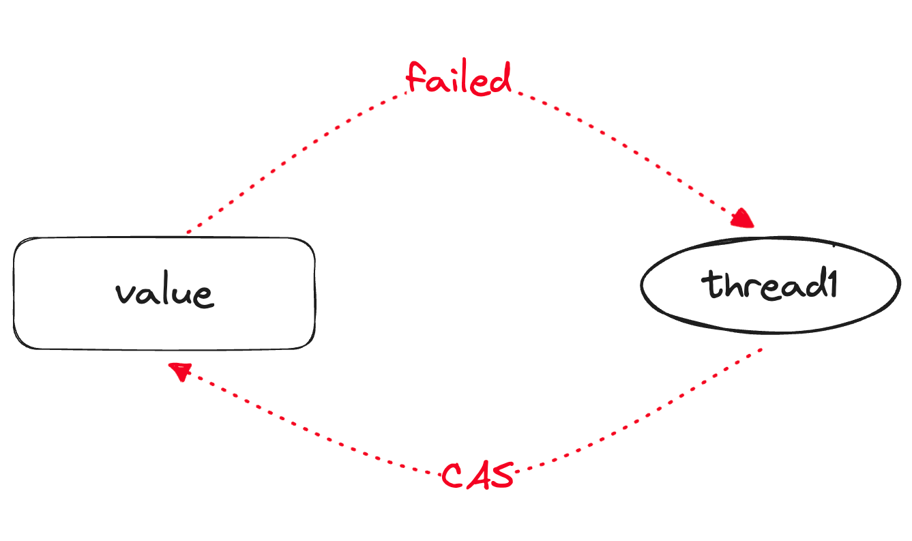

> CAS失败时的重试过程基本就是一个循环，这个循环的过程也被称为"自旋"，自旋过程中线程不会阻塞、不会挂起，持续处于RUNNABLE状态，不会释放已经获得的锁。

这种基于循环CAS操作的并发控制方式也被称为"乐观锁"，但实际上它是没有对资源上锁的。这种方式比较适用于读多写少、线程并发竞争不激烈的场景，可以有效提高程序的整体性能。

### 锁

#### 锁的基础：Monitor

在Java中，锁的粒度为对象，也就是作用于多个线程抢占对象的时候，如果我们将锁的逻辑进行简化，可以发现锁本质上是在描述和维护**对象与线程之间的关系**，而用于实现这一关系维护的关键结构就是monitor。

monitor又是一个JVM C++层面的数据结构，一个monitor结构会明确关联一个Java Object对象，而一个monitor结构里面又主要包含了以下三个部分：

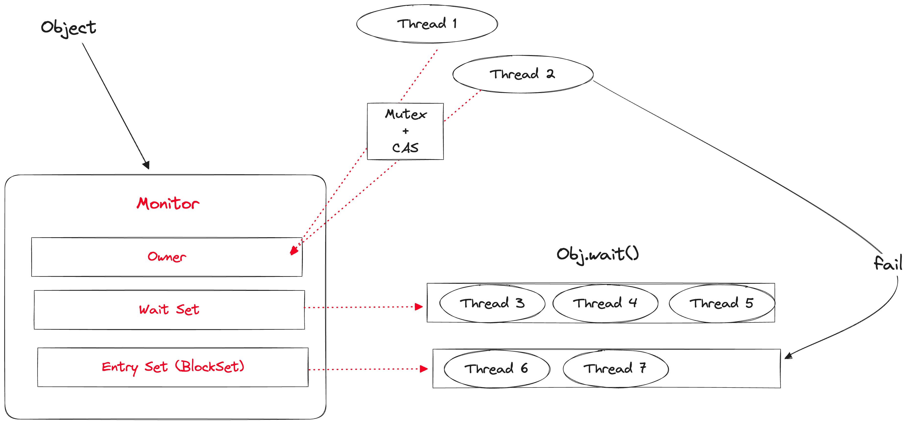

- Owner：当前拥有该monitor的线程。monitor本身采用操作系统的mutex lock，结合cas保障同一时刻一定只有一个线程能够成为monitor的Owner，从根本上实现线程访问的互斥性。
- Wait Set：当一个拥有该monitor的线程调用对应对象的wait()方法时，该线程就会释放monitor owner，并被加入该monitor的WaitSet中（也就是上文wait()机制中所说的对象的wait set）。
- Entry Set：当一个线程抢占monitor的Owner失败时，就会被加入该monitor的EntrySet中（也就是上文中所提到的对象的blocked set）。

> 由于mutex lock是操作系统提供的能力，所以在线程锁定成为Monitor Owner时，需要进行系统调用，从用户态切换到内核态。

#### synchronized的使用

在Java中通常可以用`synchronized`关键字来实现对对象的加锁，其中`synchronized`有多种多种使用方式，锁定的对象各不相同:

1. 锁定单个对象（不论是局部变量还是类的静态变量，锁定的都是对象本身）

```java
private static Object o;

synchronized(o) {
    // 锁定的对象是o
}
```

2. 修饰对象方法，锁定的是执行方法的对象

```java
class A {
    public synchronized void hello() {
      // ...
    }
}

A a = new A();
a.hello(); // 锁定的是对象a
```

3. 修饰类静态方法，锁定的是类的class对象

```java
class A {
    public static synchronized void hello() {
      // ...
    }
}

A.hello(); // 锁定的是A.class
```

#### 锁的膨胀

在JDK 1.6之前，Java中的锁都是采用monitor机制来实现的，但是这种锁由于需要进行系统调用，对性能的开销较大，也被称为重量级锁。

但实际上很多时候线程对锁的竞争不会那么激烈，因此可以进行一定程度的优化来提高性能，于是在JDK 1.6后，又额外引入了偏向锁、轻量级锁两种新的对象锁机制，在使用`synchronized`时JVM会根据当前对象的线程竞争程度进行膨胀，以提高整体性能。

一个对象当前是否被线程上锁，又是处于何种锁状态，在对象头的MarkWord中进行标记，不同锁状态下的MarkWord结构分别如下图所示：

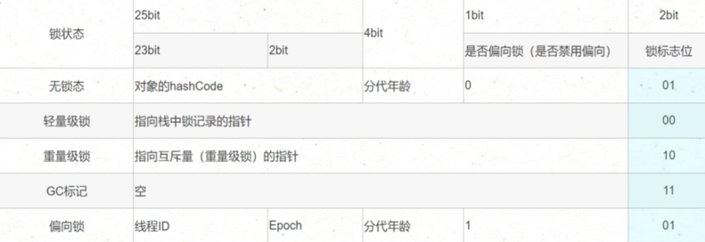

**无锁（自旋）**

即对象的初始状态，没有任何线程请求对该对象上锁，多线程并发访问无锁对象的时候，采用的处理机制为CAS自旋。

**偏向锁**

偏向锁的优化思路基于一个假设，即很多时候一个对象只会被一个线程上锁。在并发场景下为了安全起见通常都会给先对共享的变量上锁再访问，但很多时候线程的并发竞争并没有那么激烈，因此最终可能在很长一段时间内，都只有一个线程对这个对象上锁。

为了优化这种情况下的性能，偏向锁设定的规则是只要需要判定访问对象的线程没有发生改变，这样在只有一个线程执行同步代码块时能够显著提高性能。
因此对象在偏向锁状态下，MarkWord中存储了持有偏向锁的threadID，每当有线程访问该对象时，只需要对比threadID，如果一致就可以直接访问（只需要判断，不需要CAS），如果不一致则说明出现其他线程竞争偏向锁，此时锁将会升级到下一阶段的轻量级锁。

**轻量级锁**

对象在偏向锁状态下，如果出现第二个线程访问该对象，偏向锁就会升级为轻量级锁。轻量级锁仅适用于"只有两个线程竞争对象锁"的情况，思路也很简单，就是让后来的线程通过CAS自旋等待一会，大致实现如下：

- 首先，在一个线程进入`synchronized`块之前，会在栈中开辟一块空间存储锁记录（LockRecord），主要用于存放线程的ThreadID，以及当前线程所持有的锁信息。
- 当一个对象升级为轻量级锁时，就会在MarkWord中存储获取该锁的线程的LockRecord的栈桢地址
- 有线程访问处于轻量级锁状态的对象时，需要判断MarkWord中存储的LockRecord的栈桢地址是否是指向当前线程的，若是，说明本线程持有该对象的轻量级锁，可以直接访问，若不是，则需要通过CAS自旋直到成功修改MarkWord中的栈桢地址，完成锁的抢占

如果一个线程长时间自旋都无法抢占到轻量级锁，或者在其自旋等待的时候出现第三个线程，则轻量级锁升级为重量级锁。

**重量级锁**

重量级锁需要采用monitor来实现，当一个对象的锁膨胀为重量级锁时，JVM会为该对象分配一个monitor结构并将monitor的地址存放到MarkWord中。重量级锁的运行机制借助monitor来实现：

- 当一个线程访问处于重量级锁状态的对象时，先根据MarkWord取出对应的monitor结构，然后对比monitor的owner线程是否是当前线程，若是则可以继续执行同步代码块
- 若对象monitor的owner不是当前线程，则说明该对象已经被其他线程锁住，把当前线程放入monitor的entry set（blocked set）中等待，线程进入BLOCKED状态
- 当monitor的owner被释放时，从entry set中唤醒线程再度抢占对象的锁（即抢占monitor owner）

**膨胀机制**

在Java 1.6后，使用`synchronized`对一个对象进行上锁，会根据并发竞争的程度，按照偏向锁-轻量级锁-重量级锁的方式渐进升级。

`synchronized`最终在编译时转为`monitorenter`和`monitorexit`两个字节码命令，分别对应JVM的两个native方法`InterpreterRuntime::monitorenter`和`InterpreterRuntime::monitorexit`，锁的膨胀流程在`InterpreterRuntime::monitorenter`中具体体现。

下面是常规情况下锁的膨胀流程：

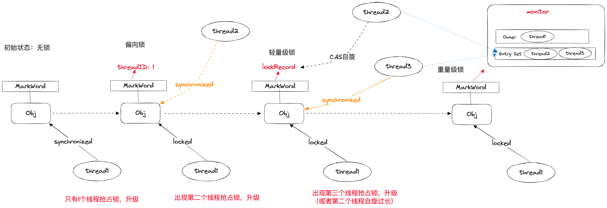

> 正常情况下，对象锁的等级会按照抢占锁的数量逐步膨胀升级，但有一种例外情况是当某个线程调用`Object.wait()`/`Object.notify()`方法时，由于需要使用到monitor结构中的wait set，所以会立刻将对象的锁膨胀为重量级锁并为对象分配关联monitor对象
> 可参见下述JDK源码（`/src/hotspot/share/runtime/synchronizer.cpp`）：

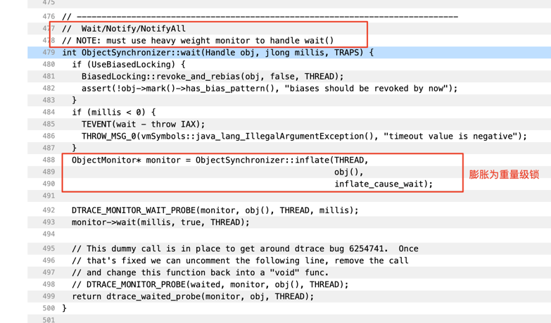

#### AQS

上面讲完了`synchronized`所对应的，基于膨胀机制和monitor的悲观锁实现，在Java中还有另外一种锁的实现，即使用JUC包下的`Lock`系对象，这类锁和`synchronized`不同，并没有采用monitor，也没有锁膨胀机制，而是基于一套Java自己实现的状态同步 + 等待队列，称为AQS（Abstracted Queued Synchronizer）。

JUC包下大部分的线程同步类对象（如Lock、ReentrantLock、CountDownLaunch等）都是基于AQS实现的，这类锁相比`synchronized`关键字来说有更多的api可使用，能够实现更灵活的操作。

AQS提供了一套能够实现多线程之间状态同步的机制，并通过抽象好的API暴露出来，供子实现类使用。实现AQS的子类主要分为`Lock`和`Condition`两大类，前者用于解决互斥问题，后者用于解决同步问题，本文在这里主要讨论前者。

**AQS的核心构成**

AQS的核心组成包含两部分：一个线程共享的状态变量state（由volatile修饰，保障多线程之间的可见性）和一个基于双向链表实现的FIFO等待队列（CLH无锁队列）queue：

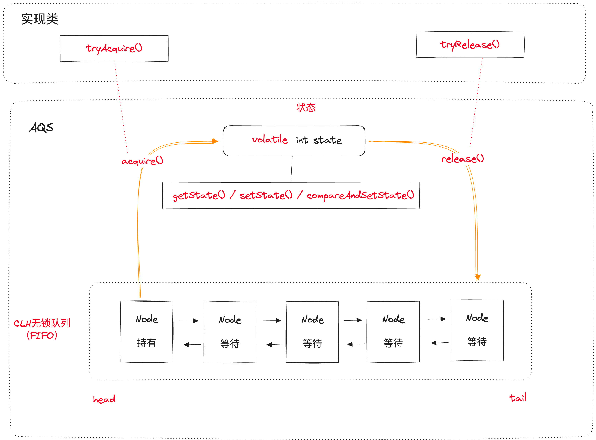

queue中的Node是对线程信息的一个封装（并不是线程本身），里面包括线程的引用和节点本身的状态（注意，不是线程的状态，这里节点的状态是用于AQS实现调度而设置的）。

AQS的基本运行原理为，当一个线程请求共享资源（state）时，若被请求的共享资源空闲（通常以state=0表示），那么就将当前请求资源的线程设置为有效的工作线程，并将共享资源设置为锁定状态（修改state=1）；
如果被请求的共享资源已经被锁定（通常以state=1表示），那么就将当前线程插入等待队列的尾部进行等待，整体的思路和monitor非常类似。

整个运行流程的核心API都被AQS封装定义好，包括尝试锁定(acquire)、释放(release)，以及对state资源的读取和修改，但具体实现交给了子类（例如acquire中会调用子类tryAcquire、release中会调用子类tryRelease），子类可以根据需要实现不同的效果，从而提高锁的灵活性。

**使用AQS实现锁机制**

下面是基于AQS实现锁机制的一个简单例子：

```java
public class MyLock extends AbstractQueuedSynchronizer {

    @Override
    protected boolean tryAcquire(int arg) {
        // 通过CAS尝试抢占锁，state = 0 表示无锁、state = 1表示有锁
        // 如果抢占成功，返回true，否则返回false
        return compareAndSetState(0, 1);
    }

    @Override
    protected boolean tryRelease(int arg) {
        // 释放锁，由于释放的时候肯定已经获取锁了，所以不需要CAS，直接set即可
        setState(0);
        return true;
    }

    public static void main(String[] args) {
        MyLock lock = new MyLock();
        // 线程1
        new Thread(() -> {
            System.out.println("线程1尝试获取锁");
            lock.acquire(1);
            System.out.println("线程1获取到了锁");
            try {
                Thread.sleep(1000);
            } catch (InterruptedException e) {
                e.printStackTrace();
            }
            lock.release(1);
            System.out.println("线程1释放了锁");
        }).start();
        // 线程2
        new Thread(() -> {
            System.out.println("线程2尝试获取锁");
            lock.acquire(1);
            System.out.println("线程2获取到了锁");
            lock.release(1);
            System.out.println("线程2释放了锁");
        }).start();
    }
}
```

可以看到，基于AQS，仅仅通过定义`tryAcquire`和`tryRelease`，编写两行代码就可以实现一个基础的互斥锁了。

**为什么需要AQS？**

说到这里，看起来AQS和基于monitor实现的`synchronized`在思路上没有什么区别，只不过AQS是基于Java代码实现，monitor则借助了C++和操作系统的系统调用实现。既然已经有了`synchronized`，为什么还要大费周章搞一个AQS出来呢？

Java提供AQS最大的原因在于提供可定制性，`synchronized`的实现是JVM层面已经定好的，用户没有任何干预的空间，而AQS将很多的实现和判断都交给了子类（即开发人员），这样就可以更灵活地实现一些复杂的线程互斥/同步需要。

我们以死锁为例，避免死锁的一种方式是让线程主动破坏死锁产生的条件，但采用`synchronized`是无法做到的，因为线程抢锁失败的时候会被直接阻塞，也无法释放已经持有的锁，但如果使用AQS，我们则可以通过AQS提供的API来改变这些行为，例如：

- 让被阻塞的线程能够响应中断，从而拥有感知外部信息，主动释放已经持有的锁的可能性。（抢锁时，调用`acquireInterruptibly()`而不是`acquire()`）
- 支持超时，如果线程一段时间内没有抢锁成功，不会继续阻塞，而是返回一个错误，根据错误进一步处理就有机会让线程主动释放已经持有的锁。（使用`tryAcquireNanos(int arg, long nanosTimeout)`）
- 非阻塞地获取锁，如果尝试获取锁失败，并不进入阻塞状态，而是直接返回，那这个线程也有机会释放曾经持有的锁。(调用`tryAcquire()`)

在下面我们进一步讨论更复杂的锁机制时，就会看到只有通过AQS才能灵活的实现公平锁/非公平锁、共享锁/独占锁、可重入锁/不可重入锁这些复杂的锁。

#### 锁的公平性

公平锁和非公平锁不是具体的实现，而是一种概念：

- 公平锁：多个线程按照申请的顺序来获取锁，线程直接进入等待队列排队，只有队列头部的线程可以获取锁。
- 非公平锁：任一线程申请锁时，直接先尝试获取锁，只有获取不到时才进入等待队列排队。

公平锁能够保障所有等待的线程都一定能获取到锁资源，不会饿死，但由于队列中除了头部之外所有的线程都会阻塞，所以吞吐效率比较差；非公平锁下，如果线程获取锁时恰好能够获取到，就不用被阻塞丢到队列末端排队，从而减少一次阻塞/唤醒的系统开销。

简要来说，非公平锁就是允许线程"插队"获取锁，从而减少线程的排队等待。

`synchronized`实现的锁是非公平调度的，而基于AQS实现的锁在加锁时可以通过`tryAcquire`/`nonfairTryAcquire`来决定是加公平锁还是非公平锁：

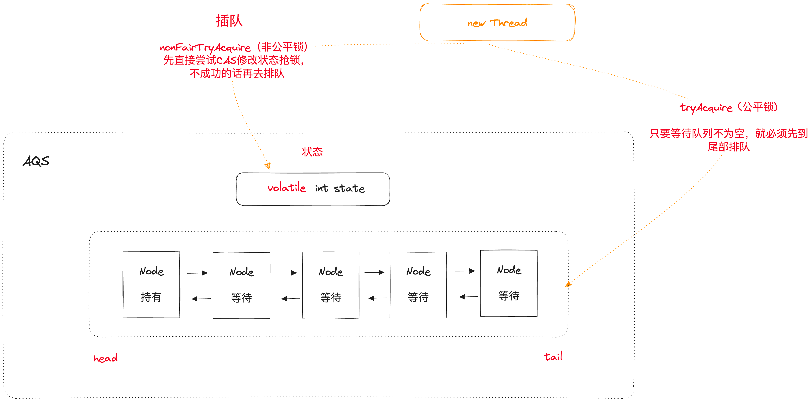

#### 锁的可重入性

锁的可重入性同样也是一种概念。

- 可重入锁：同一个线程可以多次尝试对该资源加锁，只要该线程已经持有了资源的锁，后续再尝试加锁就直接成功
- 不可重入锁：同一个线程只能对一个资源加一次锁，如果该线程已经持有了资源的锁，再次尝试锁定该资源时会判断当前资源已经被锁定，不能获取锁，从而陷入死锁

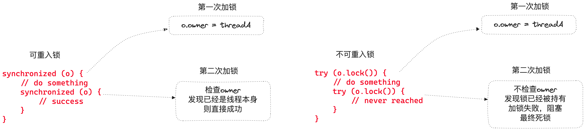

`synchronized`实现的锁是可重入的，基于AQS的锁是否可重入则由`tryAcquire`的实现锁决定（典型实现：`ReentrantLock`可重入，`NonReentrantLock`不可重入）。

#### 锁的共享与独占

- 独占锁：一个锁同一时刻只能被一个线程所持有，也称为互斥锁，是最常见的锁实现
- 共享锁：一个锁同一时刻可以被多个线程锁持有

共享锁和独占锁也是锁的一种概念。

**为什么会有共享锁？**

一个非常实际的例子是读/写锁，在数据库中，为了保证数据的一致性，如果一个线程正在读某个记录，那这条记录在读取完毕之前都不能被写入修改，但可以被其他线程同时读取；而如果一条记录正在被写入修改，那么其他线程既不能同时写入，也不能同时去读取这条记录。

这就延伸出了读写锁的概念，当一个线程读取记录的时候，对这个记录加读锁，此时如果有其他线程过来读取，那么同样可以获得锁，这样多个线程可以同时读取数据，提高效率，这便出现了一个锁可以被多个线程同时持有的情况。
而当有线程需要写入该记录的时候，则需要没有任何其他线程读/写该记录，此时锁又变成了独占的了。

具体到实现上，`synchronized`只能实现独占的互斥锁，而基于AQS的锁，只要允许state的值超过1，那就是共享锁，否则就是独占锁，下面是一个基于AQS实现读写锁的简单示范：

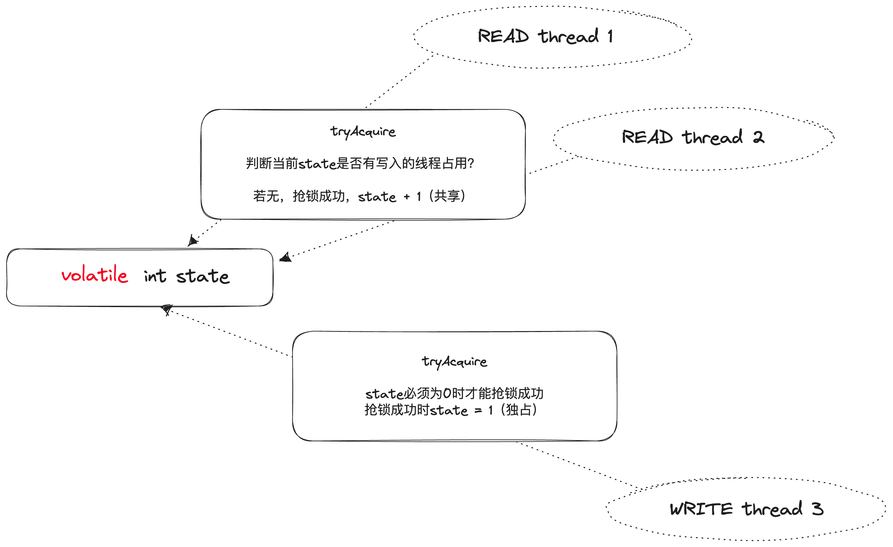

### volatile

volatile关键字是为了解决多线程并发访问共享变量时的不可见性问题而引入的，在理解volatile的作用前，需要先了解JVM的工作内存模型。

JVM内存模型下，为每个线程抽象了一个"工作内存"的概念，当线程访问一个主内存中的数据时，会在对应线程的工作内存中产生一个该数据的副本，随后线程对该变量的操作都是基于这个副本，最终该副本再通过save同步到主内存。

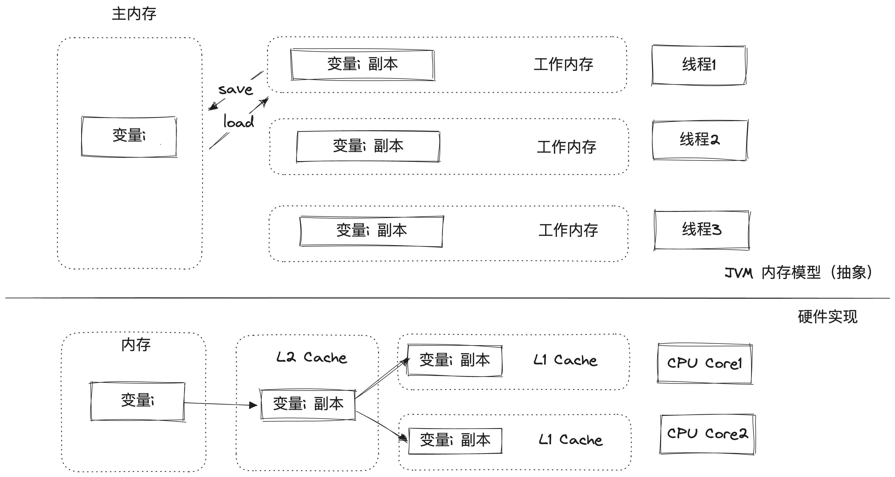

这个工作内存的抽象，落实到具体操作系统和计算机硬件的实现上，就是CPU的缓存和内存之间的关系，举一个具体的例子，假设有一个双核的CPU，每个核心都拥有一个独立的1级缓存，以及一个共享的2级缓存，如果每个核心都正在执行一个线程，那么这个核心的1级缓存就是该线程的工作内存（这只是一个例子，具体实现由JVM和平台共同决定）。

在上面这个例子的假设下，我们来看看内存的不可见性问题是如何产生的：假设CPU的两个核心分别在运行线程A和B，并且A和B要同时读取和修改一个主存中的共享变量i（初始值为1）：

- 线程A先获取变量i，此时1，2级缓存均为空，所以从主存中读取将i=0加载到1，2级缓存中，此时主存、线程A的1级缓存、2级缓存里i = 0
- 线程A修改变量i，修改先在1级缓存生效，然后传递到2级缓存，最后save到主存，此时主存、线程A的1级缓存、2级缓存里i = 1
- 线程B此时获取变量i，此时线程B的1级缓存里没有i，于是从2级缓存拉取，得到 i = 1，此时主存、线程B的1级缓存、2级缓存里i = 1
- 线程B修改变量i = 2，修改先在1级缓存生效，然后传递到2级缓存，最后save到主存，此时主存、线程B的1级缓存、2级缓存里 i = 2，**但是线程A的1级缓存里 i仍然是1**
- 线程A获取变量i，由于1级缓存中已经有i = 1，因此错误地拿到了 i = 1

这就是多线程场景下，内存的不可见性问题，即一个线程对主存变量的修改对另一个线程不可见。在加锁的情况下是不会出现这种问题的，但是如果是CAS无锁的操作，就有可能因为不可见性影响而出现错误。

volatile就是为了解决这个问题而被引入，被volatile关键字所修饰的变量，线程在写入变量时不会把值缓存在寄存器或者其他地方，而是会把值刷新回主内存，这样就解决了不可见性的问题。

> volatile还可以用于禁止编译器指令重排优化来避免一些多线程下代码执行顺序的问题，这里不展开了。

### ThreadLocal

ThreadLocal是一个用于解决多线程变量共享问题的工具，使用ThreadLocal设置的变量，在每一个线程中都有一个副本，每个线程访问到的都是专属于自己的那个副本，而不会对其他线程产生干扰。

ThreadLocal的使用场景和锁完全不同，用ThreadLocal所创建的对象，虽然在代码形式上看起来是一个对象，但其实在运行时是每个线程都会创建对应的副本，线程只关心自己的副本，而不需要和其他线程共享同一份数据，进而也就没有了并发互斥和同步的问题。

```java
public class Test {
    
    private static ThreadLocal<String> _tl = new ThreadLocal<>();

    public static void main(String[] args) {
        Thread t1 = new Thread(() -> {
            _tl.set("t1"); // t1内访问的_tl对象是自己独享的副本
            System.out.println(_tl.get()); // 输出t1
        });
        Thread t2 = new Thread(() -> {
            _tl.set("t2"); // t2内访问的_tl对象也是自己对象的副本
            System.out.println(_tl.get()); // 输出t2
        });
    }
}
```

下面是一些典型的使用场景：

- WEB框架中采用ThreadLocal存储一次HTTP请求的Session信息，传递给各个线程
- Spring中的事务切面，使用ThreadLocal来储存当前线程持有的数据库连接

最后来看一下Java中ThreadLocal的实现：在每个Thread中都有个一个ThreadLocals变量，它是一个Entry数组，每个Entry都是一对KV。

当在一个线程内对某个ThreadLocal变量赋值的时候，（若该变量在该线程中的副本还没创建）会在其ThreadLocals数组中插入一个Entry，K为该ThreadLocal对象，V则是该线程内所赋的副本值。插入的位置（数组下标）是通过一套hash算法计算得到。

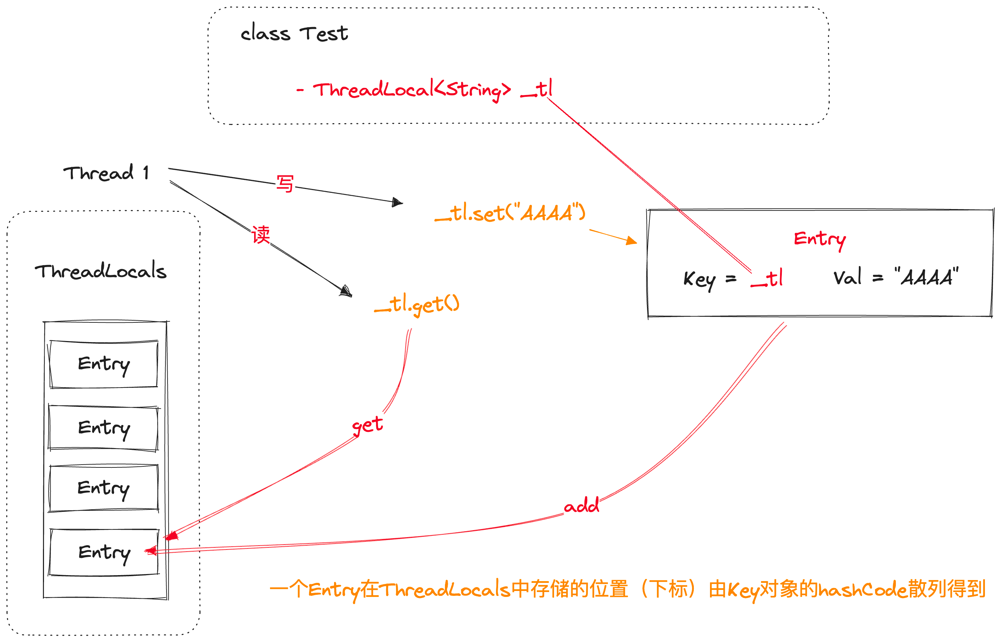

一个线程获取某个ThreadLocal变量的时候，则是在该线程的ThreadLocals数组中通过hash计算定位到对应的下标，取出Entry对象，进而得到Value。

> - Entry的Key存放的是对ThreadLocal对象的弱引用，这是为了防止ThreadLocal对象被意外设置成null时，无法回收内存进而引发内存泄露。
> - 在线程池场景下，由于一个线程可能会被复用，所以在线程使用完成后通常要把该线程的ThreadLocal清理掉，否则下一个复用该线程的任务可能会读到错误的历史数据。


### 线程安全实例

最后再聊一些Java中经典的数据结构实现数据安全的思路

#### ConcurrentHashMap

ConcurrentHashMap是非常常用的一种线程安全的数据结构，主要用于在多线程场景下替代基本的HashMap。

在聊ConcurrentHashMap之前，不妨先看看HashMap本身的实现，HashMap采用数组+链表（红黑树）的方式来实现K-V对的存储：

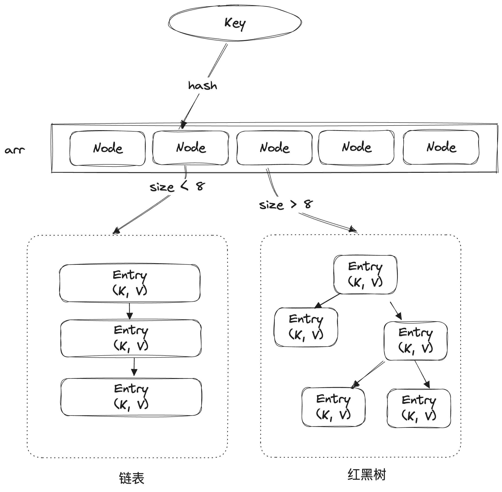

- Key对象通过Hash计算下标散列到数组中某个坑位
- 如果出现Hash冲突，则桶对应的存储变为链表，插入额外的元素，查找时需要先Hash再遍历整个链表
- 数组的大小可以动态扩容，当HashMap存放的总元素数量 > 扩容因子 * 数组大小时，就自动执行扩容
  - 每次扩容会扩展数组一倍的大小，扩容后需要对所有元素重新计算hash，所以扩容是一个性能较差的操作
- 如果冲突过多，某个桶内链表长度>8，则先尝试扩容，若数组大小已经扩展到64，则将对应桶数据结构改为红黑树

HashMap本身是线程不安全的，在多线程并发操作的时候可能会出现问题：

- 如果多个线程并发操作不同的Key，但这两个Key的Hash是冲突的，那么就会出现多个线程同时修改数组中同一个下标对应的桶的情况，有可能出现错误
  - 例子：线程A向HashMap中添加一个值，该Key对应arr[0]，该位置当前尚未有其他元素，于是线程A尝试将值放入arr[0]，但同时线程B操作的另一个Key也对应arr[0]
    （哈希冲突），最终只有一个线程的Key能够成功写入，另一个则被覆盖
- 如果多个线程的Put操作同时触发HashMap的扩容，多个线程会同时重新计算所有元素的hash并插入，这个过程中可能会发生覆盖而导致数据丢失

我们知道，解决线程安全问题的最好办法就是加锁，所以为了让HashMap变得线程安全，只要对所有的put操作加锁就可以了（即`Collections.synchronizedMap()`），但毫无疑问，这会导致Map的写入性能下降非常多。

ConcurrentHashMap旨在提供一个性能更好的、线程安全的HashMap，在1.7版本之前，ConcurrentHashMap通过Segment分段锁的机制来提高性能，这个思路也很简单，那就是把数组拆成多个段，这样锁的粒度就会变小，多线程put操作的时候，只要不是恰好命中同一个段，就不会出现锁的抢占了，从而提高性能：

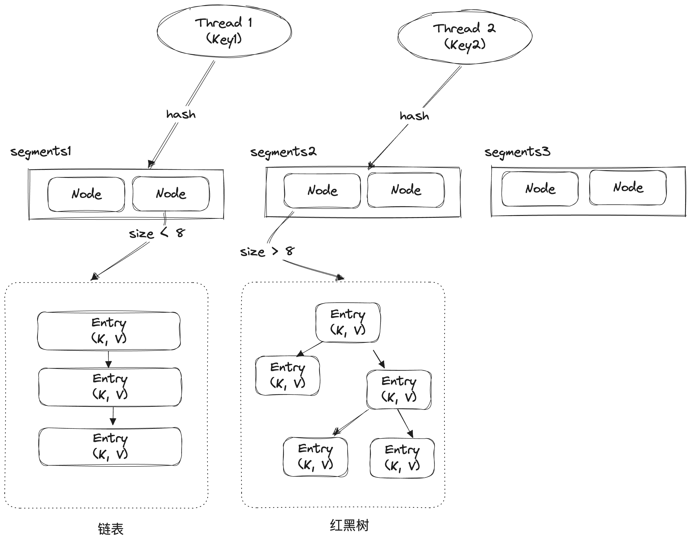

不过对于一些跨段的操作如`size()`, `isEmpty()`，还是会按照顺序对每个段依次加锁。

而在1.8版本之后，为了进一步提高性能，JDK重新大改了整个ConcurrentHashMap的设计，将原来的分段锁替换为了`synchronized`和大量的`CAS`操作，以减少重量级锁的使用。

这个版本下的ConcurrentHashMap取消了分段设计，而针对写入操作了更细化的并发处理：

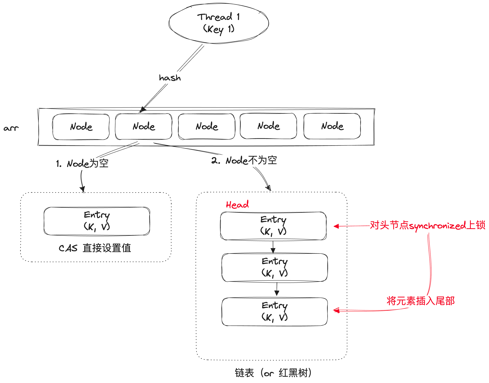

同时在并发扩容机制上也进行了大量优化，通过大量引入CAS机制减少了线程的阻塞情况，具体过程这里不做展开了。

另外，对于一些需要扫描全Map的操作（例如`size()`），ConcurrentHashMap不会加锁进行全量扫描，而是通过内部的一个计数器变量来进行统计返回（不过，这种场景下返回的可能是近似值，不保证100%准确）。

#### BlockingQueue

BlockingQueue是JUC包中提供的阻塞队列实现