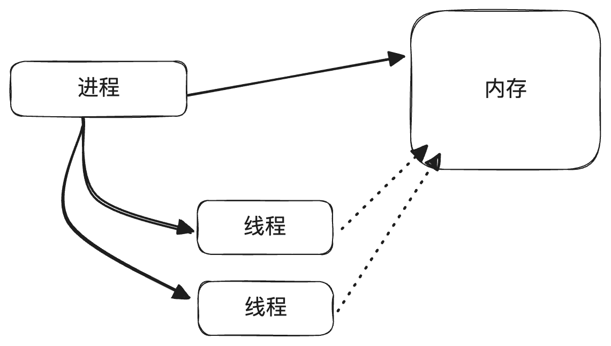
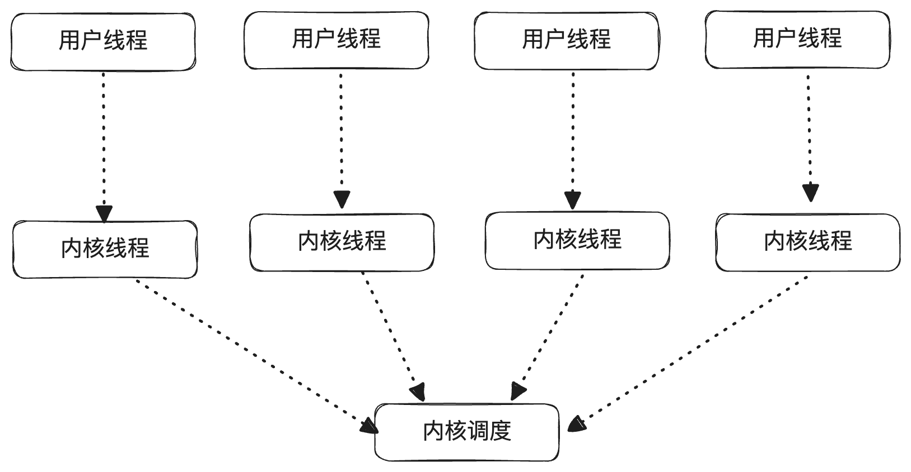
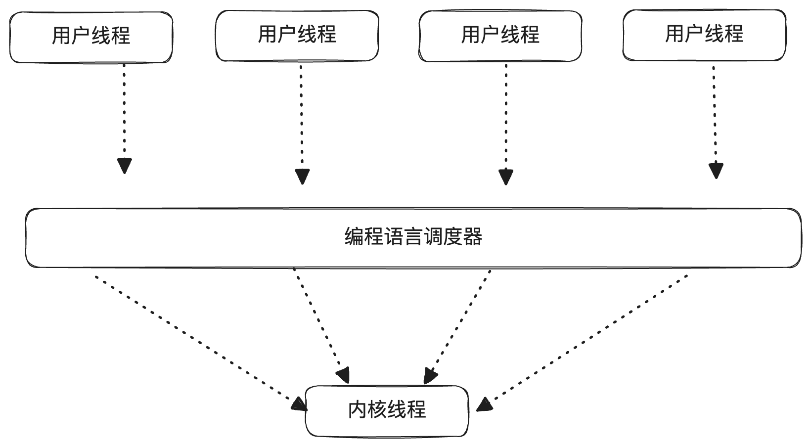
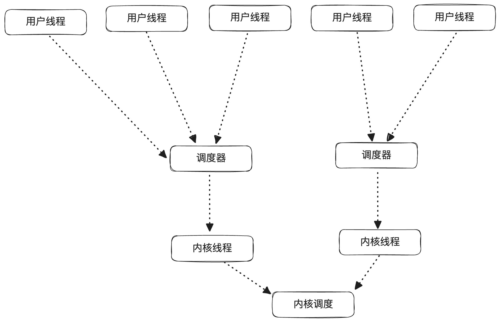
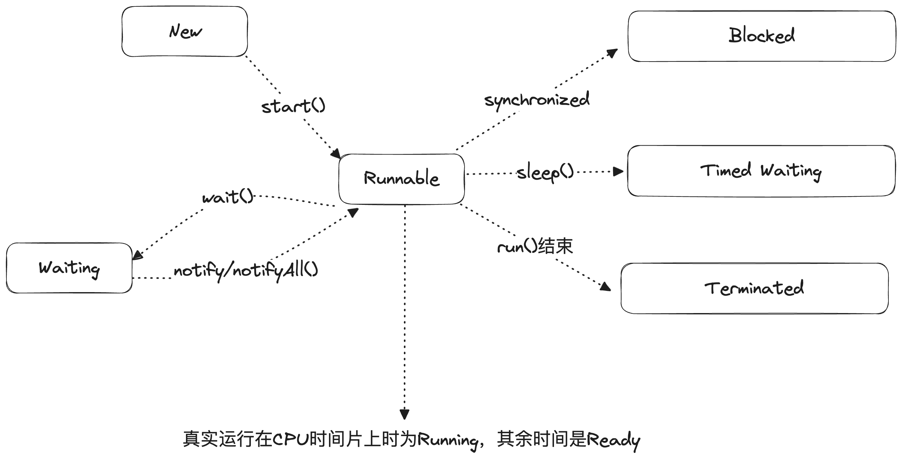
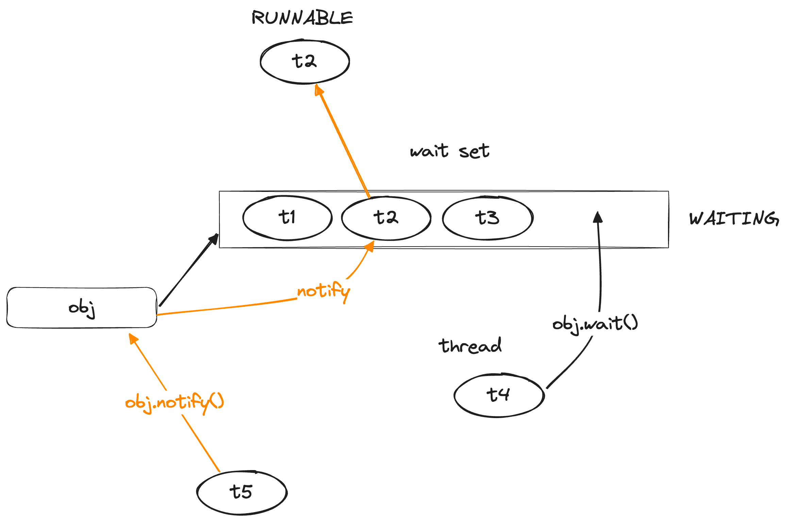
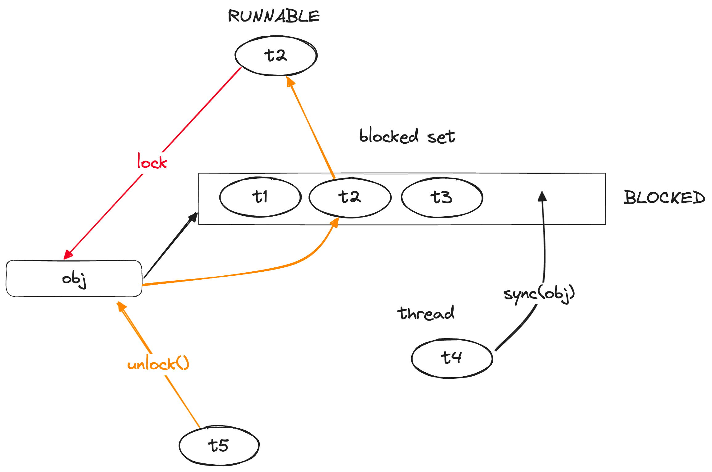

# 03 高级语言的自我修养：线程并发

### 线程的基本概念

#### 何为线程

线程是操作系统执行任务的最小调度单位，细化一下就是**CPU资源的最小调度单位**。

线程是进程下的一个子概念，进程是操作系统分配资源（CPU+内存）的最小单位，因此每个进程拥有自己独立的内存空间（分段实现），而线程则没有，一个进程下的所有线程共享该进程本身所持有的内存空间。



#### 用户线程与内核线程

不同的操作系统平台中线程的实现略有不同，操作系统上原生的线程实现被称为**内核线程**（例如Linux下的pthreads）。
由于Java的跨平台特性，需要由JVM为开发人员模拟出一个虚拟且通用的计算机，因此在JVM层面（也即Java进程层面）的线程并非是原始的内核线程，而是经过了一定的抽象和封装，通常被称为**用户线程**。

通常需要将用户线程映射到内核线程上以实现运行和调度，但不同的语言、不同的平台上用户线程和内核线程的映射方式会有较大的不同，一般有三种常见的映射方式：

**1:1 映射**

即1个用户线程映射到1个内核线程上，这种模式下，一个用户线程就是一个内核线程，线程之间互不影响。缺点是创建和调度内核线程的系统调用次数会非常多，效率比较差。



> 目前主流的JVM虚拟机在主流的平台上都是采用1:1映射进行用户线程到内核线程的映射

**N:1 映射**

所有的用户线程都映射到一个内核线程上，这种模式下，只需要创建一个内核线程，由编程语言自行调度该线程何时运行哪个用户线程。优点是系统调用的开销较小，缺点则是非常依赖编程语言对用户线程的调度，用户线程阻塞的风险较高。



> 采用N:1映射的编程语言也被称为"单线程模型"，比较出名的是JavaScript（Node）

**N:M 映射**

创建一定数量的内核线程，并把用户线程按照一定的策略分配到这些内核线程上，这种方式算是结合了前两者的优点，但对编程语言所提供的调度器分配策略有非常高的要求



> 采用N:M映射的典型例子是Go语言，通过复杂调度器建立起Go Routine（用户级）和内核线程的灵活映射，以实现并发效率的最大化

### Java线程的抽象

#### 基本形式

在Java中，一个线程对于开发者而言，被抽象为*一段可以感知和操作其运行状态的代码*，在实际编程中以`java.lang.Thread`对象表示。

```java
Thread t = new Thread(() -> {
    // 可执行的代码
    System.out.println("hello, world");
});

// 感知对应代码的执行状态
t.isAlive();
t.isSleep();

// 操作对应代码的执行状态
t.interrupt();
t.sleep(3000);
```

#### 线程状态

Java中为线程抽象了6种状态，下图标识了6种状态之间的相互转换关系：



- New：Thread刚被创建出来时的初始状态
- Runnable：说明当前线程处于**可执行**状态，注意可运行并不一定意味着真的在CPU上运行（细分一下的话，真实运行的状态为Running，还没调度到CPU的状态为Ready）
- Terminated：线程的代码片段执行完毕，就会达到Terminated，此时线程通常会被回收
- Waiting：表示线程需要进行等待其他线程执行，除非有外部通知/中断打破，否则线程会持续等待，处于此状态的线程**会释放所持有的锁**
- TimedWaiting：限时等待，表示线程需要暂停执行一小段时间，处于此状态的线程**不会释放所持有的锁**，暂停结束后将重新恢复到Runnable状态
- Blocked：当且仅当线程尝试抢占某个对象的锁时，会进入Blocked状态，Blocked状态的线程**不会释放已经持有的锁**

### Java线程的调度 (D2)

#### 抢占式调度 & 协同式调度

线程的两种常见调度方式分别是抢占式调度和协同式调度：

抢占式调度即传统的时间片分配调度，给每个线程分配一定的时间片，当时间片耗尽后会被强制切换到其他线程执行。

协同式调度则需要依靠线程之间"主动"互相协作，比如A线程运行到一定时间发现需要等待，就主动将时间片让给其他线程。

目前大多数的操作系统/编程语言对线程的调度采用的都是抢占式机制。

#### 线程优先级

由于Java采用了1：1的线程映射模型，最终线程的调度其实完全由操作系统来处理，Java侧只能提供一定的建议。最主要的机制就是线程优先级的设定，Java本身为每个线程提供了1～10的优先级设定范围，最终会适配到操作系统线程的优先级上进而影响线程调度。

#### 非RUNNABLE线程的处理

线程优先级 + OS调度基本解决了RUNNABLE线程的调度，但对于非RUNNABLE状态的线程，则需要Java自行处理来进行状态流转。

1. WAITING: wait() & notify()

处于WAITING状态的线程通常由wait() & notify()函数进行流转（park()、join()等也可以，但这里只展开说最基础的），wait()和notify()都是Object类的方法，通常配合在一起使用：

**wait()**：将当前线程设置为WAITING状态（同时会释放线程持有的所有锁），并加入到对应object的wait set中（一个队列）。

**notify()**：从对应object的wait set中取出一个（随机）线程，重新设置为RUNNABLE状态，如果使用notifyAll()则是将wait set中的所有线程都取出设置为RUNNABLE状态。



通过wait()和notify()机制可以快速实现线程的等待和恢复，适用于多个线程之间互相"协同"的场景，可以认为是协同式调度思路的一种体现。

下面是一个使用wait() & notify() 机制实现的简单生产者 - 消费者代码示意：

```java
// consumer
Object o = new Object();
synchronized(o) {
    while (empty) {
        o.wait();
    }
    // consume
    o.notify();
}
// producer
synchronized(o) {
    while (!empty) {
        o.wait();
    }
    // produce
    o.notify();    
}
```

2. BLOCKED: synchronized & lock()

处于BLOCKED状态的线程，只可能是在抢占锁的时候出现，当一个线程（通过synchronized或者Object.lock()等方式）抢占某个对象的锁失败时，就会被标记为BLOCKED状态并被放入对应对象的blocked set队列中，此时线程不会释放它已经抢占的锁。

只有当对应对象的锁被其他线程释放后，才会从blocked set中（随机）取出一个线程，重新标记为RUNNABLE状态，需要注意的这个被唤醒的线程会立刻获取对应对象的锁，所以blocked set中其他的线程会继续等待。



3. TIMED_WAITING: sleep()

TIMED_WAITING状态的线程主要由sleep(time)调用产生，并在对应time时间结束后自动转换为RUNNABLE，线程不会释放持有的任何锁

**延伸1：一个有趣的生产者-消费者问题**

下面考虑一个非常简化的生产者-消费者模型，我们假设生产者和消费者各只需要生产/消费一次

```java
// consumer: 先wait，再consume
Object o = new Object();
synchronized(o) {
    o.wait();
    // consume
}
// producer：先produce，再notify
synchronized(o) {
    // produce
    o.notify();
}
```

如果先执行consumer，再执行producer，结果是生产和消费都可以正常进行；如果先执行producer，再执行consumer，则结果是生产成功，但消费者永远卡在WAITING阶段。

（可以按照block、wait的逻辑分别推演一遍）

#### 线程打断机制

在一些场景下，需要能够终止某个线程的运行，在早期的Java版本中提供了Thread.stop()等方法来实现线程的终止，但如果在线程运行期间强行打断，很有可能会出现非常多的异常情况，例如数据不同步、连接未正确释放等等，风险非常高。

因此后续Java废弃了stop()等强行终止线程的方法，改为interrupt打断机制，如果希望某个线程终止时，可以调用该线程的interrupt()方法，但该方法并不会立刻中断线程，而是将是否要中断的决定交给被中断的线程本身。在被中断的线程中可以通过`Thread.currentThread().isInterrupted()`来获取当前线程是否被请求中断，然后自行处理和判断是否要中断执行。（类似Linux中的信号机制，interrupt只是传递一个信号，具体如何处理要看被中断的线程本身）

下面是线程处理interrupt的一种经典代码：

```java
Thread t = new Thread(() -> {
    try {
    while (!Thread.currentThread().isInterrupted()) {
    // do something
    }
    // handle the interrupt signal
    } catch (InterruptedException e) {
    // 当该线程处于阻塞（WAITING,BLOCKED）状态时，如果被调用了interrupt()方法，就会抛出这个异常
    // handle the interrupt signal
    } finally {
    // clean up
    }
});
```

#### 线程池【D3】

### 线程安全【D3】

### 并发问题与CAS【D3】

### 锁【D4/D5】

### ThreadLocal【D11】

### 线程安全实例

#### ConcurrentHashMap【D12】

#### BlockQueue【D13】