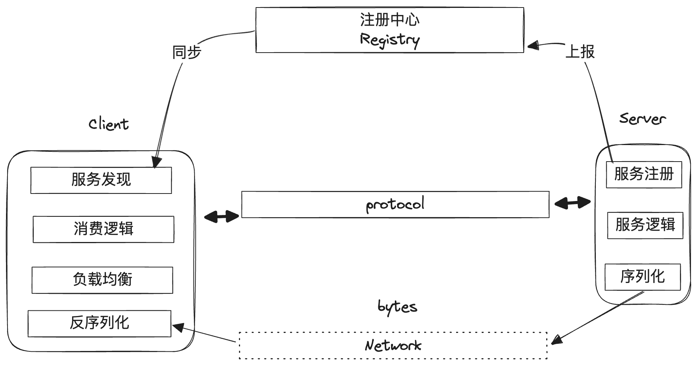

# 04 - 分布式系统

### 分布式系统诞生的背景

随着互联网的诞生，计算机软件所需要承载的用户量呈指数倍增长，尽管硬件层面上存在摩尔定律的增长，但单一计算机硬件的性能增长曲线很快就无法赶上用户量的膨胀，为了解决这个问题，分布式系统的概念被提出。

分布式系统的核心思路是水平扩展提供同一服务的计算机硬件的数量，从而分摊压力，实现硬件层面 1 + 1 = 2的效果，我们把这些提供同一服务的硬件总和称为集群。

除了水平扩展硬件数量，还可以将复杂的软件逻辑进行合理的拆分，让不同的集群处理不同的步骤，进一步减少单个硬件节点的负载压力。


### RPC

远程过程调用（Remote Procedure Call，RPC）技术是分布式系统构成的核心，RPC主要用于为分布式系统下集群与集群之间提供稳定可靠的通信机制。

#### RPC的基本构成

一个RPC最基础的构成包含以下几个部分：

- 协议：用于定义RPC的输入输出
- 客户端：RPC的消费方使用，用于发起调用
- 服务端：RPC的实现方，用于提供RPC服务
- 注册中心：用于存储和同步一个RPC所有可用服务端的信息



一次RPC调用的基本流程大致如下：

1. （调用前）RPC服务的提供者/消费者根据协议实现客户端与服务端逻辑
2. RPC服务端启动，并将自己的调用地址（通常是IP）上报给注册中心
3. RPC客户端发起请求，通过注册中心获取到一个可用的服务端节点地址，然后与对应节点建立连接
4. RPC客户端/服务端通过连接发送数据，并进行序列化/反序列化

大部分的RPC框架实现是重客户端，轻服务端（服务端通常只需要提供服务，服务发现、负载均衡等逻辑则在client端实现）

#### 服务发现

服务发现的本质是Client端获取Server端所有提供者地址的数据同步机制，通常由注册中心来存储RPC服务可用Server端的地址以及元数据。

注册中心是一个数据存储节点（大多数时候，注册中心本身也是一个分布式集群），它需要做到以下几点：

- 和Server端的所有节点保持心跳，并及时摘掉不健康的Server端节点，以保障Client端拉取的所有Server端地址都是可以正常提供服务的
- 保障Client端能够获取到RPC完整的可用Server端列表
- 保证稳定性：注册中心是RPC实现的核心节点，一旦出现故障会有巨大影响，所以注册中心通常需要以集群方式存在，避免单点故障
- 保证数据一致性：如果注册中心采用多节点的集群实现，那么还需要保障所有节点上存储的数据是一致的

可以看出，RPC对注册中心的要求是非常高的，注册中心的实现逻辑一般也非常复杂。为了保障性能，注册中心大多数时候会通过监听推送机制来实现服务端及客户端数据信息的同步，而不是每次都全量拉取数据：


一般在Client端会有一份本地缓存，注册中心只需要准确和及时地推送服务端节点的上下线信息，就可以保障Client端本地缓存的数据和真实提供服务的服务端信息保持一致，而只有在新的Client端加入的时候才需要全量拉取。

在稳定性和数据一致性方面，则需要有特定的算法和策略来克服多分区网络下的不稳定性问题，下文会详细介绍。

#### 负载均衡

同一个RPC服务往往会有多个Server端提供服务，为了保障每个Server端能够均摊压力，Client端在调用的时候要采用一定的负载均衡策略，以保障流量的均衡性，常见的负载均衡策略有以下几种：

1. 随机：随机从可用的Server端节点中选择一个可用的进行调用，在流量比较大的情况下，基本是均衡的

2. 轮询：按顺序不停循环调用各个Server端

3. 活跃最少优先：需要维护Sever端的调用情况，总是选择当前（或一段窗口内）被调用次数最少的Server端调用

4. 响应速度优先：需要维护Sever端的调用情况，总是选择当前（或一段窗口内）响应最快的Server端调用

5. 一致性Hash算法：通常是根据调用参数，采用一致性Hash算法得出需要调用的节点，关于一致性Hash算法的详情可参考[之前的文章](https://juejin.cn/post/7298899182166507555)

#### 安全与稳定性

通常一个完整拆分的大型应用，可能是由众多服务通过RPC串联在一起而形成，服务与服务之间的调用关系往往错综复杂，因此大部分的RPC框架并不只提供基础的通信能力，还需要提供诸多手段来保障服务调用过程中的安全和稳定性。

**监控**

RPC框架一般会提供最基础的监控能力（尤其是对服务端而言），包括各个服务的调用次数、调用耗时、异常次数等等。

**链路追踪**

当分布式应用复杂到一定程度，从外部发起的一次调用可能最终被转换为应用内众多服务之间互相的调用串联，关系错综复杂。链路追踪旨在明确一次请求过程中，有哪些服务被调用，并明确这些服务之间的依赖关系和调用顺序。

一般来说，链路追踪对一次请求会形成一个全局唯一的id（通常称为traceID），并将这个id在每一次RPC调用中进行透传，在每个节点上打印对应的日志（如被调用的RPC接口、调用开始时间、结束时间、异常信息等），最终通过将这些进行汇总和排序整理，就可以得到一个完整的链路调用情况。

**容错机制**

分布式系统下，RPC服务之间的上下游调用存在诸多不稳定性，对于一个RPC服务的提供者来说，既需要考虑上游调用方不合理的调用，也需要考虑自己服务本身出现故障的状况下，如何尽可能减小影响和损失，这就需要对服务引入一定的容错机制，下面是一些常见的手段：

1. 限流

    限流是应对上游调用量过大时的保护机制，服务提供方合理评估自己可以承载的调用量上限，在调用方的调用量超过阈值时，就将多余的请求限流，做异常处理。

2. 熔断

    熔断通常是根据服务调用的成功率（也有时候是根据调用时间）来判断服务是否陷入异常状态，如果判断一定窗口内成功率（或超时率）突破了阈值，就阻止更多的请求访问，做异常处理。

    熔断通常需要对应的自动恢复机制，否则一次熔断后服务将完全处于不可用状态。

3. 降级容灾

    降级容灾是服务端判断自己无法正常处理时，一种兜底的手段，通常是对部分逻辑（或全部逻辑）进行简化处理，比如直接返回默认值、返回某个固定值、从缓存拉取最近一次正确返回的结果等等。

    限流和熔断手段通常都会配合降级容灾一起使用，来尽可能降低服务不可用的损失。

    另外，如果服务端自己进入完全不可用状态，那么降级容灾手段往往也会失效，为了避免这种情况，一般也会在RPC框架或者网关层面实现一定的降级容灾能力，进一步降低出现故障时的损失率。


#### 延伸1：令牌桶限流算法

令牌桶是一种常见的限流算法，思路是建立一个蓄水桶，以固定的速率向桶中放入令牌。所有请求都必须要消费桶中的令牌才能够通行，如果桶中没有令牌就会对请求限流，这样可以保障服务端最终接收请求的速率不会超过令牌生产的速率。


下面是一个基于Java实现的简单令牌桶限流算法示意：

```java
public class TokenBucketLimiter {

    /**
     * 当前桶中的令牌数量
     */
    private AtomicInteger tokens = new AtomicInteger(0);

    /**
     * 桶的大小上限，用于进行峰值保护（即瞬时流量保护）
     */
    private int capacity = 100;

    /**
     * 放置令牌的速率（单位：s）
     */
    private int rate = 100;

    /**
     * 最后一次放置令牌的时间
     */
    private Long lastTime = System.currentTimeMillis();

    public boolean reachLimit(int applyCount) {
        // 计算当前令牌的数量
        synchronized (lastTime) {
            long now = System.currentTimeMillis();
            long timePassed = now - lastTime;
            int tokensToBeAdded = (int) (timePassed / 1000 * rate);
            if (tokensToBeAdded > 0) {
                // 向桶中增加令牌数量，最大不超过桶容量
                tokens.set(Math.min(capacity, tokens.get() + tokensToBeAdded));
            }
            if (tokens.get() < applyCount) {
                // 令牌数量不足，限流
                return true;
            } else {
                // 消耗令牌
                tokens.addAndGet(-applyCount);
                lastTime = now;
                return false;
            }
        }
    }
}
```
#### 延伸2：断路器模式熔断

断路器模式是一种用于实现服务熔断的常见设计模式，在该模式下通过一个断路器节点保护服务提供方，所有来自客户端到请求都需要通过经过断路器才能够访问到服务端，并且断路器监听和感知每一次请求的状态（是否成功、是否超时等）。

断路器节点一般有三种状态：

- OPEN：打开状态；此时客户端可以通过断路器访问到服务端，同时断路器会检测请求的状态
- CLOSED：关闭状态；在一定窗口内，当请求错误数/超时数达到设定的阈值，断路器就会进入关闭状态，此时客户端请求无法访问到服务端，而是被断路器拒绝（或降级容灾）。
- HALF_CLOSED：半关闭状态；当断路器达到CLOSED状态后，服务端的负载压力将会大幅下降，一段时间后可能自行恢复，此时断路器会适当放行一部分客户端请求到服务端，如果这些请求成功，就说明服务端已经恢复，则断路器可以转换为OPEN状态。


### CAP定理

CAP定理是分布式系统一个基础理论。CAP定理指出，对于一个分布式系统（或者由于网络隔离等原因产生的分区系统），它无法同时保证一致性、可用性和分区容忍性，而是必须要舍弃其中的一个。

由于分布式系统一般无法避免分区容忍性，所以一般会根据实际的业务情况，在一致性和可用性中二选一。

#### 一个例子：分布式事务

### 数据一致性算法

D4/D5
