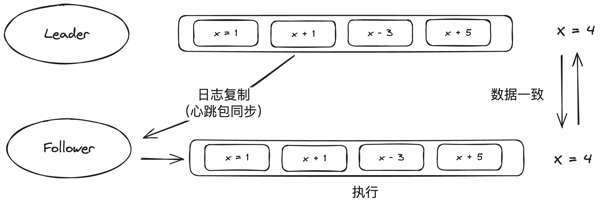

# 04 - 分布式系统

### 分布式系统诞生的背景

随着互联网的诞生，计算机软件所需要承载的用户量呈指数倍增长，尽管硬件层面上存在摩尔定律的增长，但单一计算机硬件的性能增长曲线很快就无法赶上用户量的膨胀，为了解决这个问题，分布式系统的概念被提出。

分布式系统的核心思路是水平扩展提供同一服务的计算机硬件的数量，从而分摊压力，实现硬件层面 1 + 1 = 2的效果，我们把这些提供同一服务的硬件总和称为集群。

除了水平扩展硬件数量，还可以将复杂的软件逻辑进行合理的拆分，让不同的集群处理不同的步骤，进一步减少单个硬件节点的负载压力。


### RPC

远程过程调用（Remote Procedure Call，RPC）技术是分布式系统构成的核心，RPC主要用于为分布式系统下集群与集群之间提供稳定可靠的通信机制。

#### RPC的基本构成

一个RPC最基础的构成包含以下几个部分：

- 协议：用于定义RPC的输入输出
- 客户端：RPC的消费方使用，用于发起调用
- 服务端：RPC的实现方，用于提供RPC服务
- 注册中心：用于存储和同步一个RPC所有可用服务端的信息


一次RPC调用的基本流程大致如下：

1. （调用前）RPC服务的提供者/消费者根据协议实现客户端与服务端逻辑
2. RPC服务端启动，并将自己的调用地址（通常是IP）上报给注册中心
3. RPC客户端发起请求，通过注册中心获取到一个可用的服务端节点地址，然后与对应节点建立连接
4. RPC客户端/服务端通过连接发送数据，并进行序列化/反序列化

大部分的RPC框架实现是重客户端，轻服务端（服务端通常只需要提供服务，服务发现、负载均衡等逻辑则在client端实现）

#### 服务发现

服务发现的本质是Client端获取Server端所有提供者地址的数据同步机制，通常由注册中心来存储RPC服务可用Server端的地址以及元数据。

注册中心是一个数据存储节点（大多数时候，注册中心本身也是一个分布式集群），它需要做到以下几点：

- 和Server端的所有节点保持心跳，并及时摘掉不健康的Server端节点，以保障Client端拉取的所有Server端地址都是可以正常提供服务的
- 保障Client端能够获取到RPC完整的可用Server端列表
- 保证稳定性：注册中心是RPC实现的核心节点，一旦出现故障会有巨大影响，所以注册中心通常需要以集群方式存在，避免单点故障
- 保证数据一致性：如果注册中心采用多节点的集群实现，那么还需要保障所有节点上存储的数据是一致的

可以看出，RPC对注册中心的要求是非常高的，注册中心的实现逻辑一般也非常复杂。为了保障性能，注册中心大多数时候会通过监听推送机制来实现服务端及客户端数据信息的同步，而不是每次都全量拉取数据：


一般在Client端会有一份本地缓存，注册中心只需要准确和及时地推送服务端节点的上下线信息，就可以保障Client端本地缓存的数据和真实提供服务的服务端信息保持一致，而只有在新的Client端加入的时候才需要全量拉取。

在稳定性和数据一致性方面，则需要有特定的算法和策略来克服多分区网络下的不稳定性问题，下文会详细介绍。

#### 负载均衡

同一个RPC服务往往会有多个Server端提供服务，为了保障每个Server端能够均摊压力，Client端在调用的时候要采用一定的负载均衡策略，以保障流量的均衡性，常见的负载均衡策略有以下几种：

1. 随机：随机从可用的Server端节点中选择一个可用的进行调用，在流量比较大的情况下，基本是均衡的

2. 轮询：按顺序不停循环调用各个Server端

3. 活跃最少优先：需要维护Sever端的调用情况，总是选择当前（或一段窗口内）被调用次数最少的Server端调用

4. 响应速度优先：需要维护Sever端的调用情况，总是选择当前（或一段窗口内）响应最快的Server端调用

5. 一致性Hash算法：通常是根据调用参数，采用一致性Hash算法得出需要调用的节点，关于一致性Hash算法的详情可参考[之前的文章](https://juejin.cn/post/7298899182166507555)

#### 安全与稳定性

通常一个完整拆分的大型应用，可能是由众多服务通过RPC串联在一起而形成，服务与服务之间的调用关系往往错综复杂，因此大部分的RPC框架并不只提供基础的通信能力，还需要提供诸多手段来保障服务调用过程中的安全和稳定性。

**监控**

RPC框架一般会提供最基础的监控能力（尤其是对服务端而言），包括各个服务的调用次数、调用耗时、异常次数等等。

**链路追踪**

当分布式应用复杂到一定程度，从外部发起的一次调用可能最终被转换为应用内众多服务之间互相的调用串联，关系错综复杂。链路追踪旨在明确一次请求过程中，有哪些服务被调用，并明确这些服务之间的依赖关系和调用顺序。

一般来说，链路追踪对一次请求会形成一个全局唯一的id（通常称为traceID），并将这个id在每一次RPC调用中进行透传，在每个节点上打印对应的日志（如被调用的RPC接口、调用开始时间、结束时间、异常信息等），最终通过将这些进行汇总和排序整理，就可以得到一个完整的链路调用情况。

**容错机制**

分布式系统下，RPC服务之间的上下游调用存在诸多不稳定性，对于一个RPC服务的提供者来说，既需要考虑上游调用方不合理的调用，也需要考虑自己服务本身出现故障的状况下，如何尽可能减小影响和损失，这就需要对服务引入一定的容错机制，下面是一些常见的手段：

1. 限流

    限流是应对上游调用量过大时的保护机制，服务提供方合理评估自己可以承载的调用量上限，在调用方的调用量超过阈值时，就将多余的请求限流，做异常处理。

2. 熔断

    熔断通常是根据服务调用的成功率（也有时候是根据调用时间）来判断服务是否陷入异常状态，如果判断一定窗口内成功率（或超时率）突破了阈值，就阻止更多的请求访问，做异常处理。

    熔断通常需要对应的自动恢复机制，否则一次熔断后服务将完全处于不可用状态。

3. 降级容灾

    降级容灾是服务端判断自己无法正常处理时，一种兜底的手段，通常是对部分逻辑（或全部逻辑）进行简化处理，比如直接返回默认值、返回某个固定值、从缓存拉取最近一次正确返回的结果等等。

    限流和熔断手段通常都会配合降级容灾一起使用，来尽可能降低服务不可用的损失。

    另外，如果服务端自己进入完全不可用状态，那么降级容灾手段往往也会失效，为了避免这种情况，一般也会在RPC框架或者网关层面实现一定的降级容灾能力，进一步降低出现故障时的损失率。


#### 延伸1：令牌桶限流算法

令牌桶是一种常见的限流算法，思路是建立一个蓄水桶，以固定的速率向桶中放入令牌。所有请求都必须要消费桶中的令牌才能够通行，如果桶中没有令牌就会对请求限流，这样可以保障服务端最终接收请求的速率不会超过令牌生产的速率。


下面是一个基于Java实现的简单令牌桶限流算法示意：

```java
public class TokenBucketLimiter {

    /**
     * 当前桶中的令牌数量
     */
    private AtomicInteger tokens = new AtomicInteger(0);

    /**
     * 桶的大小上限，用于进行峰值保护（即瞬时流量保护）
     */
    private int capacity = 100;

    /**
     * 放置令牌的速率（单位：s）
     */
    private int rate = 100;

    /**
     * 最后一次放置令牌的时间
     */
    private Long lastTime = System.currentTimeMillis();

    public boolean reachLimit(int applyCount) {
        // 计算当前令牌的数量
        synchronized (lastTime) {
            long now = System.currentTimeMillis();
            long timePassed = now - lastTime;
            int tokensToBeAdded = (int) (timePassed / 1000 * rate);
            if (tokensToBeAdded > 0) {
                // 向桶中增加令牌数量，最大不超过桶容量
                tokens.set(Math.min(capacity, tokens.get() + tokensToBeAdded));
            }
            if (tokens.get() < applyCount) {
                // 令牌数量不足，限流
                return true;
            } else {
                // 消耗令牌
                tokens.addAndGet(-applyCount);
                lastTime = now;
                return false;
            }
        }
    }
}
```
#### 延伸2：断路器模式熔断

断路器模式是一种用于实现服务熔断的常见设计模式，在该模式下通过一个断路器节点保护服务提供方，所有来自客户端到请求都需要通过经过断路器才能够访问到服务端，并且断路器监听和感知每一次请求的状态（是否成功、是否超时等）。

断路器节点一般有三种状态：

- OPEN：打开状态；此时客户端可以通过断路器访问到服务端，同时断路器会检测请求的状态
- CLOSED：关闭状态；在一定窗口内，当请求错误数/超时数达到设定的阈值，断路器就会进入关闭状态，此时客户端请求无法访问到服务端，而是被断路器拒绝（或降级容灾）。
- HALF_CLOSED：半关闭状态；当断路器达到CLOSED状态后，服务端的负载压力将会大幅下降，一段时间后可能自行恢复，此时断路器会适当放行一部分客户端请求到服务端，如果这些请求成功，就说明服务端已经恢复，则断路器可以转换为OPEN状态。


### CAP定理

CAP定理是分布式系统一个基础理论。CAP定理指出，对于一个分布式系统（或者由于网络隔离等原因产生的分区系统），它无法同时保证强一致性、可用性和分区容忍性，而是必须要舍弃其中的一个。

由于分布式系统一般无法避免分区容忍性，所以一般会根据实际的业务情况，在强一致性和可用性中二选一。

#### 一个例子：分布式事务

假设在分布式系统下，要执行一个数据库事务，该事务内的SQL可能在多个不同的数据库实例上执行，那么就需要根据CAP定理进行取舍。

**2PC - 牺牲可用性，保障强一致性**

在分布式系统中，每个节点虽然可以知道自己操作是否成功，但是却无法得知其他节点上操作是否成功，若要保障事务的原子性和一致性，就需要有一个中央化的节点来监控和调度所有SQL的执行，以便进行失败事务的回滚等操作。

2PC (2-Phase-Commit，两阶段提交) 便是以这种思路来运行分布式事务。引入中心化节点事务协调器（TC）来全局把控每个节点的执行情况。

在TC的协助下，每个具体节点的SQL执行被拆分为两个阶段，准备（prepare）和提交（commit），因此被称为两阶段提交协议，下面是一个具体场景的例子：

假设一个分布式事务需要将你的支付宝余额转到余额宝，支付宝数据库节点为A，余额宝数据库节点为B，则2PC流程如下

1. A发起请求到协调器，协调器开始工作
2. 准备凭证
   - 协调器将prepare信息写到本地日志，这就是回滚日志了。
   - 向所有的参与者发起prepare信息，当然对于不同的执行者，这个prepare信息是不同的，这取决于他们的数据实例上要发生什么样的变动，比如这个例子中，A得到的prepare消息是通知支付宝余额数据库扣除100元，而B
     得到的prepare消息是通知余额宝数据库增加100元。
3. 执行者收到prepare消息之后，执行本机的具体事务，但不会commit，如果成功则向协调者发送yes回执，否则发送no。
4. 协调者判断收集到的所有回执，如果均为yes，就向所有的执行者发送commit消息，执行器收到该消息后就会正式执行提交。反之，如果收到任何一个no，就向所有的实行者发送abort消息，执行器收到后会放弃提交并回滚相应的改动。

可以看出，通过TC中央节点的协调，可以实现多个节点上数据的强一致性，但其牺牲了服务整体的可用性。

由于强依赖TC节点，一旦TC节点出现故障，整个分布式事务将无法运行；同时由于每个节点都需要等待TC的协调，当事务执行节点很多的时候，事务执行将会变得异常缓慢。

**TCC - 牺牲强一致性，保障高可用性**

2PC协议中，由于存在大量的同步等待条件，所以会导致性能低下，如果从保障高可用的角度出发，就应该去除这些同步等待，将整个流程进行异步化。

当然，如果去除同步等待，就有可能导致数据错误，在异步条件下通常需要引入重试机制来减少和避免错误出现的情况，这就需要系统本身实现幂等：

> 幂等：对同一个系统，使用同样的条件，一次请求和重复的多次请求对系统资源的影响是一致的，可理解为 f(f(x)) = f(x)
> 
> 对于业务系统而言，可以简单描述为"重试多次请求，最终只会操作一次"，例如给微博点赞，无论重试多少次，点赞次数都应该只+1

TCC（Try-Confirm-Cancel）是一种比较常见的事务异步处理设计模式，该模式遵循保障最终一致性的原则，将整个事务处理流程变成异步化的，并将事务的成功与失败处理逻辑都交换给事务发起方自行处理，增加了灵活性。


在TCC模式下，一次事务在发起方的处理大概分为三个步骤：

- Try阶段：锁定资源，并向下游发送异步消息。例如冻结余额10元，同时向余额宝发送消息申请增加10元。
- Confirm阶段：等待下游的处理结果，如果下游处理成功并发送回执，那么就认为事务成功，此时将数据提交。例如接收到余额宝回执，将余额中的10元正式扣除。
- Cancel阶段：如果下游处理结果失败或超时，可以发消息进行重试，如果一直超时/失败，超过一定阈值，则视为事务整体失败，此时需要将Try阶段锁定的资源进行释放/回滚。

而对于所有的下游服务来说，则需要实现消息消费的幂等性，保障上游进行重试时不会产生异常。

总的来说，TCC其实是把2PC协议的流程从数据库层面上升到了应用层面，同时取消了为保障强一致性而加入的同步等待。不同的业务可以根据实际的情况来进行决策和异常处理，从而提高服务整体的可用性。

### 数据一致性算法：Raft协议

由于CAP定理的存在，大部分的分布式系统会在保障高可用性的同时牺牲强一致性，转而追求最终一致性的方案，这是由于绝大多数的业务系统对一致性的要求不会特别高（允许出现数秒甚至数分钟的不一致），但却对可用性异常敏感（例如RT超过1s ，用户感知就会非常明显）。

但也存在相当一部分的分布式服务，对数据一致性的要求会非常高，但对高可用性的容忍性相对高一些。典型例子就是RPC的注册中心（由于Client有本地缓存，推送和拉取服务端IP可以不需要那么快，但数据绝对要准确）。

为此，注册中心通常会采用一些数据一致性算法来尽可能提高分区条件下的数据一致性。不同的注册中心有不同的思路和实现，例如ZooKeeper所使用的Paxos算法，以及Etcd所使用的Raft协议等，这些算法都具有高容错且能够跨网络分区传递的特性，下面我们以相对来说更好理解的Raft协议为例子进行介绍。

#### 基本思路：主从复制

常言道，一个和尚打水喝、三个和尚没水喝；要想保持数据的一致性，最简单同时也是最可靠的办法就是只保留一个中心化节点，所有的数据读取和写入都在这一个节点上，自然可以保障数据的一致性。

但考虑到数据读写的压力，单个节点毕竟是有上限的，那么可以设定一系列的从节点，这些从节点唯一要做的事情就是尽可能和主节点的数据保持一致，在这个前提下，外部的数据读写可以通过从节点进行，从而降低主节点的压力。

也就是说，只要保障主节点存活，且主从节点之间的同步机制正常运行，就可以实现最终的数据一致性。


#### 选主算法

主从复制的思路对整个集群中主节点的要求和约束是比较高的，简单来说可以概括为：**同一时刻，一个集群内有且只能有一个主节点**，这句话包含两层意思：

- 无论何时都需要保证集群内存在一个主节点，如果当前主节点出现异常，就需要立刻产出新的主节点来补位（即选主）
- 任何时候整个集群至多存在一个主节点，换言之要保证选主不会产生多个主节点

为了达成这两个要求，就需要有特定的选主算法，下面来看看Raft协议是如何实现选主的。

首先，将集群中所有的节点划分为三个不同的角色：

1. Leader 主节点 - 集群中唯一的主节点，必须定时向所有从节点发送心跳包来保持其主节点的身份
2. Follower 从节点 - 从主节点接收心跳包并同步主节点的数据
3. Candidate 竞选者 - 任意一个从节点接收不到主节点的心跳时，就会称为发起竞选并成为竞选者，如果竞选成功，就成为新的主节点，如果竞选失败，就回退到Follower状态


竞选部分的流程至关重要，这里需要分情况、以具体的例子、按时间线来做梳理

**基础情况：无主选举**


假设集群中存在三个节点，都是Follower。每个Follower都会被设置一个“选举等待超时时间”（election timeout），一般在150～300ms内随机分配。超过这个时间后，Follower将会把自己变为Candidate。


例如，当前节点B在等待超过150ms之后，将变为Candidate，此时它将发起选举（Election），并将任期变为1（可以认为任期Term是一个全局的逻辑时钟，它将伴随着**选举次数**单调递增）。发起选举后，它将立刻为自己投票（此时B节点得票为1）。


接着，它将会对集群中所有节点发起投票请求（reqVote），收到该请求的节点便知道，当前由B节点发起了一次选举请求，他们将会返回投票响应（rspVote）。需要注意的是，每个节点，在每个任期中，只能投一票，并且这个投票是“先来后到”的。举个例子，假设在任期Term1中，C节点先收到了B的投票请求并向B投了一票，紧接着又收到A的投票请求，它就不能再给A投票了。另外，一旦Follower节点进行了投票操作，它的election timeout将会被重置为0。


这时候我们看到，B节点因为获取了集群中大多数节点的投票（3票全票通过！），它便成为当前集群的Leader，这时候它会开始向所有Follower发送心跳包，来维持其Leader的身份。

**主节点异常：重新选主**

上面的基础情况适用于在整个集群初始无主节点的时候进行的选举，那如果集群中本来有主节点，但主节点出现异常，又该如何处理？


假设节点B在成为Leader后遭遇了某种不测，宕机了。这时候，所有的Follower将无法再接收到来自B的心跳包。在等待超过election timeout的时间后，会有一个节点的身份从Follower转变为Candidate（假设是C），重新发起选举。


此时节点C最终将会得到来自A的投票，变成新的Leader（任期递增为2）。

**多个候选人同时竞选**

如果主节点异常的时候，出现了多个候选人竞选，最终如何保证只有一个候选人可以成为Leader呢？再看一个实际例子：


假设现在有两个Follower C 、D同时成为了Candidate，并发起投票，并且节点A和B分别先收到了来自C和D的投票请求，并各自进行了投票。这时候出现了一个僵局，每个Follower在此轮选举中的投票都用光了，C和D都无法再获得更多的投票，因此他们都不能成为Leader，这时候只能等待竞选超时，进行下一轮竞选。


再次重新竞选后，取得多数选票的D成为新的Leader。

不难看出，如果出现多候选人得票相同的情况对整个选主来说是非常不利的（因为要尽可能缩短集群无主状态的时间，就要尽快选出新的Leader），为此Raft协议会对每个节点发起竞选的时间点进行了随机分配，结合先到先得的投票机制，可以减少多个选举冲突的情况。

**网络分区下的多主合并**

再来考虑一个更为极端的情况，假设由于原本的一个完整网络系统，由于故障而临时被分隔成了两个互相独立的"局域网"：


此时必然会出现一个失去了Leader的分区（如图中的C,D,E分区），这个分区内*可能*会产出一个新的Leader（之所以说是可能，是因为成为Leader要获取超过半数的多数选票，如果新的分区机器不超过半数，那这个分区内就不会出现新的Leader），例如这里的D通过选举成为了C、D、E中的Leader（注意，此时任期Term = 2）。

很不幸，由于网络分区，出现了多个Leader，那么如果网络分区被修复，两个局域网再次合二为一，该如何处理呢？

Raft协议设定了对应的规则来处理这种异常情况:

任期更大的Leader节点优先级更高，例如上面的Case，在网络分区合并后，由于节点D的任期更大，所以原来的Leader B在接收到D的心跳包后会立刻放弃自己的Leader身份，同时B的Follower A也会放弃B，这时A和B都会以D为Leader重新进行数据同步，保障集群整体数据的一致性。


> 为什么这条规则可以保证最终只有一个Leader？因为选举一定需要获取整个集群超过半数的投票，所以即便存在网络分区，最多也只可能选举出一个新的Leader，并且该Leader的任期一定大于原来的旧Leader。
> 总结一下，只要遵从"少数服从多数"的基本原则，就可以避免多Leader的脑裂问题出现。

#### 数据同步：日志复制

在确立集群的主节点后，还需要考虑主节点和从节点之间的数据同步机制，Raft协议中采用的是日志复制法，这种方法的思路是记录操作过程而不是最终结果，对于任意一个节点而言，只要初始状态和操作过程是一样的，那么最终运行完所有操作过程时，他们的状态也一定是一致的。



**数据的写入与提交**

数据的写入操作会影响整个集群中数据的变化，需要经过一定的过程来重新使整个集群每个节点都达到新的一致性状态。

首先，任意数据的写入操作只能通过主节点Leader来进行（如果请求Follower节点，则Follower节点会将请求转发给Leader），当Leader收到写入请求时，需要将该请求通过心跳包转发给所有的Follower节点。

每个Follower节点接收到对应的写入请求时，不会立刻修改数据，而是会返回一个确认信息给Leader。

只有当Leader收到**大多数节点**的确认信息时，才会认为这次写操作成功，此时将该操作提交（固化到日志中）并通知所有Follower节点执行该操作。所有Follower执行操作后，集群达到新的一致状态。


若存在少数没有完成数据同步的异常节点，这些异常节点会在数据恢复后重新同步Leader节点的操作日志，最终达到和集群整体状态的一致性。

> 这个写入流程和上面所讲的2PC协议有一定的相似之处