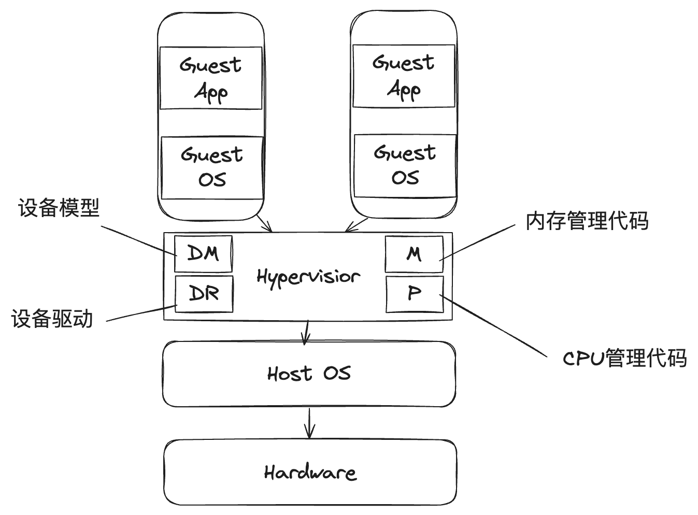
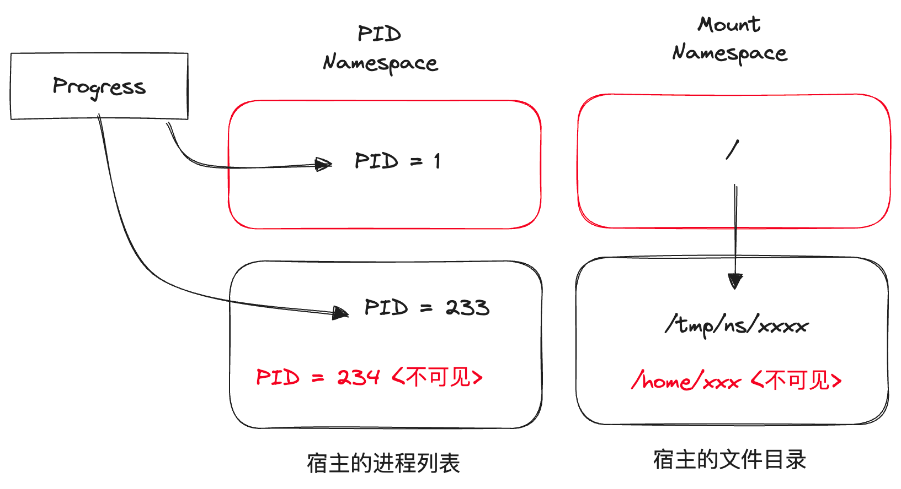
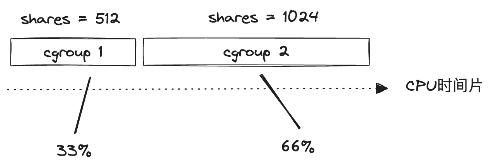
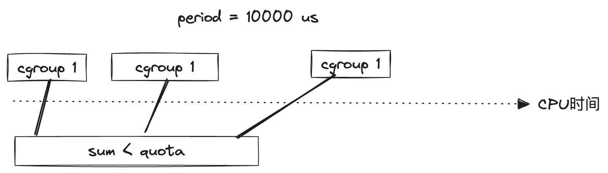
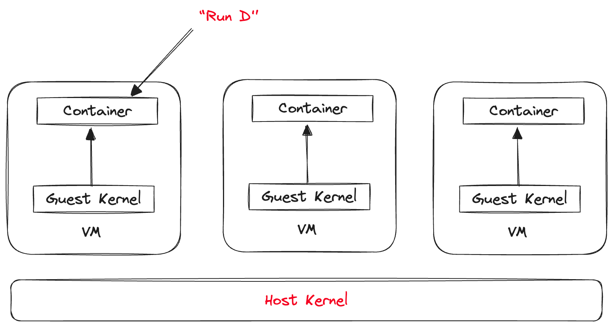
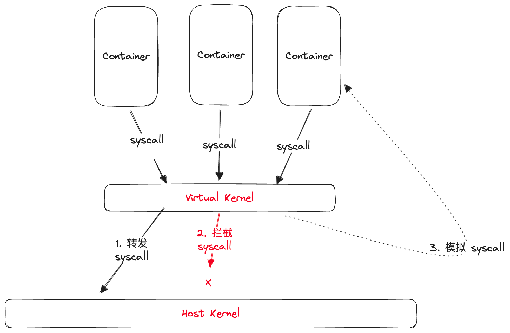

# 01 楔子：从虚拟化到容器

### 虚拟化技术的诞生

虚拟化技术指的是将一个物理硬件虚拟为多个逻辑硬件的技术。

虚拟机技术最初的诞生是由于芯片的摩尔定理导致计算机硬件性能不断提升，而单一软件并不能充分应用硬件的性能，造成资源浪费，为此，硬件厂商通过虚拟化技术将一台物理机虚拟成多台计算机，旨在提高资源的利用率。

近年来，随着互联网规模的不断扩张，超大规模软件的性能消耗远超单一硬件所能提供的水平，进而催生了分布式系统，而分布式系统对集群中单一硬件的性能要求较低，而是强调多副本，这又进一步推动了虚拟化技术的演进。

#### 传统虚拟化

传统虚拟化技术最早可以追溯到上世纪60年代，在批处理系统上，人们通过Hypervisor软件程序来实现多用户，后来随着Unix/Linux等通过分时实现的多用户操作系统的出现，虚拟化技术销声匿迹了一段时间，直到90年代物理硬件规模出现冗余才重新登上历史舞台。



传统虚拟化技术的核心是Hypervisor软件，总的来说，Hypervisor软件会托管物理计算资源，并将其虚拟化为多个逻辑计算机，这些逻辑计算机也被称为虚拟机（VM）。

而在虚拟机上的用户程序，当其运行申请物理资源相关的“虚拟化敏感”指令时，这些请求便会被Hypervisor所拦截，然后根据虚拟化的资源粒度进行控制，最终转发给宿主物理机。

这种虚拟化技术也被称为全虚拟化，其特点是使用简单，Guest OS无需做任何修改，兼容性非常不错，但是相对的，性能上会有一定的影响（毕竟指令经过了一层转发）。这也是现在最为主流、应用最为广泛的虚拟化技术，代表产品有KVM，VirtualBox，VMWare等。

#### 半虚拟化 & 硬件辅助虚拟化

半虚拟化技术，或者叫准虚拟化技术，和全虚拟化很类似，但是加入了GuestOS的针对性优化。在这种方案下，GuestOS需要针对于虚拟化进行一定的改造，集成一些半虚拟化代码，从而能够和Hypervisor更好的进行联动，让Hypervisor不必再拦截所有的指令，从而实现性能的提升。

硬件辅助虚拟化则是通过在CPU等硬件资源中专门加入对虚拟化的支持，从而实现对全虚拟化和半虚拟化性能的优化。

上述两种技术的典型结合就是Xen。

#### 操作系统虚拟化（容器技术）

操作系统虚拟化是一种更为轻量的虚拟化实现，它的思路就是由操作系统内核来实现资源的隔离和分配，虚拟化出多个子环境，让每个子环境中的进程都认为自己是在一个独立的OS中运行，最初的目的是为了实现多用户之间的互相隔离。

操作系统虚拟化相比与传统虚拟化技术和硬件虚拟化技术来说，实现更加轻量，并且由于是OS直接提供支持，不会像外挂的Hypervisor软件一样消耗大量的系统资源。

操作系统虚拟化现在也常被称为"容器技术"，我们通常将操作系统虚拟化出的一个逻辑OS称为容器，一个容器拥有以下两个特征：

- 从软件上讲，一个容器本身就是一个独立的OS，其内部的进程等和其他的容器之间是完全隔离的
- 从硬件上讲，一个容器拥有一定的硬件资源，例如CPU和内存，这些资源是由虚拟化技术基于物理宿主的硬件资源抽象分配而来

容器技术就是指在操作系统虚拟化中，实现这两个容器特征的关键技术，在Linux中对应的实现分别是cgroups和namespace，借助这套能力实现的容器也被称为LXC（Linux Containers）

#### cgroups

cgroups（control groups）是在2006年左右，由Google的工程师所提出的，这一技术是从谷歌内部的Borg系统（即后来的k8s）和GAE平台的实践中所沉淀出来的，并在2007年合并入Linux内核主干Linux，可用于实现对硬件资源的限制性分配。

简要来说，通过cgroups可以定义对各类硬件的资源使用限制，并把这些使用限制关联到一组进程上，这样的一组关联关系被称为一个cgroup。

**子系统**

cgroups对硬件资源的基本抽象是子系统，每一个子系统都对应一个管理某类硬件资源的内核组件，可以使用该子系统来控制对应的硬件资源，例如：

- cpu 子系统，可以用于给进程限制cpu使用率。
- cpuacct 子系统，可以统计 cgroups 中的进程的 cpu 使用报告。
- cpuset 子系统，可以为 cgroups 中的进程分配单独的 cpu 节点或者内存节点。
- memory 子系统，可以限制进程的 memory 使用量。
- blkio 子系统，可以限制进程的块设备 io。
- devices 子系统，可以控制进程能够访问某些设备。
- net_cls 子系统，可以标记 cgroups 中进程的网络数据包，然后可以使用 tc 模块（traffic control）对数据包进行控制。
- freezer 子系统，可以挂起或者恢复 cgroups 中的进程。
- ns 子系统，可以使不同 cgroups 下面的进程使用不同的 namespace。

cgroups中的每一个子系统都有非常复杂的实现，这里暂且按下不表，在后面的延伸部分我们会简单展开聊聊cpu和memory这两个子系统的具体实现。

**Hierarchy**

cgroups中把一系列硬件资源的限制条件以树状的层级形式进行承载，这种结构被称为Hierarchy。


Hierarchy是关联子系统和具体进程之间的桥梁，一个Hierarchy向上关联一个（或几个）具体的子系统，向下每个叶子结点都可以关联一组具体的进程（以css_set结构描述），通过这样的方式就可以形成子系统与进程组之间M x N的组合，实现非常灵活的资源限制能力。

#### namespace

Linux namespace提供了进程之间的隔离机制，简要来说，可以通过`clone`系统调用给一个进程（及其子进程）设定一个独立的命名空间，在该命名空间下的进程将会和宿主本身的其他进程在资源的可见性上完全隔离开来，命名空间在这里类似一个小沙箱的角色。

namespace有许多种类，对应不同的资源隔离，例如PID namespace可以实现进程信息（即task_struct，PCB）本身的隔离，Network namespace可以实现网络空间的隔离。

```text
Namespace   变量               隔离资源
Cgroup      CLONE_NEWCGROUP   Cgroup 根目录
IPC         CLONE_NEWIPC      System V IPC, POSIX 消息队列等
Network     CLONE_NEWNET      网络设备，协议栈、端口等
Mount       CLONE_NEWNS       挂载点
PID         CLONE_NEWPID      进程ID
User        CLONE_NEWUSER     用户和group ID
UTS         CLONE_NEWUTS      Hostname和NIS域名
```



例如我们给进程P设定一个独立的PID namespace，和一个挂载到宿主`/var/ns/xxx`目录的Mount Namespace，就可以实现这样的效果：

- 进程P在其对应的PID namespace中，PID为1，并且进程P认为全局只有它一个进程（实际上在宿主中P的PID为233，P也无法感知到宿主上其他进程如234的存在）
- 进程P在其对应的Mount namespace中所看到的根目录其实是宿主的`/var/ns/xxx`目录，并且P无法感知和访问到宿主中除此之外的目录（如宿主的`/home`)

#### 延伸1：cpu和memory子系统的实现

cgroups中的CPU子系统用于给进程设置CPU资源的使用限制，具体到实现来说，就是控制一个进程所能使用的CPU时间片（因为操作系统对进程的调度就是基于时间片的），即干预内核的进程调度策略。

具体的限制方式有以下几种：

**通过shares值相对分配**

对应cgroup属性`cpu.shares`，根据shares值进行相对限制，例如两个cgroup的`cpu.shares`分别是512和1024，那么最终在进行进程调度的时候，这两个cgroup下进程在一段时间内所分配到的时间片数量比值就会控制在1:2左右。



需要注意的是，shares只在cgroup互相竞争CPU的时候才会起效，比如cgroup2虽然应该分配2/3的时间片，但是如果cgroup2中并没有任何进程在使用cpu，那么实际上整个cpu还是被cgroup1中的进程给独享了。

**通过period和quota进行绝对分配**

对应cgroup属性`cpu.cfs_period_us`和`cpu.cfs_quota_us`，这两个属性需要配套使用，最终达到的效果是限制该cgroup中的进程在`cfs_period_us`的时间段内最多只能运行`cfs_quota_us`微秒。



CPU资源属于一种可压缩资源，当一个进程的CPU被限制后，并不会出现异常，最多是运行变慢或等待一会。相比之下，内存就是一种不可压缩资源，如果进程所需要的内存空间不足，就会立刻触发OOM异常退出。

cgroup中对于内存的限制能力可以重点关注以下几个字段（不考虑使用SWAP的情况）：

- `memory.limit_in_bytes`：设定cgroup所能使用内存的最大硬限制，当cgroup使用当内存超过这个阈值时就会触发oom
- `memory.oom_control`：当cgroup达到oom时，系统的处理方式
- `memory.soft_limit_in_bytes`：设定cgroup所能使用内存的最大软限制，达到软限制时不会触发oom，内核会尝试回收cgroup的内存并使其降到软限制以下（可以理解成一种GC）。soft_limit的值设置应该小于硬限制。

对于`oom_control`，有两种取值：

1. 默认为0表示打开oom killer，对应的处理方式是直接kill掉cgroup中触发oom的进程
2. 设置为1表示关闭oom killer，此时cgroup中触发oom的进程不会被直接kill，而是会被标记为挂起状态丢进一个OOM-waitqueue的队列中，此时如果cgroup中的内存被释放腾挪（比如kill了一些cgroup
   中其他占用内存的进程），就会从OOM-waitqueue中唤醒一部分进程尝试恢复

#### 延伸2：RunC & RunD

操作系统虚拟化相比于传统虚拟化来说非常轻量，不过其安全性完全由操作系统的内核保障，那么内核真的安全吗？我们可以完全信任内核吗？

从实际情况来，并不是这样，毕竟只要是人写的代码就一定会存在bug，这是无法避免的，所以普通的LXC容器（简称RunC）都是有安全问题的，黑客通过某些内核漏洞，可以破坏隔离机制来做一些坏事。

反过来看，传统虚拟化技术是非常安全的（物理层面，并且由于是直接拦截CPU指令等物理机指令，相比300多个Linux的内核调用来说，出错的概率要小很多），但是它的运行速度和效率却十分低下。

是否有可能存在一种将两者优点结合的技术？这就是安全容器（简称runD）所要解决的问题。

要解决安全问题，最简单直接的办法就是添加一个隔离层，只要能够把容器内所有的内核调用和宿主的内核之间有效的进行隔离，就可以避免容器影响宿主本身，目前业界有两种主流的思路来实现安全容器。

**vm隔离**

第一种思路是回到传统虚拟化技术，由vm来实现隔离层，但这个vm相比于传统的vm可以做的非常轻，只需要提供一个最精简的Linux内核即可，然后再利用这个vm创建一个容器，就可以在容器与宿主OS之间创建出一个vm的隔离层来。



这种思路从本质上来说，是提供了一种"用起来像容器的vm"，已经不再是标准意义上操作系统虚拟化，只是体验上接近。典型的代表是kata container，目前这种vm的启动速度和性能消耗已经优化到和普通容器十分接近了。

**用户态内核**

第二种思路就是在用户态搞一个虚拟内核，所有容器的系统调用不会直接调用到宿主的内核，而是被这个虚拟内核托管，再由虚拟内核决定是否要真的进行系统调用，或是进行拦截，可以认为是用虚拟内核给真实的系统内核上了一个"防火墙"：



这种思路的代表性实现是Google的gVisor，gVisor提供的虚拟内核对于容器的系统策略有三种处理方式：

1. 转发给系统内核。在gVisor中只有大约60个（约1/5）的系统调用被认为是安全可靠的，这些系统调用会被转发给内核真实执行。
2. 直接拒绝。Linux内核中存在很多冷门且疏于维护的系统调用，通常被用来攻击内核的就是这些系统调用，因此gVisor给这些系统调用打入了黑名单，只要识别到就直接拒绝。
3. 模拟实现。对于部分比较危险但又很常用的系统调用，gVisor在用户态重新封装了模拟实现，例如`open()`，这样就既能够保障功能不受影响，同时又能避免内核直接受到攻击。

### Docker：改写软件交付

#### 镜像

**UnionFS**

#### 容器

#### 基于Docker的软件交付