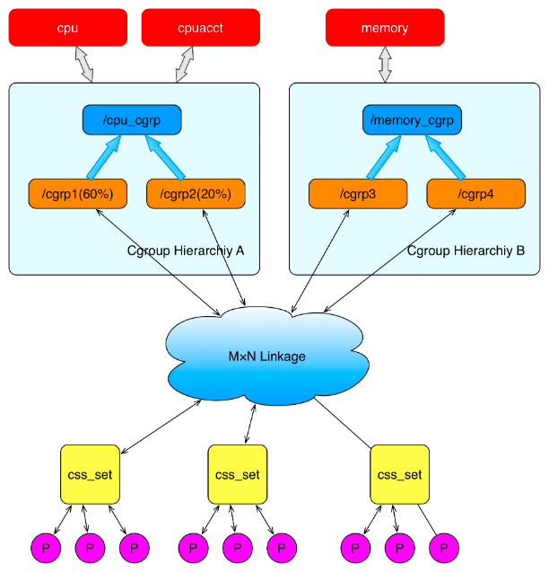
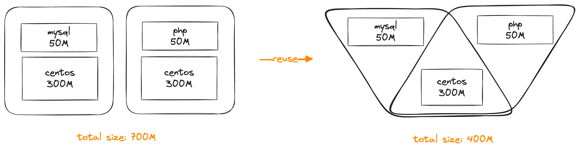
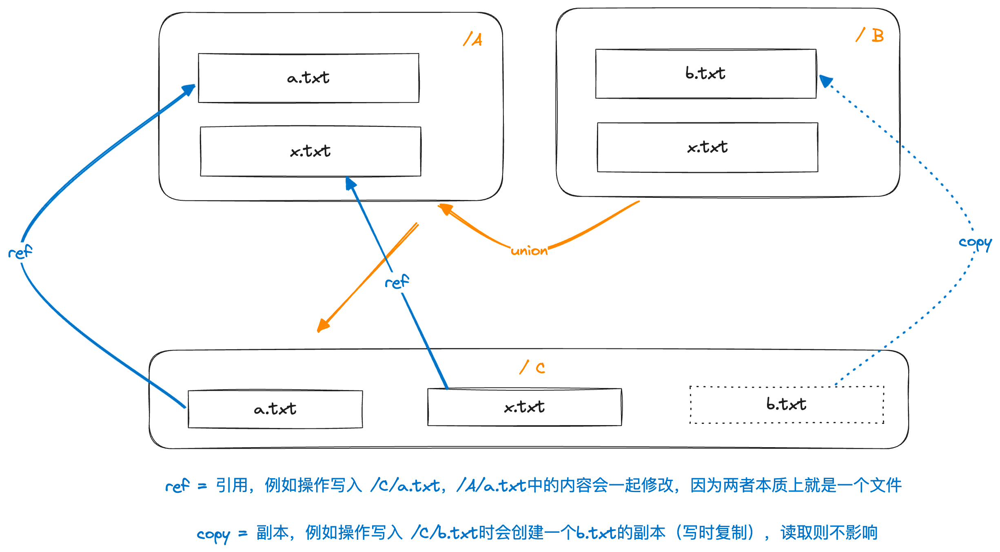
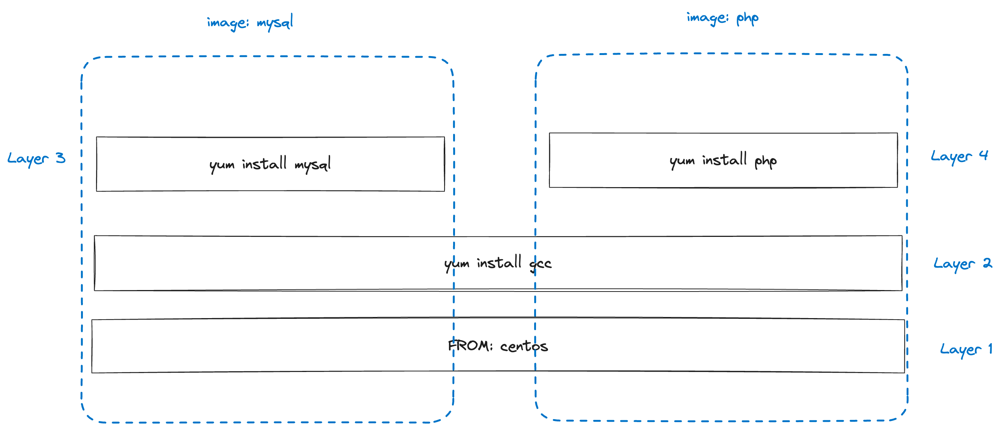
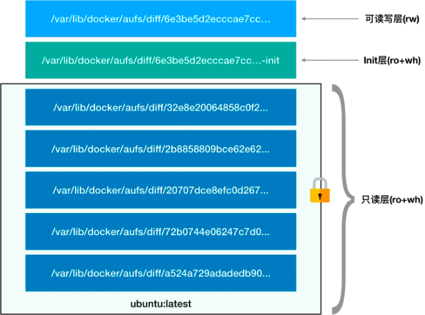
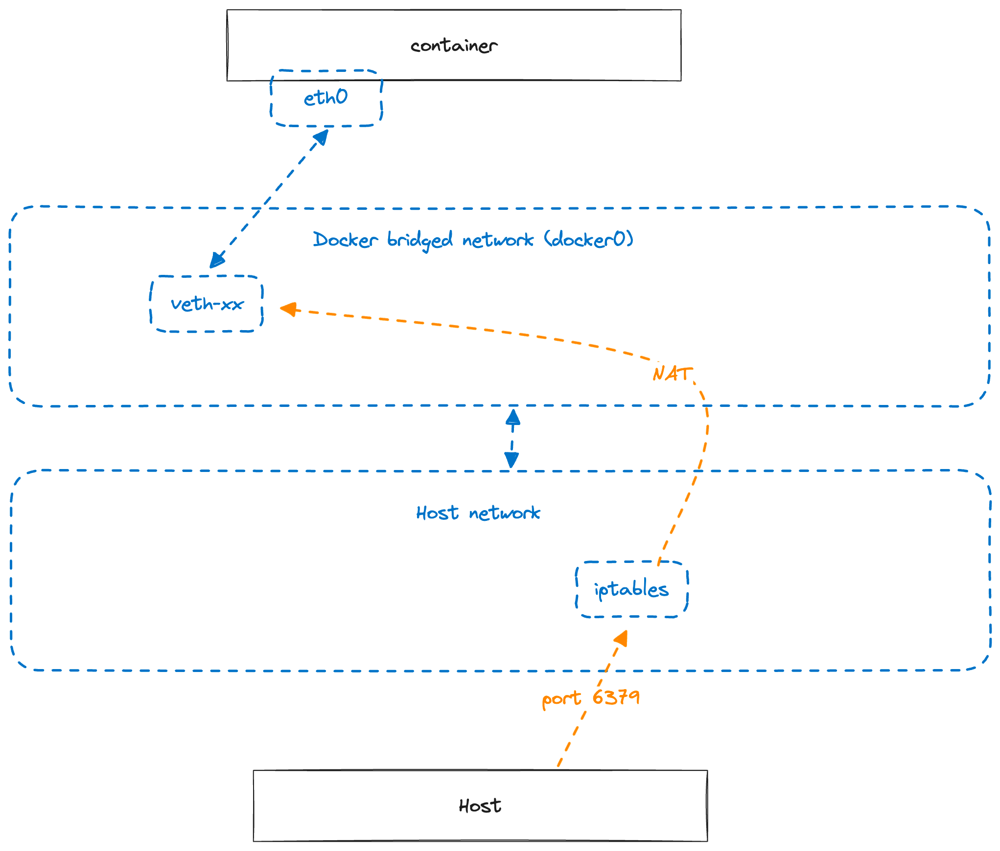

# 01 楔子：从虚拟化到容器

### 虚拟化技术的诞生

虚拟化技术指的是将一个物理硬件虚拟为多个逻辑硬件的技术。

虚拟机技术最初的诞生是由于芯片的摩尔定理导致计算机硬件性能不断提升，而单一软件并不能充分应用硬件的性能，造成资源浪费，为此，硬件厂商通过虚拟化技术将一台物理机虚拟成多台计算机，旨在提高资源的利用率。

近年来，随着互联网规模的不断扩张，超大规模软件的性能消耗远超单一硬件所能提供的水平，进而催生了分布式系统，而分布式系统对集群中单一硬件的性能要求较低，而是强调多副本，这又进一步推动了虚拟化技术的演进。

#### 传统虚拟化

传统虚拟化技术最早可以追溯到上世纪60年代，在批处理系统上，人们通过Hypervisor软件程序来实现多用户，后来随着Unix/Linux等通过分时实现的多用户操作系统的出现，虚拟化技术销声匿迹了一段时间，直到90年代物理硬件规模出现冗余才重新登上历史舞台。


传统虚拟化技术的核心是Hypervisor软件，总的来说，Hypervisor软件会托管物理计算资源，并将其虚拟化为多个逻辑计算机，这些逻辑计算机也被称为虚拟机（VM）。

而在虚拟机上的用户程序，当其运行申请物理资源相关的“虚拟化敏感”指令时，这些请求便会被Hypervisor所拦截，然后根据虚拟化的资源粒度进行控制，最终转发给宿主物理机。

这种虚拟化技术也被称为全虚拟化，其特点是使用简单，Guest OS无需做任何修改，兼容性非常不错，但是相对的，性能上会有一定的影响（毕竟指令经过了一层转发）。这也是现在最为主流、应用最为广泛的虚拟化技术，代表产品有KVM，VirtualBox，VMWare等。

#### 半虚拟化 & 硬件辅助虚拟化

半虚拟化技术，或者叫准虚拟化技术，和全虚拟化很类似，但是加入了GuestOS的针对性优化。在这种方案下，GuestOS需要针对于虚拟化进行一定的改造，集成一些半虚拟化代码，从而能够和Hypervisor更好的进行联动，让Hypervisor不必再拦截所有的指令，从而实现性能的提升。

硬件辅助虚拟化则是通过在CPU等硬件资源中专门加入对虚拟化的支持，从而实现对全虚拟化和半虚拟化性能的优化。

上述两种技术的典型结合就是Xen。

#### 操作系统虚拟化（容器技术）

操作系统虚拟化是一种更为轻量的虚拟化实现，它的思路就是由操作系统内核来实现资源的隔离和分配，虚拟化出多个子环境，让每个子环境中的进程都认为自己是在一个独立的OS中运行，最初的目的是为了实现多用户之间的互相隔离。

操作系统虚拟化相比与传统虚拟化技术和硬件虚拟化技术来说，实现更加轻量，并且由于是OS直接提供支持，不会像外挂的Hypervisor软件一样消耗大量的系统资源。

操作系统虚拟化现在也常被称为"容器技术"，我们通常将操作系统虚拟化出的一个逻辑OS称为容器，一个容器拥有以下两个特征：

- 从软件上讲，一个容器本身就是一个独立的OS，其内部的进程等和其他的容器之间是完全隔离的
- 从硬件上讲，一个容器拥有一定的硬件资源，例如CPU和内存，这些资源是由虚拟化技术基于物理宿主的硬件资源抽象分配而来

容器技术就是指在操作系统虚拟化中，实现这两个容器特征的关键技术，在Linux中对应的实现分别是cgroups和namespace，借助这套能力实现的容器也被称为LXC（Linux Containers）

#### cgroups

cgroups（control groups）是在2006年左右，由Google的工程师所提出的，这一技术是从谷歌内部的Borg系统（即后来的k8s）和GAE平台的实践中所沉淀出来的，并在2007年合并入Linux内核主干Linux，可用于实现对硬件资源的限制性分配。

简要来说，通过cgroups可以定义对各类硬件的资源使用限制，并把这些使用限制关联到一组进程上，这样的一组关联关系被称为一个cgroup。

**子系统**

cgroups对硬件资源的基本抽象是子系统，每一个子系统都对应一个管理某类硬件资源的内核组件，可以使用该子系统来控制对应的硬件资源，例如：

- cpu 子系统，可以用于给进程限制cpu使用率。
- cpuacct 子系统，可以统计 cgroups 中的进程的 cpu 使用报告。
- cpuset 子系统，可以为 cgroups 中的进程分配单独的 cpu 节点或者内存节点。
- memory 子系统，可以限制进程的 memory 使用量。
- blkio 子系统，可以限制进程的块设备 io。
- devices 子系统，可以控制进程能够访问某些设备。
- net_cls 子系统，可以标记 cgroups 中进程的网络数据包，然后可以使用 tc 模块（traffic control）对数据包进行控制。
- freezer 子系统，可以挂起或者恢复 cgroups 中的进程。
- ns 子系统，可以使不同 cgroups 下面的进程使用不同的 namespace。

cgroups中的每一个子系统都有非常复杂的实现，这里暂且按下不表，在后面的延伸部分我们会简单展开聊聊cpu和memory这两个子系统的具体实现。

**Hierarchy**

cgroups中把一系列硬件资源的限制条件以树状的层级形式进行承载，这种结构被称为Hierarchy。



Hierarchy是关联子系统和具体进程之间的桥梁，一个Hierarchy向上关联一个（或几个）具体的子系统，向下每个叶子结点都可以关联一组具体的进程（以css_set结构描述），通过这样的方式就可以形成子系统与进程组之间M x N的组合，实现非常灵活的资源限制能力。

#### namespace

Linux namespace提供了进程之间的隔离机制，简要来说，可以通过`clone`系统调用给一个进程（及其子进程）设定一个独立的命名空间，在该命名空间下的进程将会和宿主本身的其他进程在资源的可见性上完全隔离开来，命名空间在这里类似一个小沙箱的角色。

namespace有许多种类，对应不同的资源隔离，例如PID namespace可以实现进程信息（即task_struct，PCB）本身的隔离，Network namespace可以实现网络空间的隔离。

```text
Namespace   变量               隔离资源
Cgroup      CLONE_NEWCGROUP   Cgroup 根目录
IPC         CLONE_NEWIPC      System V IPC, POSIX 消息队列等
Network     CLONE_NEWNET      网络设备，协议栈、端口等
Mount       CLONE_NEWNS       挂载点
PID         CLONE_NEWPID      进程ID
User        CLONE_NEWUSER     用户和group ID
UTS         CLONE_NEWUTS      Hostname和NIS域名
```


例如我们给进程P设定一个独立的PID namespace，和一个挂载到宿主`/var/ns/xxx`目录的Mount Namespace，就可以实现这样的效果：

- 进程P在其对应的PID namespace中，PID为1，并且进程P认为全局只有它一个进程（实际上在宿主中P的PID为233，P也无法感知到宿主上其他进程如234的存在）
- 进程P在其对应的Mount namespace中所看到的根目录其实是宿主的`/var/ns/xxx`目录，并且P无法感知和访问到宿主中除此之外的目录（如宿主的`/home`)

#### 延伸1：cpu和memory子系统的实现

cgroups中的CPU子系统用于给进程设置CPU资源的使用限制，具体到实现来说，就是控制一个进程所能使用的CPU时间片（因为操作系统对进程的调度就是基于时间片的），即干预内核的进程调度策略。

具体的限制方式有以下几种：

**通过shares值相对分配**

对应cgroup属性`cpu.shares`，根据shares值进行相对限制，例如两个cgroup的`cpu.shares`分别是512和1024，那么最终在进行进程调度的时候，这两个cgroup下进程在一段时间内所分配到的时间片数量比值就会控制在1:2左右。


需要注意的是，shares只在cgroup互相竞争CPU的时候才会起效，比如cgroup2虽然应该分配2/3的时间片，但是如果cgroup2中并没有任何进程在使用cpu，那么实际上整个cpu还是被cgroup1中的进程给独享了。

**通过period和quota进行绝对分配**

对应cgroup属性`cpu.cfs_period_us`和`cpu.cfs_quota_us`，这两个属性需要配套使用，最终达到的效果是限制该cgroup中的进程在`cfs_period_us`的时间段内最多只能运行`cfs_quota_us`微秒。


CPU资源属于一种可压缩资源，当一个进程的CPU被限制后，并不会出现异常，最多是运行变慢或等待一会。相比之下，内存就是一种不可压缩资源，如果进程所需要的内存空间不足，就会立刻触发OOM异常退出。

cgroup中对于内存的限制能力可以重点关注以下几个字段（不考虑使用SWAP的情况）：

- `memory.limit_in_bytes`：设定cgroup所能使用内存的最大硬限制，当cgroup使用当内存超过这个阈值时就会触发oom
- `memory.oom_control`：当cgroup达到oom时，系统的处理方式
- `memory.soft_limit_in_bytes`：设定cgroup所能使用内存的最大软限制，达到软限制时不会触发oom，内核会尝试回收cgroup的内存并使其降到软限制以下（可以理解成一种GC）。soft_limit的值设置应该小于硬限制。

对于`oom_control`，有两种取值：

1. 默认为0表示打开oom killer，对应的处理方式是直接kill掉cgroup中触发oom的进程
2. 设置为1表示关闭oom killer，此时cgroup中触发oom的进程不会被直接kill，而是会被标记为挂起状态丢进一个OOM-waitqueue的队列中，此时如果cgroup中的内存被释放腾挪（比如kill了一些cgroup
   中其他占用内存的进程），就会从OOM-waitqueue中唤醒一部分进程尝试恢复

#### 延伸2：RunC & RunD

操作系统虚拟化相比于传统虚拟化来说非常轻量，不过其安全性完全由操作系统的内核保障，那么内核真的安全吗？我们可以完全信任内核吗？

从实际情况来，并不是这样，毕竟只要是人写的代码就一定会存在bug，这是无法避免的，所以普通的LXC容器（简称RunC）都是有安全问题的，黑客通过某些内核漏洞，可以破坏隔离机制来做一些坏事。

反过来看，传统虚拟化技术是非常安全的（物理层面，并且由于是直接拦截CPU指令等物理机指令，相比300多个Linux的内核调用来说，出错的概率要小很多），但是它的运行速度和效率却十分低下。

是否有可能存在一种将两者优点结合的技术？这就是安全容器（简称runD）所要解决的问题。

要解决安全问题，最简单直接的办法就是添加一个隔离层，只要能够把容器内所有的内核调用和宿主的内核之间有效的进行隔离，就可以避免容器影响宿主本身，目前业界有两种主流的思路来实现安全容器。

**vm隔离**

第一种思路是回到传统虚拟化技术，由vm来实现隔离层，但这个vm相比于传统的vm可以做的非常轻，只需要提供一个最精简的Linux内核即可，然后再利用这个vm创建一个容器，就可以在容器与宿主OS之间创建出一个vm的隔离层来。


这种思路从本质上来说，是提供了一种"用起来像容器的vm"，已经不再是标准意义上操作系统虚拟化，只是体验上接近。典型的代表是kata container，目前这种vm的启动速度和性能消耗已经优化到和普通容器十分接近了。

**用户态内核**

第二种思路就是在用户态搞一个虚拟内核，所有容器的系统调用不会直接调用到宿主的内核，而是被这个虚拟内核托管，再由虚拟内核决定是否要真的进行系统调用，或是进行拦截，可以认为是用虚拟内核给真实的系统内核上了一个"防火墙"：


这种思路的代表性实现是Google的gVisor，gVisor提供的虚拟内核对于容器的系统策略有三种处理方式：

1. 转发给系统内核。在gVisor中只有大约60个（约1/5）的系统调用被认为是安全可靠的，这些系统调用会被转发给内核真实执行。
2. 直接拒绝。Linux内核中存在很多冷门且疏于维护的系统调用，通常被用来攻击内核的就是这些系统调用，因此gVisor给这些系统调用打入了黑名单，只要识别到就直接拒绝。
3. 模拟实现。对于部分比较危险但又很常用的系统调用，gVisor在用户态重新封装了模拟实现，例如`open()`，这样就既能够保障功能不受影响，同时又能避免内核直接受到攻击。

### Docker：改写软件交付

容器技术在2007年左右就已经问世，但并没有在工程界掀起太大的波澜，此时的容器技术主要被用于隔离，还没有和软件交付牵扯上什么关系。直到2013年左右Docker的出现，通过引入镜像这一绝妙的设计直接改写了软件交付的事实标准，容器技术才真正被发扬光大。

在Docker提出基于容器镜像的软件交付方式之前，服务端的软件交付和部署都是非常混乱且琐碎的，比如要部署一个服务端的应用，往往需要下载安装大量的软件包，再编写各种配置文件，执行一堆脚本，更要命的是，如果使用的Linux发行版有较大的不同，那么各种软件包的版本兼容将可能是一场噩梦。

有没有可能把服务端的软件交付做成像智能手机的应用市场那样，一键安装和使用呢？答案是可能的，Docker通过引入镜像的概念，将软件和其依赖的环境进行整合打包，绑定成一个整体，再结合操作系统虚拟化技术使得镜像可以独立隔离运行，如此一来，镜像就变成了一种可分发的、标准化的产物。

#### 镜像

通过上文的描述不难看出，镜像正是Docker改变软件交付格局的要点所在，那么镜像究竟是什么呢？

从本质上来看，（在Linux下）一个Docker镜像就是一个rootfs，即一个完整的根目录，包含了一个OS所有完整的文件内容，这就是为什么镜像可以保证软件运行环境的一致性：因为镜像已经把软件所运行的OS环境整个都给打包了。

我们可以通过将Docker镜像文件解压来验证这一点：

```shell
$ docker export $(docker create busybox) | tar -C rootfs -xvf -

# 得到的产物：一个完整的rootfs
bin  dev  etc  home proc root sys  tmp  usr  var
```

看到这里我们已经可以大致推断出，Docker运行镜像时就是通过mount namespace把镜像中打包好的rootfs作为隔离容器的根目录，从而还原出一个和镜像打包时一模一样的OS环境。

这种实现方式可以说非常简单粗暴，但很容易发现一个问题，那就是由于要打包完整的rootfs，镜像的体积会变得非常大：

我们可以设想一下，一个简化版本的centos发行版镜像大小大约在300M上下，如果按照这种方式把centos的rootfs和软件打包在一起，那么每个软件的体积都要额外增加300M，更不要说大多数的软件还有额外的依赖。显然这种做法会造成大量的磁盘空间占用，而且如果通过网络分发镜像也会造成大量的带宽占用，因此优化镜像空间占用就成了镜像是否能够"流动"起来的关键性问题。

但如果仔细观察一下，不难发现镜像与镜像之间有非常多的内容是重复的，例如基于centos分别创建一个mysql和一个php镜像，这两个镜像中除了各自软件包的部分有所不同，基底的os镜像（centos）都是完全一致的，那么这部分一致的空间是否可以复用呢？



答案当然是确定的，Docker通过UnionFS技术实现了这一点，所以下面我们先来聊聊UnionFS是什么，又是如何运作的。

**UnionFS**

联合文件系统（UFS），最主要的功能是将多个目录挂载合并到同一个目录下，举个例子：

```text
tree
.
├── A
│   ├── a.txt
│   └── x.txt
└── B
    ├── b.txt
    └── x.txt
```

对于上面这样一个目录结构，可以通过mount把它们挂载到一个共同目录`C`下面：

```text
mount -t aufs -o dirs=./A:./B none ./C

$ tree ./C
./C
├── a.txt
├── b.txt
└── x.txt
```

> 这里的aufs是ufs的一种实现，原本命名为another union file system，后来直接改名为advanced union file system，这也是Docker默认所使用的ufs实现

上述命令把目录B融合到了目录A上，并形成了一个新的目录C，当然目录C不是粗暴地把目录A和B中的文件拷贝过来这么简单，而是有一定的读写权限控制。aufs中对于融合前的目录设定了两种策略：

- rw（可读写）：引用原目录中的文件，即在融合后的目录中操作对应文件时就是操作原始文件
- ro（只读）：拷贝原目录中的文件，读取时仍然是读取的原始文件，只有在对该文件进行写入操作的时候才会产生一份新的拷贝（即写时复制）

以上面的case为例，由于没有指定具体的读写策略，默认会将第一个目录（A）设置为rw，第二个目录（B）设置为ro，效果如下：



**Layer**

借助UFS就可以实现镜像内容的复用，只需要把底层共同依赖的部分（如centos）和上层软件部分（如mysql）通过UFS挂载在一起，并且将共同依赖的部分设置为ro，软件部分设置成rw，就能在复用缩减镜像体积的同时，保障不同镜像之间的内容互不干扰。

按照这个思路，Docker在UFS的基础上抽象出了层（Layer）的概念，每一次对镜像的操作都会产生一个全新的完整rootfs，但这个rootfs是在之前的基础上通过ufs挂载一个新目录而形成，如此一来，一个完整镜像就变成了层的叠加，而每一层都只是逻辑上的一个ufs，并且相同的层可以被任意镜像所复用，这样就极大缩减了镜像的体积，并且使得镜像的构建方式变得异常灵活：



借助Layer的抽象复用，Docker镜像的体积大小逐渐降到了可接受的范围，而正因如此镜像才可以被更好地通过网络分发，Docker在此基础上建立了全球性的镜像仓库Docker Hub，至此，服务端软件交付的"App Store"终于真正被实现了。

#### 容器

在了解过cgroups、namespace、ufs等技术后，Docker中的容器也就不再是什么神秘的东西了。稍作思考就可以明白，所谓的容器，就是将镜像中的rootfs作为mount namespace挂载，再通过pid 、network等namespace隔离，最后使用cgroups加以硬件资源限制的一组进程。

因此在这部分仅讨论一些小的细节实现，以便大家更好地理解Docker容器的运行机制。

**运行时Layer**

当一个镜像被运行起来后，就得到了容器，由于容器本身是正在运行的一组进程，在运行过程中势必会发生对镜像本身rootfs的修改，这里为了保证原始的镜像文件不被破坏，Docker在运行一个镜像时，会在镜像上再叠加两个Layer，运行的容器中所发生的所有修改都只会在这两个Layer中进行，而原本镜像的Layer都以ro方式挂载，这样就可以保障容器运行时所发生的修改不会干扰原始的镜像。



这两个叠加的Layer一个被称为Init层，另一个被称为可读写层（位于顶部），其中Init层首先被创建，这是Docker设定的一个内部层，主要用于存放一些和当前容器相关的配置项，如etc/hosts等。可读写层最后被创建，且以rw方式挂载，容器运行时所发生的所有修改都只对rw层生效。

新增的rw层可以保障文件新建/修改时不影响底层Layer，但是无法处理删除文件的情况，为了解决这个问题，UFS还提供了一个"白屏障"技术（简称为wh），当rw层中删除一个文件时，并不会真的删除该文件，而是生成一个对应的`.wh`文件，当ufs识别到存在`.wh`文件时，对上层就会封装成该文件已经被删除的样子，可以说是一种逻辑删除的形式。

**网络环境桥接**

最后来思考一下容器内部如何进行网络链接，Docker在创建容器的进程时候，会设定独立的Network namespace，这时容器内部的网络和宿主是完全隔离的。

但绝大多数时候我们都需要容器和宿主之间的网络能够互相联通（首先，宿主要能够访问容器所提供的服务，其次，容器也需要通过宿主访问到外部的网络）。 为此Docker额外为容器提供了一系列的网络联通机制，其中默认的是网桥机制。

在网桥机制下，Docker会在宿主机上创建一个虚拟的网桥`docker0`，当一个容器启动时，Docker会创建一对互相联通的虚拟网卡，其中一个放置在容器内，另一个则放置在虚拟网桥中，这样就可以实现容器和宿主网络的互通。

> 经过虚拟网桥转发数据会造成一定的性能损耗，因此对于网络通信要求特别高的场景不适用桥接模式

除此之外，Docker还通过iptables转发规则，实现了宿主机上指定端口转发到指定容器的能力，例如执行`docker run redis -d -p 6379`，就会在宿主机的iptables设定一个NAT转发规则，之后宿主机器上请求`127.0.0.1:6379`的请求都会被转发给`docker0`桥接网络，再进一步转发到对应的容器内部。



#### 小结

不难看出，Docker的核心技术（cgroups、namespace、ufs）本身都不是什么新技术，但经过有机的组合，以及镜像和容器的概念抽象后，就完全改写了软件交付的方式。

就像2007年初代iPhone的问世一样，它对业界的影响是长久且深远的，甚至推动了整个云计算行业后续的变革。
现如今我们耳熟能详的微服务、DevOPS甚至是云原生等概念，可以说都是在Docker的基础上发展而来，在后面的篇章中我们将会按照时间线一步步去体会云计算的演变。

