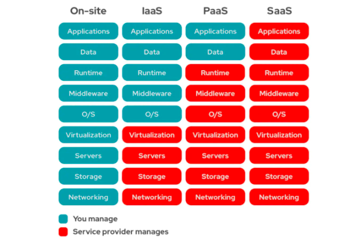
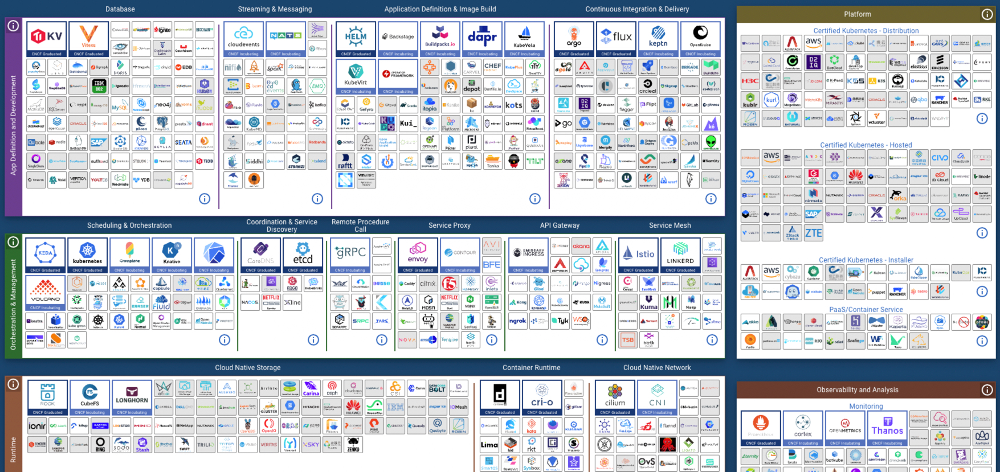

# 02 云计算的混沌时代

### 萌芽：IaaS时代

云计算本质上是售卖计算机算力的生意，在云计算的古早时期，算力是以硬件机器的规格作为标准（例如CPU的核心数、内存的容量大小），
因此这时云计算行业的核心业务就是售卖原始硬件这些计算的基础设施，这种业务模式被称为IaaS（Infrastructure as a Service，基础设施即服务）。

#### 从VM开始

上世纪90年代开始，在摩尔定律的支配下，计算机物理硬件的算力几乎呈指数倍增长，很快就出现了硬件过剩，为了能够提高硬件资源的利用率，以VM为代表的虚拟化技术被发扬光大。

在此背景下，一些硬件资源非常充足的商业公司（例如IBM、亚马逊等）开始将部分冗余的算力以物理机或VM的形式进行售卖，这便是最早的云计算产业雏形。

#### AWS

AWS（Amazon Web Service）是IaaS时代的开创和引领者，也是当今云计算产业的龙头企业。

在IaaS时代，AWS的标志性产品是EC（Elastic Compute），提供了多种不同规格的VM资源售卖，对于用户而言，不需要考虑这些VM具体的物理部署细节，例如机房地点、网络等，可以大大节省运维开销，并且由于EC实例本身支持多种规格的扩展，也能够在帮助用户节省开销的同时，避免后期规模增长而需要升级硬件规格所带来的不便。

对于绝大多数的中小企业而言，使用EC实例相比自行搭建物理机房来说，在稳定性、运维成本、价格等方便都有着碾压级的优势，很快就得到了市场的青睐，这种基于VM的IaaS交付在后续很长的一段时间内都是各大云计算厂商的核心业务模式。

### 混战：PaaS时代

随着越来越多的业务服务开始采用云计算资源作为自己的基础设施，对于云计算的诉求也逐渐向更高的抽象层次发展。
在IaaS模式下，云计算厂商只为客户提供VM形式的基础硬件资源，但VM内部的操作系统、软件包等仍然需要用户自行安装和运维。

随着服务端工程复杂度的不断演进，越来越多和业务逻辑完全无关中间件能力被抽象出来（如数据库、缓存、消息队列、对象存储等）独立发展，这些中间件逐渐发展成和硬件资源一样通用的"基础设施"，对于大多数云计算的使用方而言，自然希望这些中间件的构建和运维也能够进一步被云厂商所托管，如此一来，云计算的客户就可以更多的关注应用本身的实现。

至此，以应用为中心的云计算交付模式逐渐成型，这种交付模式目前也被称为PaaS（Platform as a Service，平台即服务），这里的平台即是指云厂商围绕应用而提供的一系列平台化能力（包括中间件平台、应用部署集成甚至是应用开发平台）。

PaaS交付模式可以说是云计算行业诞生以来所经历的一次重要变革，各大云计算厂商对于PaaS这一命题，各自给出了不同的答卷，市场竞争一度十分激烈。

#### 先行者 - GAE

在AWS开创了云计算市场不久后的2008年，Google也加入了云计算行业的竞争，但他们给出了一种和EC完全不同的解决方案 —— GAE（Google App Engine）。

GAE并不以VM形式提供计算资源的交互，而是以应用为中心提供了大量的平台化集成能力，包括存储、网络、消息等。在GAE中不存在VM这样的标准计算资源，用户也不需要关心具体的基础设施实现，只需要提供应用的代码包就可以部署和运行服务，GAE甚至可以根据流量大小帮助用户自动调整硬件资源的规格，实现按量计费。

以如今的眼光来看，GAE就是典型的PaaS式云计算服务，但在云计算行业初期，大部分的云计算用户并不能够很快接受这样的高级抽象，并且在早期的GAE中对应用的代码编写拥有非常多的限制，这进一步加剧了使用者对于应用可移植性等方便的担忧。

相比之下，AWS EC这种IaaS模式的交付更加简单、可靠，也更能被大众所广泛接受，因此GAE问世后的市场反响非常糟糕（相比于同时期的AWS和Azure来说），但不可否认的是，GAE确实迈出了云计算从IaaS走向PaaS的第一步。

GAE本身脱胎于谷歌内部的基础设施服务Borg，尽管在此时并没有受到太大的关注，但在不久后它将以另一个名字改写整个PaaS生态，并成为PaaS时代最大的赢家。

#### 容器崛起

2007年LXC技术问世，但却一直没能卷起太大的波澜，直到2013年Docker诞生，彻底改写了软件交付的方式，而这也非常深远地影响了整个云计算行业。
此时的云计算行业正在探索以应用为核心的PaaS模式，而Docker的出现直接让"应用交付"这一难题有了标准答案，为整个PaaS生态的发展指明了方向。

至此，容器成为PaaS模式下应用交付的核心，各大云厂商开始围绕容器标准迅速构建各种配套能力，可以说是"得容器者得天下"，而PaaS的"以应用为中心"这一概念，在最终落地上也就演变成了容器的运维管理能力（也被称为容器编排）。

#### Docker的野心

作为把容器技术发扬广大的"第一人"，Docker此时可以说是垄断了容器的事实标准，而Docker公司也并不打算只当一个简单的技术方案提供者，而是期望能够通过容器作为切入点在云计算行业占有自己的一席之地。

上面说到，在容器技术崛起后，容器的运维管理就成了PaaS模式下需要解决的最核心问题，此时的Docker充分发挥了近水楼台先得月的优势，顺势推出了一套完整的容器编排方案，这套管理方案由三部分组成，也被称为"Docker三剑客"：

- Docker Machine：

  >Docker是基于Linux LXC技术构建的，如果希望在其他操作系统平台上也能运行Docker容器，就需要模拟出一个Linux环境，Docker 
  > Machine正是用于解决这个问题，以提供Docker服务的多平台部署（通常借助vm技术实现）

- Docker Compose： 
  
  > 在有了容器后，一个完整的应用可以被更细粒度地拆分成多个容器，每个容器内提供一定的单元化能力（例如数据库容器、缓存容器、Web服务容器），这样可以更好地对应用结构进行解耦，同时实现更细粒度的资源分配。
  > 
  > 在此模式下部署一个完整应用就需要部署多个容器，同时还需要进行容器之间的连接配置（如通信端口），甚至还需要维护容器的启动和停止顺序，Docker 
  > Compose正是为了系统性的解决这个问题而诞生，它通过一个标准的yaml文件来定义和配置一个应用内的多个容器，使得应用本身的启动和停止可以简化成一行简单的docker-compose命令。

- Docker Swarm：

  > 在分布式系统出现后，集群代替物理机称为应用部署的最小单位，因此一个容器的完整部署需要覆盖集群中的每一台物理机，Docker 
  > Swarm把一个集群内各个物理机上的单点Docker服务组合在一起形成一个整体，以便使用者可以通过Docker服务方便的对整个集群进行容器运维管理

三剑客构建了一套完整的容器编排能力，Docker公司对其寄予厚望，希望以此为突破口进军云计算行业，甚至进一步拿下PaaS模式的标准解释权，但各大云厂商显然不会坐以待毙。

AWS很快推出了自己的容器编排服务ACS，并且向下兼容Docker-Swarm；Google此时也再度重出江湖，在GAE和Borg的基础上开源了名为Kubernetes的容器编排系统，一时间整个PaaS领域形成三足鼎立的局面。

不仅如此，为了避免Docker在容器技术上形成垄断，各大厂商联合开源社区制定出了CRI容器标准规范，在此基础上涌现出一系列开源的容器实现如rkt、containerd等，Docker不再是唯一的选择，PaaS领域的竞争此时达到了一个白热化阶段。

#### 胜者书写历史

经过一段时间的并行发展，来自Google的Kubernetes最终凭借其出色的设计以及强大的社区，成为了容器编排方案的事实标准，
2017年Docker开始主动转向拥抱Kubernetes生态，到2020年左右，各大主流云厂商基本都开始大力拥抱Kubernetes生态，
2021年初AWS下线ACS，投入Kubernetes怀抱，至此PaaS三国杀终于迎来了结局。

时至今日，以Kubernetes为代表的容器编排能力已经是各大云计算厂商提供PaaS能力的标准解决方案，整个云计算产业也在PaaS模式的加持下进一步扩宽了市场范围，至此云计算的上半场已经接近尾声。

关于Kubernetes的设计思路和原理分析我们会留在下文详细展开。

### 云原生会是下一个答案吗？

2015年，Google联合开源基金会成立了CNCF（Cloud Native Compute Foundation）组织，提出了对于云计算行业未来的愿景：

未来的应用不应该再是从本地"被迁移"到云上，而应该从一开始就为云端运行所设计，从而能够在云计算平台上获得更优的性能和更低的成本，这样的应用被称为"云原生"应用。

CNCF正是基于这样的愿景而成立（当然，从商业逻辑上来说，也可以认为是Google想要抢夺云计算行业未来的标准定义权），
不过时至今日对于"云原生"本身的定义依然是十分模糊的，有点类似PaaS时代早期的混战状态，我们暂时无法得到一个像Kubernetes和Docker这样能够被广泛接受的事实标准。

（上图是目前CNCF中所有的技术/平台总览，可以看到整个Landscape目前还是非常多样和发散的，每个细分领域都会有相当一部分的竞品）

云计算行业至今已经走到了一个相对成熟的阶段，云原生是否会是整个行业的下一个阶段？
目前我们还很难得到一个确切的答案，但云计算的技术和商业不会停下探索的脚步，整个行业一定会继续螺旋式的上升发展。在本章节的最后一部分笔者将会列举一些当前比较热门的云原生设计思想和典型代表技术，并简单探讨一下未来云计算的发展发向。

### 服务端应用架构演进

上面的部分以宏观的视角回顾了云计算行业从诞生至今的演进历史，现在让我们再回到开发者视角，盘点一下服务端应用架构是如何随着云计算行业的发展而不断变化的。

#### 单体式应用

#### SOA

#### 微服务

**DevOPS**

#### Serverless