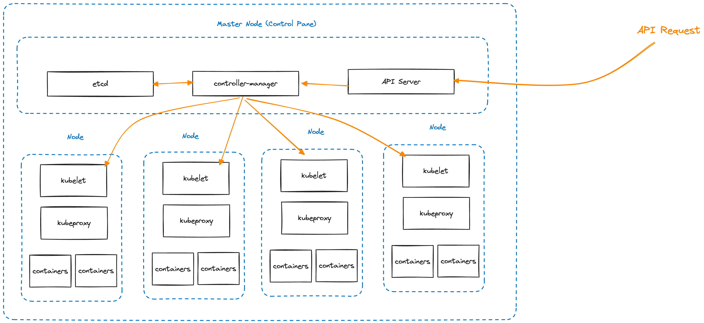

# 03 Kubernetes - 基础概念与设计

### Kubernetes简介

Kubernetes（希腊语，意为舵手，业内一般简称K8S）是由Google在2014年发布的，基于容器的集群管理系统，在发展多年后目前已经成为云计算行业最受欢迎的容器编排解决方案，拥有非常强大的开源社区和周边生态。

K8S的核心理念是"自动化"，希望帮助用户尽可能减少不必要的手动运维开销，从而实现低成本高可靠的容器集群管理。其本身脱胎于Google内部沉淀多年的集群管理系统Borg，拥有极其优秀的概念设计和逻辑实现。

上节说到K8S借助优秀的设计赢得了PaaS三国杀的最终胜利，本节我们就来简单聊一聊K8S的整体设计和基础概念，最后结合一些实际的例子来探讨下为什么市场会选择K8S。

### 整体架构



这是一张非常经典的K8S架构设计图，作为一个集群管理系统，K8S将每个独立物理硬件的单元抽象为Node节点，一个集群就是若干个（不同规格）的Node集合。

每个集群会拥有一个Master节点（也称为K8S的控制平面），该节点上部署和运行K8S集群管理的核心逻辑，包括存储集群中各节点状态的分布式存储etcd、对外提供API服务的api-server，以及对各个Node进行具体操作和状态同步的controller-manager。

K8S集群中的每个Node上都会拥有两个和K8S相关的核心进程，一个名为kubelet，负责接收来自Master节点的操作指令，进而调控本节点上的容器行为（包括部署、扩容、销毁等等）；另一个名为kube-proxy，负责维护该节点上的网络规则，并对来自外部的访问流量进行转发。

K8S集群的典型操作链路是：用户通过API Server提供的Restful API访问到Master节点，对应请求被转发给controller-manager，根据etcd获取当前集群状态后进行逻辑计算和判断，得出每个具体Node所需要做出的调整，然后将这些调整发送给对应节点的kubelet处理，最终生效。

### 声明式API

作为一个强调"自动化"的容器集群管理平台，K8S对于API的设计有非常独特的思考，引入了"声明式API"的理念：

对于K8S中的任何工作负载，用户只需要声明最终期望达到的状态提交给K8S API，不需要关心具体的运维过程，K8S接收到请求后将自动化处理，直到对应的状态达成为止。

举个例子，假设我们希望集群中某个微服务的容器数量从2个扩展到4个，如果按照传统的"过程式API"设计，那么可能需要发送这样的请求：

```jsonc
{
    "target": "demo-micro-service", // 操作的目标对象
    "opType": "expandInstance", // 表示操作类型为扩展实例
    "amount": 2 // 扩展2个实例 
}
```

但如果按照K8S的声明式API，我们只需要提交期望对象的最终状态即可：

```jsonc
{
    "target": "demo-micro-service",
    "instanceAmount": 4 // 期望有4个实例
}
```

K8S在接收到这样的状态描述就会自动化对所有节点进行调度，扩容容器数量，直到`demo-micro-service`拥有4个可用实例容器为止。

相比于传统的过程式API，声明式API只需要关心最终状态，不需要用户关注和维护中间各种复杂的运维操作细节，对用户的心智负担来说是一种极大的解放（当然，这建立在K8S强大的自动化能力之上），
于是在K8S上，管理整个集群就变成了维护一系列简单的负载声明文件（通常以yaml格式存储），具体的运维操作统统交给平台处理就行了。

-- D4

### 基础概念

#### Cluster

#### Node

#### Container

#### Pod

#### Workload

#### Service

#### Persistent Volume

#### Ingress

-- D5

### 一个典型的例子

#### 设定镜像

#### 创建Deployment

#### 设定Service

#### 访问服务