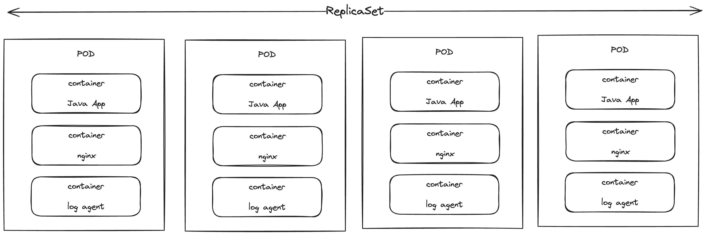

# 03 Kubernetes - 基础概念与设计

### Kubernetes简介

Kubernetes（希腊语，意为舵手，业内一般简称K8S）是由Google在2014年发布的，基于容器的集群管理系统，在发展多年后目前已经成为云计算行业最受欢迎的容器编排解决方案，拥有非常强大的开源社区和周边生态。

K8S的核心理念是"自动化"，希望帮助用户尽可能减少不必要的手动运维开销，从而实现低成本高可靠的容器集群管理。其本身脱胎于Google内部沉淀多年的集群管理系统Borg，拥有极其优秀的概念设计和逻辑实现。

上节说到K8S借助优秀的设计赢得了PaaS三国杀的最终胜利，本节我们就来简单聊一聊K8S的整体设计和基础概念，最后结合一些实际的例子来探讨下为什么市场会选择K8S。

### 整体架构


这是一张非常经典的K8S架构设计图，作为一个集群管理系统，K8S将每个独立物理硬件的单元抽象为Node节点，一个集群就是若干个（不同规格）的Node集合。

每个集群会拥有一个Master节点（也称为K8S的控制平面），该节点上部署和运行K8S集群管理的核心逻辑，包括存储集群中各节点状态的分布式存储etcd、对外提供API服务的api-server，以及对各个Node进行具体操作和状态同步的controller-manager。

K8S集群中的每个Node上都会拥有两个和K8S相关的核心进程，一个名为kubelet，负责接收来自Master节点的操作指令，进而调控本节点上的容器行为（包括部署、扩容、销毁等等）；另一个名为kube-proxy，负责维护该节点上的网络规则，并对来自外部的访问流量进行转发。

K8S集群的典型操作链路是：用户通过API Server提供的Restful API访问到Master节点，对应请求被转发给controller-manager，根据etcd获取当前集群状态后进行逻辑计算和判断，得出每个具体Node所需要做出的调整，然后将这些调整发送给对应节点的kubelet处理，最终生效。

### 声明式API

作为一个强调"自动化"的容器集群管理平台，K8S对于API的设计有非常独特的思考，引入了"声明式API"的理念：

对于K8S中的任何工作负载，用户只需要声明最终期望达到的状态提交给K8S API，不需要关心具体的运维过程，K8S接收到请求后将自动化处理，直到对应的状态达成为止。

举个例子，假设我们希望集群中某个微服务的容器数量从2个扩展到4个，如果按照传统的"过程式API"设计，那么可能需要发送这样的请求：

```jsonc
{
    "target": "demo-micro-service", // 操作的目标对象
    "opType": "expandInstance", // 表示操作类型为扩展实例
    "amount": 2 // 扩展2个实例 
}
```

但如果按照K8S的声明式API，我们只需要提交期望对象的最终状态即可：

```jsonc
{
    "target": "demo-micro-service",
    "instanceAmount": 4 // 期望有4个实例
}
```

K8S在接收到这样的状态描述就会自动化对所有节点进行调度，扩容容器数量，直到`demo-micro-service`拥有4个可用实例容器为止。

相比于传统的过程式API，声明式API只需要关心最终状态，不需要用户关注和维护中间各种复杂的运维操作细节，对用户的心智负担来说是一种极大的解放（当然，这建立在K8S强大的自动化能力之上），
于是在K8S上，管理整个集群就变成了维护一系列简单的负载声明文件（通常以yaml格式存储），具体的运维操作统统交给平台处理就行了。

### 基础概念

#### Node

Node是K8S中最小的计算硬件单元，它类似于传统集群中单台机器的概念，是对硬件物理资源的一层抽象，它可以是真实机房的物理机器，又或者是云平台上的ECS，甚至可以是边缘计算的一个终端。

无论如何，借助Node的抽象，我们可以把任何一台机器简单的看做是一组CPU和RAM资源的组合，从而达到解耦的效果

#### Cluster

对于大型系统，我们往往不会把关注点放在单个机器上，而是聚焦更大粒度的集群。

在K8S中，一般将集群看做一个整体，而不关心内部节点的状态，集群内部状态的调整将由K8S自动完成。

一个Cluster会对应一个Master节点（控制平面）

#### Pod & ReplicaSet

Pod是K8S区别于其他容器编排平台的一个显著特点：它不直接运行容器，而是运行一种称为Pod的高级结构，里面封装了一系列相关的容器，并共享相同的namespace和网络。

Pod也是K8S进行服务编排和缩扩容的基本单位，这意味着Pod里所有的容器都会被一并缩放(不管是否有必要)，因此定制Pod时应该使它的体积尽可能小一些。

一系列相同的Pod副本总和被称为ReplicaSet（副本集）：



#### Workload

工作负载是K8S中对于"应用"的抽象，具体形式上通常表现为对一组Pod的行为控制逻辑，K8S内置了几种常用的工作负载，大致可以分为以下几类：

**无状态工作负载**

最常见的一种工作负载，简要来说就是一组完全相同的Pod集合（即ReplicaSet）。

但在K8S中通常会使用Deployment对象来创建无状态工作负载，Deployment是对ReplicaSet的进一步封装，可以控制ReplicaSet中Pod的更新规则，以实现发布和回滚。

**有状态工作负载**

有状态工作负载同样是一组Pod，但其中每个Pod内部运行的逻辑并不完全一致，不能直接被替代。

例如，用多个Redis Pod构成一个Redis集群，每个Pod中存储的Key是不一样的，即各个Pod并不相同，这就是典型的有状态工作负载。

K8S原生提供了StatefulSet对象来运行有状态工作负载，相比Deployment，StatefulSet可以保障每个Pod的顺序性和唯一性。

**任务型工作负载**

用于运行一些一次性，或周期性的任务，通常会在任务开始时创建对应的Pod，任务结束后Pod自动销毁。

K8S原生提供了Job和CronJob两种对象用于支持一次性和周期性任务的运行。

**守护进程工作负载**

守护进程是一种特殊的工作负载，它作用于整个集群，通常用于对集群内的每个节点进行数据记录和监控相关的事项。

K8S原生提供了DaemonSet对象来运行守护进程，它将保障整个集群内的每一个节点都有且仅有一个该DaemonSet的Pod。

> 除了上述原生提供的工作负载对象外，K8S也支持通过CRD等方式扩展用户自定义的工作负载
> 
> 作为K8S中最为核心的逻辑，工作负载的运行原理和相关设计机制非常复杂，后面会再详细进行分析

#### Service

Service一般作用于一系列特定的Pod之上，以实现服务发现和负载均衡，通常会映射到一个具体的工作负载，为集群内部的其他工作负载及对象提供访问该工作负载的入口。

在K8S中Service作为一种独立于工作负载的对象存在，不会因为工作负载的扩缩容、创建销毁而消失；同样的，Service本身的创建和删除也不影响被关联的工作负载，也可以给一个工作负载设立多个Service。

#### Persistent Volume

在K8S中，Pod是一种非固定资源，尤其是在无状态工作负载中，Pod随时可能会被销毁（缩容）或创建（扩容），这就意味着Pod容器内的所有文件存储都是非持久化的。

Persistent Volume（持久卷）就是为了解决这一问题而被引入，这种对象用于映射一个持久化的存储（云盘 or 物理硬盘等），并最终挂载到Pod中的一个指定路径下，这样即使该Pod被销毁，对应的数据存储也可以被保留，并且可以被后续的Pod所复用。

#### Ingress

Ingress也是一种用于实现负载均衡和流量转发的对象，但和Service不同的是，Ingress用于对集群外的请求方暴露服务入口，而不是对集群内的对象提供服务发现，简要来说可以理解为整个集群的"网关"。

在实际实现中通常会使用Ingress接收处理外部流量，再根据一定的规则转发到集群内的一个（或多个）Service上。

### Kubernetes对象规范

K8S也严格遵循了面向对象的设计理念，几乎所有的操作都可以被翻译成指定对象的创建、修改和更新，并且不论是哪一种对象类型，都拥有同样的规范（类似Java中所有类挤成Object那样）。

在K8S中，任何一个对象的属性都可以大致分为以下几类：

- metadata：存储对象的元信息，包括对象的名称（name），标签（label）和注解（annotation）等
- spec：用户期望对象达到的状态配置（即声明式API）
- status：对象当前实际的状态，这部分属性不会出现在对象的配置文件中，只在运行时可见，是动态变化的

> K8S的自动运维机制可以理解为就是不断调整对象，直至status达到spec的要求

### 一个典型的例子

最后我们通过一个在K8S实际创建工作负载的例子，串联起上述的基础概念，实际感受下K8S的魅力。

下面例子所模拟的是一个典型的Web应用部署场景，该应用仅提供一个简单的Http服务返回一段静态文案，现在我们希望这个应用能够在集群中部署两个稳定的实例。

#### 构建镜像

略去代码开发和打包的环节，我们直接从应用的交付开始，在基于容器的应用交付模式下，我们只需要构建出应用的镜像并上传到镜像仓库即可。

假定我们初始的镜像版本信息如下：

```
registry.cn-qingdao.aliyuncs.com/marklux/demo-server:1.3
```

该镜像所创建的容器将在8080端口提供一个HTTP服务。。

#### 创建Deployment

接下来我们需要通过K8S的声明式API来创建一个Deployment工作负载，很简单，只需要准备一份描述该负责最终期望状态的yaml文件：

```yaml
apiVersion: apps/v1
kind: Deployment
metadata:
  name: demo-deployment # 工作负载名称
spec:
  replicas: 2 # 需要两个实例
  selector:
    matchLabels:
      app: demo-deployment 
  template: # template表示当工作负载要创建一个新的Pod时，所要遵循的模板（其实就是一个完整的Pod对象）
    metadata:
      labels:
        app: demo-deployment # Pod的标签，后续创建Service会用到
    spec:
      containers: # Pod内只有一个容器
        - name: demo-deployment
          image: registry.cn-qingdao.aliyuncs.com/marklux/demo-server:1.3
          ports:
            - containerPort: 8080
```

现在，只需要通过K8S的Restful API或者`kubectl`命令行工具将该yaml提交即可，提交后一段时间即可看到对应工作负载已经创建完成，并且拥有两个Pod实例：

```text
$ kubectl get deployment
NAME              READY   UP-TO-DATE   AVAILABLE   AGE
demo-deployment   2/2     2            2           13s

$ kubectl get pods
NAME                               READY   STATUS      RESTARTS        AGE
demo-deployment-7b65bb7875-2d8nt   1/1     Running     0               37s
demo-deployment-7b65bb7875-mnnlg   1/1     Running     0               37s
```

#### 创建Service

为了能够以负载均衡的方式访问到对应工作负载的Pod所提供的服务，还需要创建对应的Service对象，同样也是使用声明式API：

```yaml
apiVersion: v1
kind: Service
metadata:
  name: my-demo-service
spec:
  selector:
    app: demo-deployment # 匹配所有标签中app=demo-deployment的Pod
  ports:
    - protocol: TCP
      port: 32344 # 最终代理到的端口
      targetPort: 8080 # Pod提供服务的端口
  type: NodePort 
```

如此我们就为demo-deployment工作负载创建了一个Service对象，此后如果我们希望访问demo-deployment中的服务，只需要请求Service提供的32344端口，请求就会被自动负载均衡转发给demo-deployment下的某一个Pod

#### 访问服务

创建服务后，我们可以通过curl方式来通过Service访问对应的工作负载：

```text
$ curl http://192.168.49.2:32344
Hi, World!
```

#### 发布更新

工作负载成功创建后，必然会出现需要修改更新工作负载的情况（即发布 or 回滚），这种更新在容器化模式下，就是修改对应工作负载中所有Pod所使用的容器镜像版本。

我们可以通过修改Deployment对象中Pod template的container image，然后重新提交该Deployment来实现更新，例如将上面例子中的镜像修改为1.2版本，然后重新应用Deployment：

```yaml
apiVersion: apps/v1
kind: Deployment
metadata:
  name: demo-deployment
spec:
  replicas: 2 
  selector:
    matchLabels:
      app: demo-deployment 
  template:
    metadata:
      labels:
        app: demo-deployment
    spec:
      containers:
        - name: demo-deployment
          image: registry.cn-qingdao.aliyuncs.com/marklux/demo-server:1.2 # 修改为1.2版本
          ports:
            - containerPort: 8080
```

重新提交后稍等一段时间，再次访问对应的Service，可以发现输出内容已经发生修改，说明更新已经生效了。

```text
$ curl http://192.168.49.2:32344
Hello, World!
```

这里需要提一下K8S中原生工作负载的默认更新方式都是先创建新的Pod，然后再替换原有的Pod，即**覆盖式更新**，
这样做的好处是在更新期间，原有的Pod依然可用，整体服务的可用性不会受到影响，但对应的会造成一定的资源冗余（发布期间会创建额外的Pod）。

如果我们希望能够实现滚动式的发布更新（金丝雀发布），比如每次只发布替换一个Pod，则可以通过Deployment的`strategy`来指定对应的策略：

```yaml
apiVersion: apps/v1
kind: Deployment
metadata:
  name: demo-deployment
spec:
  replicas: 2
  selector:
    matchLabels:
      app: demo-deployment
  template:
    metadata:
      labels:
        app: demo-deployment
    spec:
      containers:
        - name: demo-deployment
          image: registry.cn-qingdao.aliyuncs.com/marklux/demo-server:1.3
          ports:
            - containerPort: 8080
  strategy:
    type: RollingUpdate # 设定策略为滚动更新
    rollingUpdate:
      maxUnavailable: 1 # 声明最多只能有一个Pod不可用，那么更新过程中每一轮就只会更新一个Pod
```

需要注意的是，K8S原生的滚动更新实现是无法手动暂停和分批操作的，也就是说一批更新结束后会立刻进行下一批的操作。