# 04 Kubernetes-基本实现分析

### Pod

Pod在K8S中的具体存在形式是一系列高度关联的容器的组合，这也是K8S中最小粒度的运行和调度单位。

#### Pod的结构

一个Pod内部包含多个容器，这些容器分为两大类：Init Containers和Running Containers，前者会在Pod启动时优先运行，以实现某些功能的初始化；后者则是在初始化完成后会运行的容器。

每个容器都需要有自己独立的名称，以便和其他容器进行区分（但是多个容器的镜像可以是相同的）。

#### Pause容器

前面说到，在K8S中，所有的容器之间的网络是互通的，这其实是通过共享join同一个network namespace实现的。

在K8S中，每个Pod都隐含了一个pause容器，这个pause容器内只包含一个非常精简的进程，这个进程存在的意义就是为Pod内的network（等） namespace提供一个稳定的"宿主"。

即，Pod内的所有容器都会加入Pod内pause容器的network namespace，从而实现网络的互通。pause容器会在Pod创建时就被创建出来，并在整个Pod生命周期都持续保持存活，换个角度讲，**Pod本身其实也就是一组通过pause容器联系在一起的容器**。

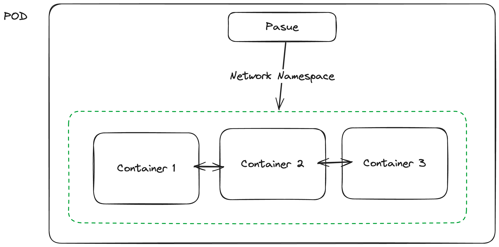

下面就是pause容器内唯一进程对应的代码，可以看出其本身并没有任何逻辑，只是起到一个逻辑性的作用（在启动后就会处于pause状态，这也是为什么称之为pause容器）

```c
#include <signal.h>
#include <stdio.h>
#include <stdlib.h>
#include <string.h>
#include <sys/types.h>
#include <sys/wait.h>
#include <unistd.h>

#define STRINGIFY(x) #x
#define VERSION_STRING(x) STRINGIFY(x)

#ifndef VERSION
#define VERSION HEAD
#endif

static void sigdown(int signo) {
  psignal(signo, "Shutting down, got signal");
  exit(0);
}

static void sigreap(int signo) {
  while (waitpid(-1, NULL, WNOHANG) > 0)
    ;
}

int main(int argc, char **argv) {
  int i;
  for (i = 1; i < argc; ++i) {
    if (!strcasecmp(argv[i], "-v")) {
      printf("pause.c %s\n", VERSION_STRING(VERSION));
      return 0;
    }
  }

  // 必须作为容器内的1号进程，否则不能稳定提供namesapce
  if (getpid() != 1)
    /* Not an error because pause sees use outside of infra containers. */
    fprintf(stderr, "Warning: pause should be the first process\n");

  if (sigaction(SIGINT, &(struct sigaction){.sa_handler = sigdown}, NULL) < 0)
    return 1;
  if (sigaction(SIGTERM, &(struct sigaction){.sa_handler = sigdown}, NULL) < 0)
    return 2;
  if (sigaction(SIGCHLD, &(struct sigaction){.sa_handler = sigreap,
                                             .sa_flags = SA_NOCLDSTOP},
                NULL) < 0)
    return 3;

  for (;;)
    pause(); // 持续在pause状态
  fprintf(stderr, "Error: infinite loop terminated\n");
  return 42;
}
```

> pause容器也可以为Pod内的其他容器提供除了network namespace以外的namespace共享（如PID），不过默认情况下是关闭的（会破坏容器的隔离性）

#### 生命周期

一个Pod从创建到被销毁，完整的生命周期包含以下几个阶段：

- Create：创建阶段，该阶段会首先停止pause容器和所有不该运行的容器（如果是重启），然后按顺序分别启动Pod的pasue容器、init容器和常规容器。
- Probe：健康检查阶段，如果Pod设置了livenessProbe和readinessProbe探针，那么此时会由ProbeManager创建一个worker（Go Routine）来负责该Pod后续的健康检查，这个worker此后将会一直定期检查和更新该Pod的存活状态。
- Running：正常的运行阶段，Pod内所有的容器都处于Running状态
- Shutdown：停止阶段，在Pod被销毁或停止（重启）时触发，如果Pod设置了PostStop钩子，此时会被调用。
- Restart：重启阶段，即重新回到Create阶段的过程

#### 探针与钩子

**探针**

考虑到实际运维容器时场景的多样性，K8S不太可能用一个统一的标准去界定Pod内的某一个容器是否达到可用状态，因此便引入了探针（Probe）的概念：

探针可以认为是一种用于检测容器状态的开放式接口，通过给容器定义探针可以帮助K8S识别该容器的真实状态，在K8S中存在以下三种探针：

- startupProbe：启动探针，用于判断容器是否已经启动完毕（会影响后续容器的启动和Pod状态，只会检查一次）
- livenessProbe：存活探针，用于判断容器是否存活（即定期的健康检查）
- readinessProbe：就绪探针，用于判断容器是否可以对外提供服务（会影响Service服务注册）

探针支持三种不同的运行形式：

- exec：指定容器内的一个可执行程序来运行
- httpGet：通过向容器的指定端口发送HTTP GET请求来运行
- tcpSocket：通过tcpSocket与容器指定端口通信来运行

**钩子**

很多时候容器在启动时和退出前都需要执行一些特殊操作来保证正常运行和安全，比如初始化日志文件、关闭数据库连接等，这就需要K8S能够向容器同步和同志当前容器所处的状态，为此K8S引入了钩子机制。

目前可以为容器设定两种不同的钩子：

- postStart：在容器被创建后和startupProbe探针执行前运行，需要注意的是，在一个容器的postStart钩子正确返回之前，K8S都不会启动下一个容器（根据声明顺序）
- preStop：在容器被终止前运行，只要preStop钩子没有执行完毕，容器就不会被终止

可以看出钩子程序的执行都是阻塞式的，并且需要注意的是如果钩子程序运行失败，整个容器都会直接异常退出，因此钩子函数的设定要尽可能轻量。

> 钩子程序同样可以用exec、httpGet和tcpSocket三种模式声明和运行

### Service

Pod在K8S中是被自动运维管理的，其IP就是可变且易变的，因此不能以传统物理机部署的思路，期望以某个固定的IP访问到Pod所提供的服务。

为了能够让集群内部不同的Pod（即业务模块）之间能够互相调用，就需要提供服务发现和负载均衡的能力，这就是Service对象的作用。

#### 分类：NodePort和LoadBalancer

Service对象有两种运行模式：

- NodePort - 和集群上的某个端口进行映射绑定，后续该端口的所有流量都会被转发给Service对象处理（对集群中的每个Node都生效）
- LoadBalancer - 新建一个LoadBalancer节点并与之绑定，后续所有通过该节点的流量都会被转发给Service对象，LoadBalancer的具体实现则和云厂商强相关。

下面我们主要通过NodePort模式讨论Service的实现原理，在此之前还需要了解一些基础概念：

#### Endpoint

Endpoint是K8S的一个内置对象，其作用是维护一组Pod在集群内的IP地址，存储于Master节点的etcd中。

Endpoint在Service创建时被同步创建，并存储满足该Service对象中selector规则的所有Pod的IP：

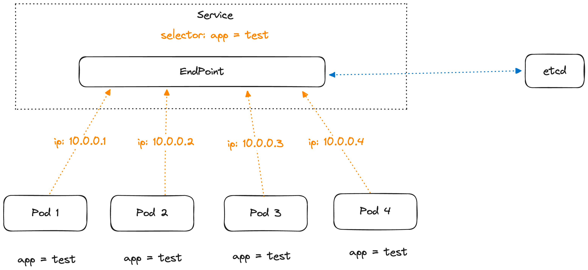

由于Pod的IP不是固定的，Pod本身的生命周期也是不固定的，因此EndPoint是一个动态的对象（起到了类似RPC服务中注册中心的作用）。

借助Endpoint对象，Service就可以知道此时所有可用的Pod对象的IP，并进行流量的负载均衡和转发。

#### kube-proxy

之前说过，在K8S的每个节点上都有一个kube-proxy组建，这个组件用于维护节点上的网络代理和路由规则，Service对象将流量转发给具体的Pod就是借助kube-proxy来实现的。

kube-proxy本身的实现非常复杂，这里我们主要说一下Service是如何借助kube-proxy实现流量转发的，有三种模式：

**userspace（用户空间）**

在此模式下，每当一个Service被创建，节点上的kube-proxy就会在该节点上同步创建一个iptables路由规则和一个go routine，其中iptables规则用于将服务的流量转发给kube-proxy进程， 
go routine则用于在kube-proxy和对应Pod之间搬运数据：

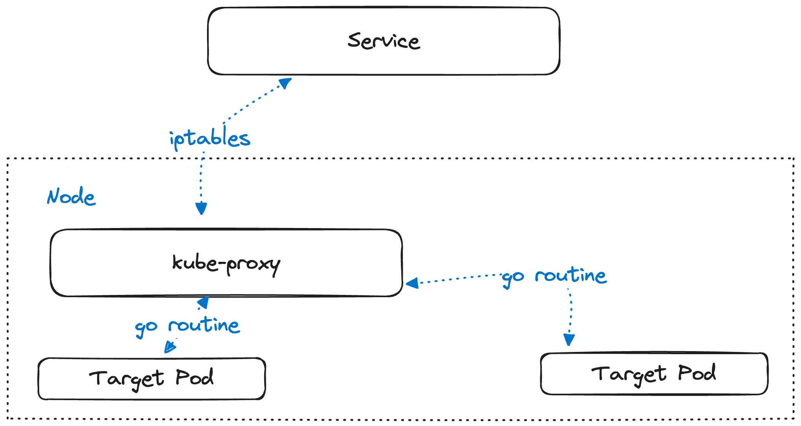

由于该模式下数据的传输依靠一个个运行在用户态的go routine，所以被称为用户空间模式。

**iptables**

在此模式下，节点上的数据转发完全依靠iptables规则，kube-proxy通过监听Endpoint和Service对象的变更，不停地动态建立/删除Pod和具体端口之间的iptables规则。

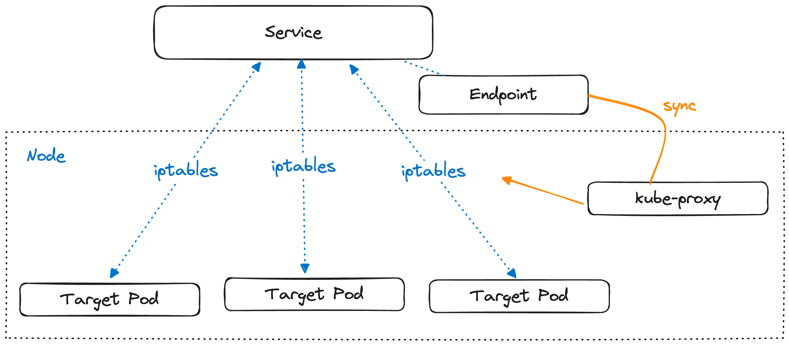

该模式下，所有的数据转发全部在内核态完成。

**ipvs**

在iptables模式下，如果集群中Service数量变得非常庞大时，会有非常严重的性能问题（由于iptables规则过多，路由匹配和新增规则动作都会变得异常缓慢）。
为了优化这个问题，K8S在1.9版本之后又引入了ipvs，一个同样运行在内核态的流量转发程序，但和iptables不同的是，它使用了哈希表作为底层数据结构，大大增加了匹配和新增规则的速度。

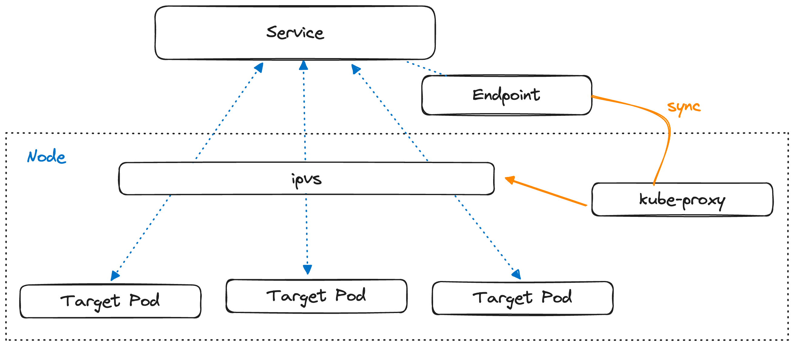

#### DNS形式的服务发现

如果要在集群内部使用Service来做服务发现，K8S提供了一种非常优雅的形式：将Service对象的访问地址写入集群网络的`resolve.conf`中，注册成一个DNS发现规则，
如此一来，如果希望访问某个Service，只需要访问一个对应的域名就可以，这使得集群内部的RPC访问变得极其自然。

例如想要在容器内访问一个集群内的Service对象所提供的HTTP服务，那么只需要编写这样的代码：

```go
req, err := http.NewRequest("GET", "http://${serviceName}?a=b", nil)
```

就可以自然访问到集群内${serviceName}对应的Service对象（的ClusterIP），并经过服务发现和负载均衡最终路由到一个提供该服务的Pod上。

#### Headless Service

常规模式下的Service自带负载均衡能力，访问时最终会被转发到一个具体的Pod上，但也存在一些场景（例如有状态应用）下并不需要负载均衡能力，而是希望能够获取Service下所有可用的Pod IP地址。

这种需求可以通过创建Headless Service来实现，这种Service不会在DNS上注册一个整体的域名（ClusterIP），而是按照一定的命名规范把Service下每个Pod的IP都注册至DNS中，让使用方可以根据需求获取任意Pod的IP。

Headless Service通常是和StatefulSet绑定在一起使用的，在下文中我们会看到其实际的使用方式。

### Pod的存储

#### Volume

在K8S中，Volume可以看作是一种对Pod存储资源的抽象，Volume的具体实现可以有很多方式，比如`EmptyDir`、`ConfigMap`和`HostPath`等，
一个Pod内声明的Volume资源可以被Pod内任意的Container所共享（挂载），这也是通过共享pause容器的namespace来实现的。

```yaml
apiVersion: v1
kind: Pod
metadata:
  name: test-pod
spec:
  containers:
  - name: test-container
    image: busybox
    volumeMounts: # 配置该容器如何挂载使用Pod下的Volume
    - name: cache-volume
      mountPath: /cache
    - name: test-volume
      mountPath: /hostpath
    - name: config-volume
      mountPath: /data/configmap
    - name: special-volume
      mountPath: /data/secret
  volumes: # 声明Pod下的Volume资源
  - name: cache-volume
    emptyDir: {}
  - name: hostpath-volume
    hostPath:
      path: /data/hostpath
      type: Directory
  - name: config-volume
    configMap:
      name: special-config
  - name: secret-volume
    secret:
      secretName: secret-config
```

#### Persistent Volume

K8S内大多数Volume的实现都不是持久化的，会随着Pod的消失而被一并清理，如果希望Pod内的存储数据可以被持久化，就需要使用Persistent Volume（持久卷）。

Persistent Volume（简称PV）和上面所说的Volume不一样，它并不是一种依附于Pod的配置概念，而是一种独立于Pod存在的资源，我们可以通过yaml来声明创建一个PV：

```yaml
apiVersion: v1
kind: PersistentVolume
metadata:
  namespace: default
  name: local-pv
spec:
  capacity:
    storage: 200Mi
  accessModes:
    - ReadWriteMany # 可以并发读写
  storageClassName: standard # 实现方式为本地磁盘
```

在上面的例子中，创建了一个名为`local-pv`的本地磁盘PV存储，大小200M，访问模式支持并发读写。该PV被创建后就持有了一个稳定的200M存储空间，不论后续是否有Pod读写该PV，对应的存储空间都会被一直保留（直到该PV被删除）

在Pod中并不能直接使用PV，而是需要通过一种名为PersistentVolumeClaim（简称PVC）的对象来访问PV，下面是一个具体的PVC对象实例：

```yaml
kind: PersistentVolumeClaim
apiVersion: v1
metadata:
  name: local-pvc
  namespace: default
spec:
  accessModes:
    - ReadWriteMany
  storageClassName: standard
  resources:
    requests:
      storage: 50Mi
```

可以看出，PVC本身只是对持久化存储资源使用诉求的一种抽象，并不会包含具体的PV和Pod信息。

在实际使用上，需要由Pod配置Volume时选择PVC类型，此时K8S会根据PVC中声明的容量及访问模式在集群内自动寻找合适的PV来进行绑定：

```yaml
apiVersion: v1
kind: Pod
metadata:
  name: vol-pvc
  namespace: default
spec:
  volumes: # 声明了一个PVC Volume
  - name: html
    persistentVolumeClaim:
      claimName: local-pvc # 对应的PVC对象名
  containers:
  - name: myapp
    image: nginx
    volumeMounts: # 挂载到容器内
    - name: html
      mountPath: /usr/share/nginx/html/
```

上述Pod被应用到集群内部后，可以发现local-pvc被绑定到了local-pv上（因为集群里只有一个pv）

```text
$ kubectl get pvc
NAME        STATUS    VOLUME    CAPACITY   ACCESS MODES   STORAGECLASS   AGE
local-pvc   Bound     local-pv  50Mi       RWO,RWX                       24s
```

Pod、Volume、PV和PVC之间的关系可以用下图来表示：

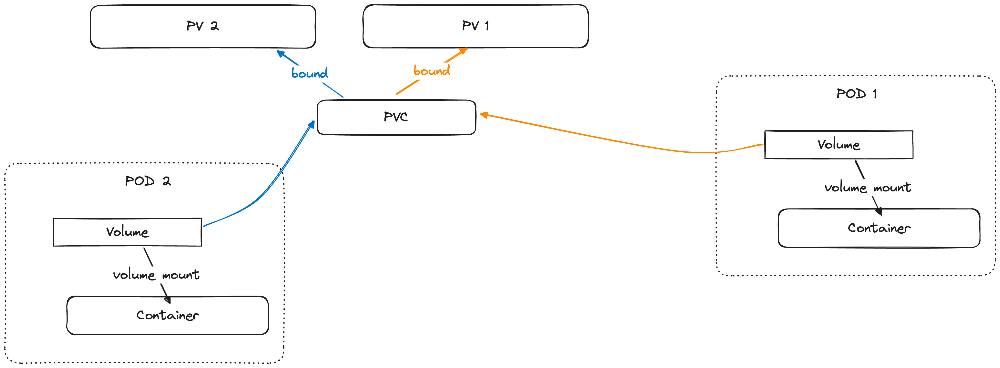

### Workload

这一部分我们重点讨论两个原生的工作负载实现，分别是对应无状态应用的Deployment和对应有状态应用的StatefulSet。

#### Deployment

Deployment本身是基于ReplicaSet的进一步封装，所以先来聊聊ReplicaSet在K8S中是一个什么样的概念。

**ReplicaSet**

ReplicaSet（副本集，简称RS）可以认为是一组数量固定的、满足筛选条件（labels）的Pod，ReplicaSet的三大构成元素是：

- matchLabels：描述RS匹配标签的规则（例如 app = test-rs）
- replicas：期望RS下持有的Pod实例数量
- template：当集群内匹配标签的Pod不足时，创建新Pod的模板

一个简单的RS定义例子：

```yaml
apiVersion: apps/v1
kind: ReplicaSet
metadata:
  name:  test-rs
  namespace: default
spec:
  replicas: 2 
  selector:
    matchLabels:
      app: test-rs # 匹配Pod的规则
  template: # 创建Pod的模板
    metadata:
      labels:
        app: test-rs
    spec:
      containers:
      - name: c1
        image: nginx
        ports:
        - containerPort: 80
```

ReplicaSet的工作规则是：

1. 检测当前集群中满足matchLabels的Pod实例有哪些
2. 判断这些Pod实例是否满足声明的replicas数量，如果不足则用template创建新的Pod，如果过多则会删除一部分

可以看出RS只对Pod数量和matchLabels敏感，而对Pod本身的内容是不关心的（template只是用于新建），
所以即便是在创建RS前就已经存在的Pod，只要labels被RS所匹配，不论该Pod内的容器是否符合template标准，都会成为RS的一部分：

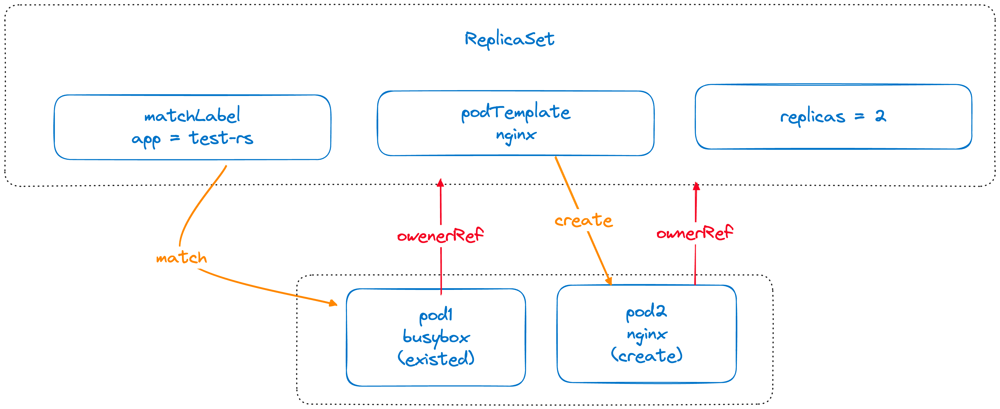

所有被RS匹配上的Pod都会被设置对应的ownerReference，这将影响K8S的垃圾回收机制，如果后续该RS被删除，所有ownerReference归属于该RS的Pod会被一并删除。

在RS中，只能对replicas实例数进行更新，而不能对已经创建的Pod的内容（即容器镜像）进行更新，无法承载常规的应用发布回滚需求，于是便有了更进一步的Deployment对象。

**Deployment与ReplicaSet的关系**

我们先来看一个简单的Deployment的对象定义：

```yaml
apiVersion: apps/v1
kind: Deployment
metadata:
  name:  test-deployment
  namespace: default
spec:
  replicas: 2 
  selector:
    matchLabels:
      app: test-deployment # 匹配Pod的规则
  template: # 创建Pod的模板
    metadata:
      labels:
        app: test-deployment
    spec:
      containers:
      - name: c1
        image: nginx
        ports:
        - containerPort: 80
```

我们可以发现，这个Deployment对象居然和之前的ReplicaSet对象长的一模一样（除了kind不同），并且在apply该Deployment之后，集群中会同步创建出一个Deployment对象和一个ReplicaSet对象。

实际上，Deployment是通过控制ReplicaSet，来进一步实现对Pod的调整的，这就是为什么Deployment和ReplicaSet那么像，因为它本身就需要创建出一个ReplicaSet才能控制Pod。

Deployment、ReplicaSet和Pod之间的关系如下图所示：

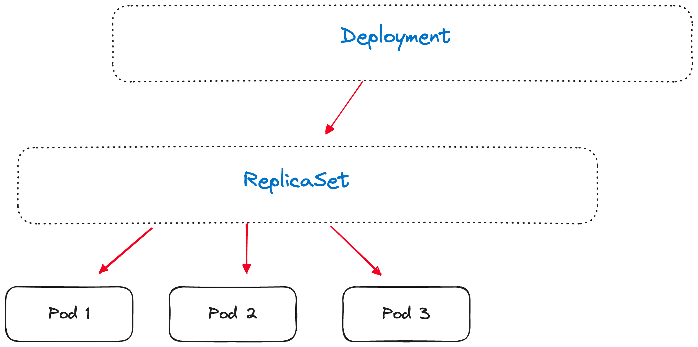

**Deployment更新的原理**

Deployment相比与ReplicaSet最大的功能特性就是支持Pod的滚动更新，那么这个更新机制是如何实现的呢？

答案是通过创建新的ReplicaSet，并缩容旧的ReplicaSet。在Deployment中，每次更新都会生成一个新的RS对象（称为一个版本，revision），与此同时原有的RS对象并不会消失，整个更新的过程其实就是：

1. 调整新创建的RS对象的replicas实例数量，从0逐步扩容至所需的数量（此时，RS会利用template同步创建出新版本的Pod）
2. 调整原有的RS对象的replicas实例数量，逐步缩容至0（此时，RS会回收旧版本的Pod）
3. 最终新的RS对象成为Deployment的当前版本（current revision），旧的RS对象不会被删除，只是被当成历史版本存储

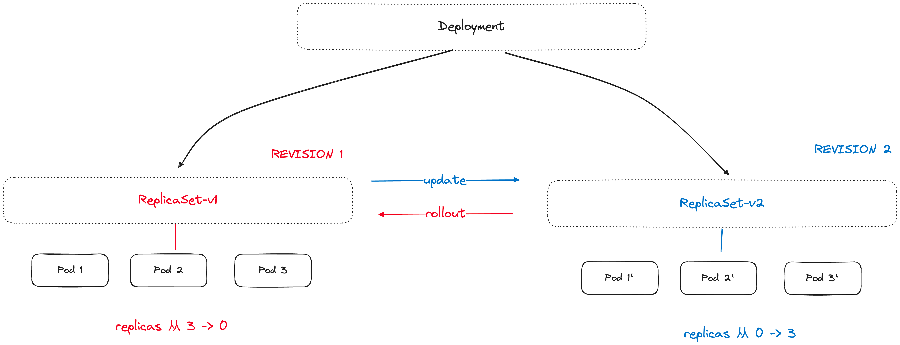

当我们完成一次Deployment发布之后，通过`kubectl get rs`就可以看到历史和当前两个版本的RS对象，他们控制的实例数量分别是0和目标值：

```text
$ kubectl get rs
NAME                         DESIRED   CURRENT   READY   AGE
demo-deployment-7b65bb7875   2         2         2       3d15h # 当前版本的RS对象，实例数量为设定的目标值
demo-deployment-7cc749f5dd   0         0         0       3d14h # 上一个版本的RS对象，实例数量已经缩至0
```

理解了这个原理，就很容易明白Deployment的滚动更新和回滚分别是怎么一回事：

- 滚动更新其实就是根据规则控制调整原有RS对象和新RS对象的replicas数量（比如maxUnavailable=1 就是每次老RS只缩容一个，新RS只扩一个）
- 回滚其实就是从历史的Revision中找到对应的RS对象，然后把它当作新的RS对象做一次更新。

#### StatefulSet

StatefulSet是K8S中用于支持有状态应用的工作负载，相比于Deployment，StatefulSet最大的几个不同在于：

1. StatefulSet管理的每个Pod都有唯一的标识，不论怎么调度都不会发生改变（即便是Pod更新重建，其ID也不会发生变化）
2. StatefulSet中Pod的启停顺序是严格受控的，操作第N个Pod一定要等前N-1个执行完才可以
3. 每个StatefulSet需要有一个对应的HeadlessService，存储和维护所有Pod的IP地址，DNS域名格式为`${podName}.${serviceName}`
4. StatefulSet支持灰度发布升级（可以仅指定某几个Pod升级，而不是全局滚动升级），换句话说，**StatefulSet并不是通过ReplicaSet来关联和控制Pod，而是直接操作具体的Pod本身**

除此之外，StatefulSet通常需要配合PV使用，来保障Pod存储的持久性，这样即便Pod本身被更新和重建，其存储的数据也可以被继任者复用，从而对外实现Pod（逻辑、存储、标识）始终未发生改变的效果。

**例子**

我们先给出一个简单的StatefulSet例子，认识StatefulSet的基本构成：

```yaml
# 创建StatefulSet必须要先创建一个Headless Service对象
apiVersion: v1
kind: Service
metadata:
  name: redis-service
  labels:
    app: redis # 匹配Pod的标签
spec:
  ports:
  - name: redis-port
    port: 6379
  clusterIP: None # ClusterIP设置为None即表示为HeadlessService
  selector:
    app: redis
    appCluster: redis-cluster
---
apiVersion: apps/v1beta1
kind: StatefulSet
metadata:
  name: redis-app
spec:
  serviceName: "redis-service" # 对应上面创建的HeadlessService名称
  replicas: 6 # 整体副本数量
  template:
    metadata:
      labels:
        app: redis
        appCluster: redis-cluster
    spec:
      # 省略一些复杂配置属性
      containers:
        - name: redis
          image: "registry.cn-qingdao.aliyuncs.com/gold-faas/gold-redis:1.0"
          command:
            - "redis-server"
      volumes:
        - name: "redis-conf"
          configMap:
            name: "redis-conf"
            items:
              - key: "redis.conf"
                path: "redis.conf"
        - name: "redis-data"
          emptyDir: {}
```

将上述配置声明应用到K8S集群后，将会创建出`redis-app-0`～`redis-app-5`一共6个Pod，并且这些Pod可以通过独立的DNS规则访问。

例如想要访问3号Pod的Redis服务，可以通过`redis-app-3.redis-service`在DNS中找到对应Pod的IP，并通过6379端口访问服务。

**伸缩机制**

StatefulSet被创建后，会不断循环检测集群中其所属的Pod（和RS一样，根据matchLabel匹配），并将这些Pod按照名称序号排序成一个数组。

接着会根据当前StatefulSet设定的replicas数量判断该数组是否需要做出调整，如果数组中的Pod数量大于replicas，就从尾部截断删除多余的Pod，如果数组中的Pod数量小于replicas，则根据模板创建新的Pod实例填充至数组中，被创建出的Pod序号始终是连续的。

除此之外，如果数组中某些序号对应的Pod并不实际存在（对应下面更新机制会讲），会立刻使用最新版本的template创建一个Pod实例填充该位置。

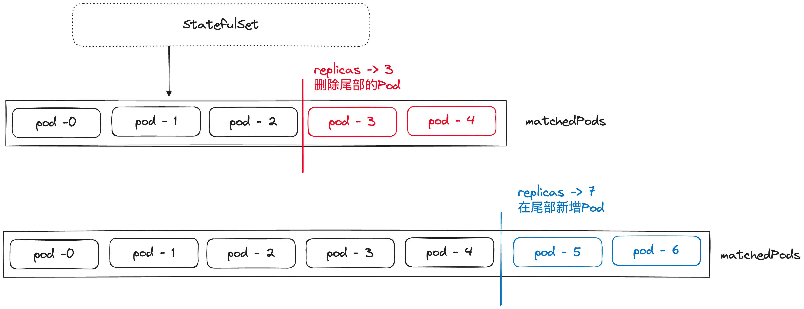

不论是删除还是新增Pod，StatefulSet都会严格按照顺序单调执行，比如在上图的例子中，缩容时会按倒序先停止删除pod-4，再停止删除pod-3；扩容时会先创建运行pod-5，再创建pod-6。当前一个Pod的操作没有完成时，下一个Pod的操作永远不会开始。

**更新机制**

StatefulSet对于Pod的更新一定发生在伸缩调整之后，即只有当StatefulSet按照上面的流程伸缩到实际可用的Pod数量和replicas声明的一致后，才会开始进行Pod的更新。

对Pod执行更新的前提是能够区分出一个Pod属于哪个版本，和Deployment不一样的是，由于没有ReplicaSet这个中间层，StatefulSet的版本控制记录的就是StatefulSet对象本身的信息，一个版本称为一个Revision，被对应版本StatefulSet创建出的Pod status中会包含对应的Revision ID（一个hash），可以根据这个来判断Pod属于哪个版本。

> 有关Revision和Controller等K8S核心运行逻辑的概念说明，会在下一节中展开聊聊，这里只需要把Revision当作是对象的版本号和快照就行

在Revision的基础上，StatefulSet对Pod的更新机制是，从数组尾部开始，依次删除不属于当前版本的Pod。删除后整个StatefulSet的实例数量会发生变化，再次触发伸缩逻辑，此时会扩容补充新版本的Pod到对应被删除的位置，如此便实现了Pod的有序更新。

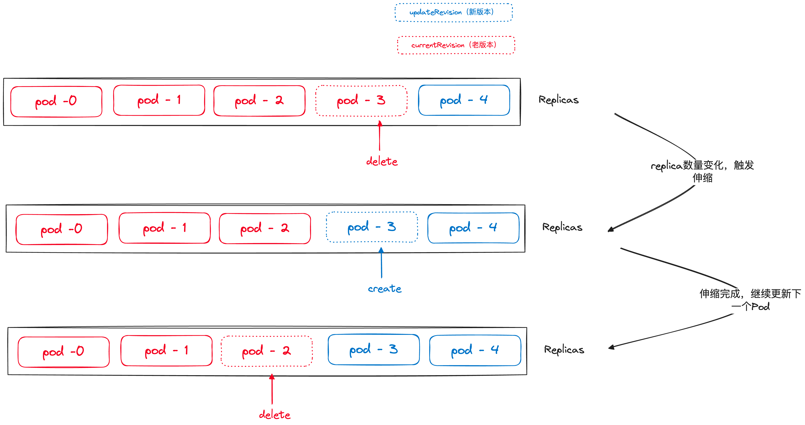

> StatefulSet还支持分批灰度的滚动更新，即可以只更新一部分的Pod并维持该状态，而不是像Deployment的滚动更新那样一定会更新完所有的Pod才能停止
> 除此之外，还可以通过OnDelete更新策略只更新特定序号的Pod

**StatefulSet与PVC**

StatefulSet下Pod的更新、删除都不会影响Pod声明的PVC资源，即便一个Pod被删除甚至StatefulSet本身被删除，在其存活过程中所使用的PVC资源都会依旧保持存留，以便后续可以恢复使用。

### AutoScaler

K8S相比于传统的集群管理工具，拥有一个非常有趣的特性，就是支持根据具体的资源使用情况**自动伸缩**工作负载的大小，这项能力可以在无状态负载中使用，被称为Auto Scaler。

K8S的自动伸缩能力分为两种，一种是水平伸缩，即工作负载中每个Pod的规格不变，只是调整Pod的数量；还有一种是垂直伸缩，即工作负载中Pod的数量不变，但规格弹性变化（如CPU资源）。

两种不同的自动伸缩能力对应在实现上就是两种不同的自动伸缩器对象，HPA（Horizontal Pod Autosacler）和VPA（Vertical Pod Autoscaler）。

#### HPA

HPA是目前来说使用最广泛的一种自动伸缩器，要使用HPA，必须先能够采集整个集群的负载指标（Metric），因此需要先引入一定的Metric采集能力（如influxDB、heapster等）才可以使用HPA。

在实现上，HPA会通过定时的巡检（loop）来不断检查工作负载的指标，并根据下面的公式计算当前工作负载应该持有多少个实例，再对比当前工作负载实际持有的实例数量来决定是否要对工作负载进行伸缩。

```text
desiredReplicas = ceil[currentReplicas * ( currentMetricValue / desiredMetricValue )]
```

- desiredReplicas：最终计算得到的当前工作负载应该拥有的实例数量
- currentReplicas：当前工作负载实际用用的实例数量
- desiredMetricValue：设定的监控指标的期望值（比如CPU期望维持在50%利用率）
- currentMetricValue：当前监控指标的实际值
- ceil：向上取整

我们可以通过`kubectl autoscale`来创建一个HPA，例如：

```text
kubectl autoscale deployment helloworld --cpu-percent=10 --min=1 --max=5
```

上述命令会给`helloworld`deployment创建一个HPA，期望的指标为CPU利用率10%，能够接收的伸缩范围是1～5个Pod，创建完成后可以通过`kubectl get hpa`看到对应的对象。

#### VPA

VPA目前的使用场景并不多，因此实现上也没有HPA成熟，因此这里我们仅介绍一下大致的概念。

VPA的使用同样需要先向集群引入Metric采集能力，在实际实现上，有两种具体的伸缩模式：

- create模式：创建一个新的、伸缩过规格的Pod实例替换原有的实例
- in-place模式：在Pod不变的情况下，原地调整其资源限制

当前阶段VPA主要还是采用create模式进行伸缩，in-place模式由于实现难度很高，还处于实验阶段中。