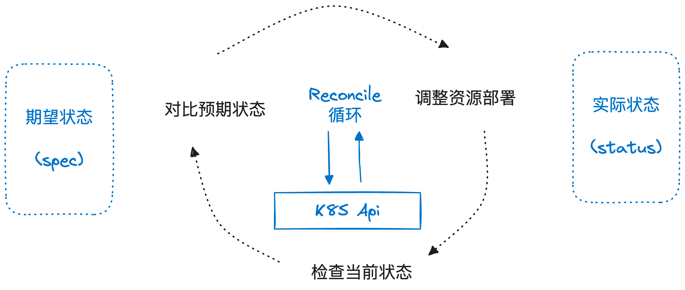
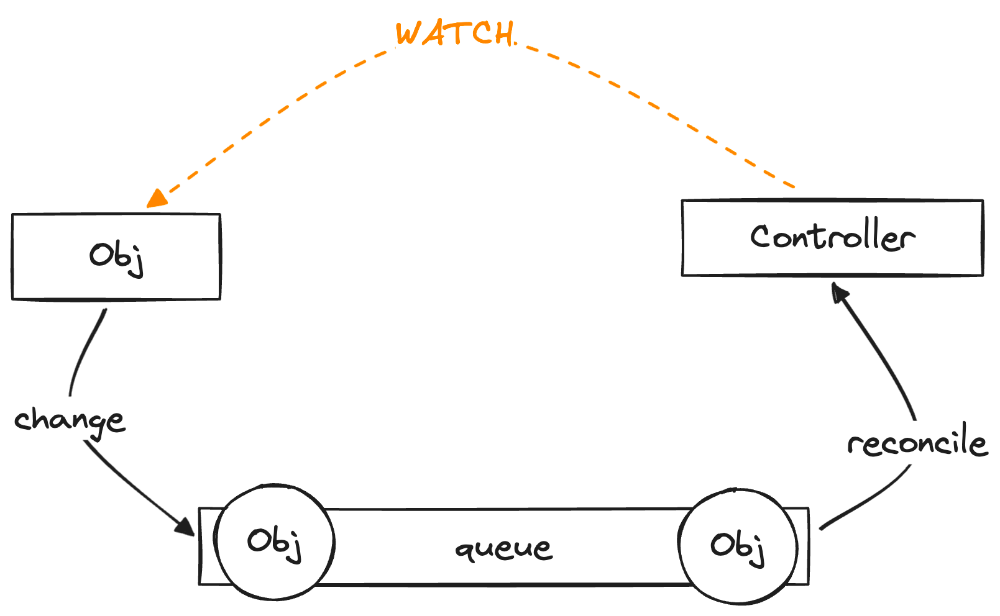
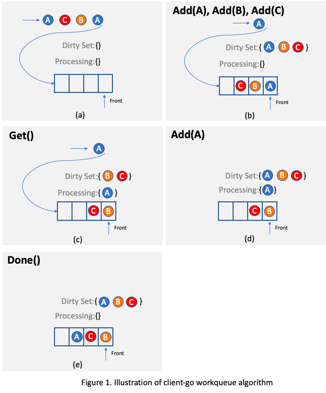
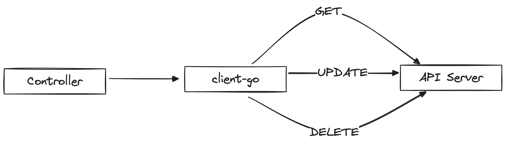
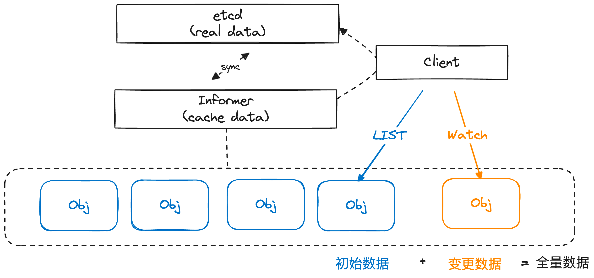
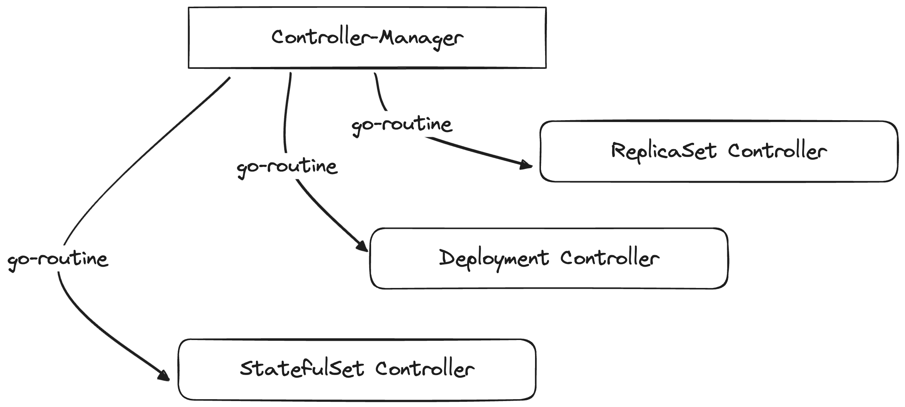

# 05 Kubernetes - 运行机制与扩展

### Controller

Controller是K8S中实现"自动化"运维的核心组件，通常情况下，K8S中的每一个对象都拥有一个对应的Controller，它的作用就是不断调整对象的实际状态（status），直到其符合用户声明的预期（spec）。

可以说K8S中关于一种对象的核心运行逻辑都在与之相对应的Controller之中，所以研究明白Controller就能研究明白K8S上层的运行机制。

#### Reconcile

上面讲了，Controller的核心逻辑就是不断检查对象的实际状态，并对比对象的期望状态进行调整，这个永不间断的循环过程被称为**Reconcile（调谐）**。



当然，Controller不可能真的以死循环的方式去运行，通常在实际实现上Controller会监听一类对象的变更（并且可以指定一定的过滤条件，比如只监听对象的Update事件），
当对象本身发生满足要求的变更时，会被抽象成一个请求丢到一个工作队列中，再通知Controller的Reconcile逻辑消费该队列中的请求，这样就可以让Reconcile"按需触发"。



需要注意的是，这个请求本身的结构非常简单，只包含对象的命名空间和名称，不包含对象的实际信息和触发对象变更的事件：

```go
// Request contains the information necessary to reconcile a Kubernetes object.  This includes the
// information to uniquely identify the object - its Name and Namespace.  It does NOT contain information about
// any specific Event or the object contents itself.
type Request struct {
	// NamespacedName is the name and namespace of the object to reconcile.
	types.NamespacedName
}
```

因此，当Controller中的Reconcile循环接收到Request时候，通常都还需要借助K8S API去查询对象的实际信息。

**并发Reconcile**

当Controller监听的对象变更十分频繁时，就会在队列中堆积大量的请求，如果Controller只有一个线程处理请求，就会导致Reconcile的运转效率低下，这时候就需要引入多线程来并发Reconcile。

但引入多线程并发处理后，又会产生一致性问题，即两个线程有可能会同时消费处理同一个对象，导致互相之间产生冲突。为了避免出现这种问题，K8S在工作队列上增加一了一些额外的逻辑来保障多个Reconcile
循环不会同时处理一个对象，下面来展开说说这个工作队列的运行机制。

首先，整个队列被拆分为三个组成部分（注意这里存储的都是对象，而不是请求）：

- DirtySet - 用于所有正在排队等待处理的对象
- ProcessingSet - 用于存放正在被Reconcile处理的对象
- Queue - 存放正在被排队等待被处理的对象



整个队列的运行逻辑是（结合上面的图例a，假设有4个请求达到队列，其中有两个请求都关联了对象A）：

1. 当一个请求到达，与之关联的目标对象首先被加入到DirtySet中（如上图b，前三个请求使对象A，B，C被加入到DirtySet）

    - 如果该请求关联的对象已经在DirtySet中了，那么该请求将会被丢弃
    - 进一步判断ProcessingSet中是否已经有该对象，如果没有，则将该对象放入Queue中；否该请求也被丢弃

2. 当任意Reconcile线程空闲时，就从Queue头部取出一个对象处理（包装成请求），并将该对象放入ProcessingSet中，同时从DirtySet中移除（如上图c，对象A被放入ProcessingSet
   ，同时从DirtySet中移除）

    - 如果此时又有请求该对象的请求到达，那么按照第1步的规则，该对象会被再次加入到DirtySet中，但不会入Queue（如上图d）
   
3. Reconcile处理完某个对象后，该对象从ProcessingSet中被移除，如果此时DirtySet还有这个对象，那么就将这个对象加入Queue中（如上图e)

上述逻辑通过DirtySet和ProcessingSet的去重逻辑，可以保障同一时刻一个对象只会被一个Reconcile循环所消费，但会引入两个新的问题：

- 在1，2步骤中会出现请求被丢弃的情况，但由于请求本身只包含对象名，所以在到实际处理过程前只要多个请求关联的对象是一样的，那么丢弃掉后来的请求也不会对Reconcile逻辑产生任何影响

- 由于去重逻辑，请求的处理顺序可能和实际达到顺序不一致，导致一定的延迟，比如在对象A被Processing期间，有新的关于A对象的请求都要先在DirtySet中等待，只有当Processing结束才会被放到Queue
  队尾，这期间可能会被其他对象的请求"插队"，导致这些新请求要延迟很久才能被处理。解决这个问题的一个办法是提高Reconcile的并发度来加速Queue的消费，这样延迟就不会带来过大的影响。

#### Client

在Reconcile逻辑的实际实现中，往往需要和K8S的API进行交互，比如获取对象的实际和期望状态、对指定对象进行更新等；这时候就需要在Controller代码中和K8S的API Server进行通信，
K8S官方提供了一套基于go语言的client SDK（本质上就是封装了API Server的Restful API调用），称为client-go，Controller的实现者可以通过这个client来与K8S集群的API进行交互。



#### Informer与List-Watch

在实际运行过程中，Controller的Reconcile逻辑中可能会大量且频繁的调用client，这会对API Server以及背后的etcd存储产生巨大的压力，进而对K8S集群的稳定性造成重大影响。

为了解决这个问题，K8S提供了一套缓存能力，可以帮助每个Controller创建一个独立的内存缓存，用于缓存Controller所需要监听的K8S对象数据，并且可以保证该缓存中的数据和etcd中的数据完全一致，
如此一来Controller内需要获取对象数据的时候就可以直接从该缓存中读取，不必再通过Client调用API Server，这套缓存能力被称为Informer。

> Informer缓存只能解决读操作的压力，对于写操作和删除操作还是需要直接通过client访问API Server的

Informer的工作原理是List-Watch机制，即在创建时，先通过client调用对象的List接口拿到一类对象的所有数据缓存到本地，然后通过Watch接口监听该类对象后续的所有变更，当发生变更时立刻同步变更本地缓存，如此便可保障Informer缓存中的对象数据和实际的对象数据始终保持一致。



#### Controller Manager

最后来说一下Controller的运行机制，通过上面的分析不难看出Controller其实就是一组利用了K8S Client实现具体逻辑的进程。
事实上这些进程也是以Pod的方式运行在K8S集群里的，但在实际部署粒度上来说，多个Controller会被合并成一个ControllerManager部署运行，
例如K8S的原生工作负载Controller就是部署运行在`kube-system`的`kube-controller-manager`Pod中：

```text
$ kubectl get pod
NAME                               READY   STATUS             RESTARTS           AGE
kube-controller-manager            1/1     Running            1 (133d ago)       175d
```

> 这里的kube-controller-manager以静态Pod方式运行，而不是更高级的工作负载形式（可以想一下是为什么）

最终一个controller manager会以go routine的方式运行多个实际的Controller，下文的扩展机制中会看到自定义的Controller也是以这样的方式来运行的。



-- D4

### Operator模式

#### CRD

#### Webhook

**mutate**

#### Custom Controller

-- D4

### KubeBuilder

-- D5

### 实例：OpenKruise SidecarSet

-- D6/D7