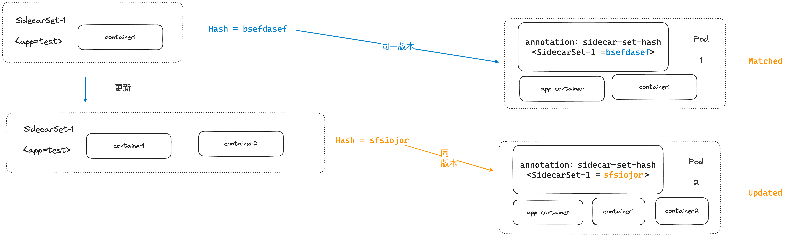
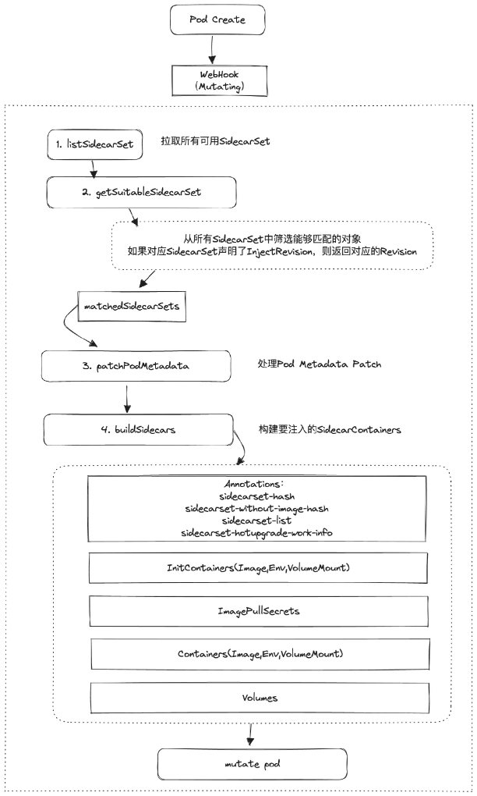

# 05 Kubernetes - 运行机制与扩展

### Controller

Controller是K8S中实现"自动化"运维的核心组件，通常情况下，K8S中的每一个对象都拥有一个对应的Controller，它的作用就是不断调整对象的实际状态（status），直到其符合用户声明的预期（spec）。

可以说K8S中关于一种对象的核心运行逻辑都在与之相对应的Controller之中，所以研究明白Controller就能研究明白K8S上层的运行机制。

#### Reconcile

上面讲了，Controller的核心逻辑就是不断检查对象的实际状态，并对比对象的期望状态进行调整，这个永不间断的循环过程被称为**Reconcile（调谐）**。


当然，Controller不可能真的以死循环的方式去运行，通常在实际实现上Controller会监听一类对象的变更（并且可以指定一定的过滤条件，比如只监听对象的Update事件），
当对象本身发生满足要求的变更时，会被抽象成一个请求丢到一个工作队列中，再通知Controller的Reconcile逻辑消费该队列中的请求，这样就可以让Reconcile"按需触发"。


需要注意的是，这个请求本身的结构非常简单，只包含对象的命名空间和名称，不包含对象的实际信息和触发对象变更的事件：

```go
// Request contains the information necessary to reconcile a Kubernetes object.  This includes the
// information to uniquely identify the object - its Name and Namespace.  It does NOT contain information about
// any specific Event or the object contents itself.
type Request struct {
	// NamespacedName is the name and namespace of the object to reconcile.
	types.NamespacedName
}
```

因此，当Controller中的Reconcile循环接收到Request时候，通常都还需要借助K8S API去查询对象的实际信息。

**并发Reconcile**

当Controller监听的对象变更十分频繁时，就会在队列中堆积大量的请求，如果Controller只有一个线程处理请求，就会导致Reconcile的运转效率低下，这时候就需要引入多线程来并发Reconcile。

但引入多线程并发处理后，又会产生一致性问题，即两个线程有可能会同时消费处理同一个对象，导致互相之间产生冲突。为了避免出现这种问题，K8S在工作队列上增加一了一些额外的逻辑来保障多个Reconcile
循环不会同时处理一个对象，下面来展开说说这个工作队列的运行机制。

首先，整个队列被拆分为三个组成部分（注意这里存储的都是对象，而不是请求）：

- DirtySet - 用于所有正在排队等待处理的对象
- ProcessingSet - 用于存放正在被Reconcile处理的对象
- Queue - 存放正在被排队等待被处理的对象


整个队列的运行逻辑是（结合上面的图例a，假设有4个请求达到队列，其中有两个请求都关联了对象A）：

1. 当一个请求到达，与之关联的目标对象首先被加入到DirtySet中（如上图b，前三个请求使对象A，B，C被加入到DirtySet）

    - 如果该请求关联的对象已经在DirtySet中了，那么该请求将会被丢弃
    - 进一步判断ProcessingSet中是否已经有该对象，如果没有，则将该对象放入Queue中；否该请求也被丢弃

2. 当任意Reconcile线程空闲时，就从Queue头部取出一个对象处理（包装成请求），并将该对象放入ProcessingSet中，同时从DirtySet中移除（如上图c，对象A被放入ProcessingSet
   ，同时从DirtySet中移除）

    - 如果此时又有请求该对象的请求到达，那么按照第1步的规则，该对象会被再次加入到DirtySet中，但不会入Queue（如上图d）
   
3. Reconcile处理完某个对象后，该对象从ProcessingSet中被移除，如果此时DirtySet还有这个对象，那么就将这个对象加入Queue中（如上图e)

上述逻辑通过DirtySet和ProcessingSet的去重逻辑，可以保障同一时刻一个对象只会被一个Reconcile循环所消费，但会引入两个新的问题：

- 在1，2步骤中会出现请求被丢弃的情况，但由于请求本身只包含对象名，所以在到实际处理过程前只要多个请求关联的对象是一样的，那么丢弃掉后来的请求也不会对Reconcile逻辑产生任何影响

- 由于去重逻辑，请求的处理顺序可能和实际达到顺序不一致，导致一定的延迟，比如在对象A被Processing期间，有新的关于A对象的请求都要先在DirtySet中等待，只有当Processing结束才会被放到Queue
  队尾，这期间可能会被其他对象的请求"插队"，导致这些新请求要延迟很久才能被处理。解决这个问题的一个办法是提高Reconcile的并发度来加速Queue的消费，这样延迟就不会带来过大的影响。

#### Client

在Reconcile逻辑的实际实现中，往往需要和K8S的API进行交互，比如获取对象的实际和期望状态、对指定对象进行更新等；这时候就需要在Controller代码中和K8S的API Server进行通信，
K8S官方提供了一套基于go语言的client SDK（本质上就是封装了API Server的Restful API调用），称为client-go，Controller的实现者可以通过这个client来与K8S集群的API进行交互。


#### Informer与List-Watch

在实际运行过程中，Controller的Reconcile逻辑中可能会大量且频繁的调用client，这会对API Server以及背后的etcd存储产生巨大的压力，进而对K8S集群的稳定性造成重大影响。

为了解决这个问题，K8S提供了一套缓存能力，可以帮助每个Controller创建一个独立的内存缓存，用于缓存Controller所需要监听的K8S对象数据，并且可以保证该缓存中的数据和etcd中的数据完全一致，
如此一来Controller内需要获取对象数据的时候就可以直接从该缓存中读取，不必再通过Client调用API Server，这套缓存能力被称为Informer。

> Informer缓存只能解决读操作的压力，对于写操作和删除操作还是需要直接通过client访问API Server的

Informer的工作原理是List-Watch机制，即在创建时，先通过client调用对象的List接口拿到一类对象的所有数据缓存到本地，然后通过Watch接口监听该类对象后续的所有变更，当发生变更时立刻同步变更本地缓存，如此便可保障Informer缓存中的对象数据和实际的对象数据始终保持一致。


#### Controller Manager

最后来说一下Controller的运行机制，通过上面的分析不难看出Controller其实就是一组利用了K8S Client实现具体逻辑的进程。
事实上这些进程也是以Pod的方式运行在K8S集群里的，但在实际部署粒度上来说，多个Controller会被合并成一个ControllerManager部署运行，
例如K8S的原生工作负载Controller就是部署运行在`kube-system`的`kube-controller-manager`Pod中：

```text
$ kubectl get pod
NAME                               READY   STATUS             RESTARTS           AGE
kube-controller-manager            1/1     Running            1 (133d ago)       175d
```

> 这里的kube-controller-manager以静态Pod方式运行，而不是更高级的工作负载形式（可以想一下是为什么）

最终一个controller manager会以go routine的方式运行多个实际的Controller，下文的扩展机制中会看到自定义的Controller也是以这样的方式来运行的。


### Operator模式

K8S原生的工作负载已经可以涵盖大多数的部署运维需求，但实际的业务应用环境往往是非常复杂的，不可能有标准的解决方案，因此K8S必须要支持自定义扩展，当前最常见的一种扩展机制就是Operator模式。

Operator是一种利用K8S的扩展机制来实现自定义对象运维的模式，通常包含三个组成部分：

- CRD（Custom Resource Definition） - 自定义的对象结构
- Webhook - 对CRD对象的API请求进行校验和调整
- （Custom）Controller - 自定义的Controller，监听对应CRD对象的变更，并实现对应的Reconcile逻辑


#### CRD

在介绍CRD之前，需要先了解K8S中对于对象和类型的一些基本知识

**Kind & Resource**

Kind（种类）指的是一个API对象的类型，例如Pod、Service、Deployment等；Resource则指代K8S中的一类对象（如pods，services），这两者的概念比较绕，但是不用过多纠结，从实际使用上来讲理解以下几点即可：

1. Kind是比Resource更顶级的一个概念，一个Kind下可以有多种Resource，但是一个Resource只能属于一种Kind，从这个角度上来讲也可以认为Resource是一种"子Kind"，但90%以上的情况下Kind和Resource都是1：1对应的
2. Kind通常体现于yaml文件中的Kind字段，最终映射到一个Go语言中的Type，Resource则体现于K8S的RestfulAPI（后面GVK和GVR部分会有具体例子）

可以通过`kubectl api-resources`来查看所有的Resource以及它们和Kind之间的关系：


**Group Version**

K8S中的对象定位分组，类似于Java中的package概念，在yaml文件中表现为`apiVersion`字段，例如：

```
batch.tutorial.kubebuilder.io/v1
```

有了Group Version就可以构建出Kind和Resource的唯一坐标，分别称为GVK（Group Version Kind）和GVR（Group Version Resource）

- 通过GVK可以在K8S内唯一确定一个Kind，例如`apps/v1 Pod`
- 通过GVR可以在K8S内唯一确定一种Resource，例如`GET /api/v1/namespaces/{namespace}/pods`

GVR和GVK之间可以相互转换，通常以GVR形式请求Restful API后，该请求在实际代码中会被传化成一个对应GVK的Go对象（结构体）。

**Scheme**

Scheme用于建设Kinds和go types的映射，也就是说给定Go type就知道他的GVK，给定GVK就知道他的Go type，作用基本相当于一个双向转换器

**CRD**

介绍完上面的概念就可以理解CRD的构成了，一个完整的CRD对应了K8S中一个GVK、一个GVR和一个Scheme，在代码层面体现为一个GoType，如：

```go
type CloneSet struct {
	metav1.TypeMeta   `json:",inline"`
	metav1.ObjectMeta `json:"metadata,omitempty"`

	Spec   CloneSetSpec   `json:"spec,omitempty"`
	Status CloneSetStatus `json:"status,omitempty"`
}
```

在实际使用层面来说，就是一种自定义的yaml文件:

```yaml
apiVersion: apps.kruise.io/v1alpha1
kind: CloneSet
metadata:
  labels:
    app: demo-server
  name: demo-server
spec:
  updateStrategy:
    type: InPlaceIfPossible
    partition: 0
  replicas: 2
  selector:
    matchLabels:
      app: demo-server
  template:
    metadata:
      labels:
        app: demo-server
    spec:
      containers:
      - name: demo-server
        image: registry.cn-qingdao.aliyuncs.com/marklux/demo-server:1.3
        imagePullPolicy: Never
        ports:
        - containerPort: 8080
```

#### Webhook

Webhook作用于K8S的API Server上，可以用于拦截指定类型对象的Restful请求，并通过回调的方式来进行干预，
通过给CRD注册一个Webhook，我们就可以对K8S中这类对象的所有变更（创建、更新、删除）增加额外的逻辑，最常见的作用是做转换（mutate）和校验（validation）。

**mutate**

Mutate Webhook允许用户在API Server的请求通过基础校验后，拦截请求的对象，并几乎允许用户对该对象进行任意的修改，因此可以实现非常多的功能。

比如拦截Pod对象的所有创建请求，给所有的Pod对象都注入一个额外的Container；拦截Deployment对象的删除请求，阻止某些核心Deployment被删除。

**validation**

Validation Webhook主要用于做对象的字段检查校验，在一个对象通过API Server的对象schema基础校验后，就会调用关联该对象的Validation Webhook做进一步的字段合法性校验。

在Validation Webhook中通常做一些业务性质的字段校验，比如数字取值的上下限、可支持的类型枚举等，如果没有通过Validation Webhook的校验，请求就会被拒绝并报错。

两种Webhook的执行时机如下图所示：


#### Controller

为了能够让自定义对象能够在K8S内真正"运转"起来，还需要编写Controller，实现对应的Reconcile逻辑并部署到集群中。

> 通常需要一定的脚手架工具来协助开发Controller，而不是直接基于原生client

### KubeBuilder

KubeBuilder是一套用于辅助开发人员实现K8S Operator模式的框架，它提供了以下功能：

- 生成CRD的Yaml定义，协助开发者向K8S注册CRD Kind和Resource
- 生成Controller代码脚手架，开发者只需要实现Reconcile循环逻辑即可
- 提供Controller的runtime框架，包括Informer缓存实现和基础镜像等
- 提供WebHook代码脚手架，协助开发者实现Validation或Mutate Webhook，并注册至K8S

下面是一个通过KubeBuilder实现Operator模式的简单过程示范（完整例子代码可见[GITHUB](https://github.com/MarkLux/k8s-operator-demo)）

1. 初始化代码工程

    ```
    kubebuilder init --domain marklux.cn --repo marklux.cn/k8s-operator-demo
    ```

2. 创建API（CRD的GVK）

    ```
    kubebuilder create api --group batch --version v1 --kind CronJob
    ```

3. 生成CRD Yaml文件（执行`make manifest`)

    ```yaml
    apiVersion: apiextensions.k8s.io/v1
    kind: CustomResourceDefinition
    metadata:
      annotations:
        controller-gen.kubebuilder.io/version: v0.11.3
      creationTimestamp: null
      name: cronjobs.batch.marklux.cn
    spec:
      group: batch.marklux.cn
      names:
        kind: CronJob
        listKind: CronJobList
        plural: cronjobs
        singular: cronjob
        scope: Namespaced
      versions:
        # 省略 schema
    ```
4. 在上面创建好的工程结构中，实现Controller文件的Reconcile逻辑
5. 将CRD Yaml apply到K8S集群中
6. 将Controller打包成镜像，部署到K8S集群中，创建对应的Deployment（通过`make docker-build`和`make deploy`)
7. （可选）为对应的CRD创建Webhook并集成至K8S中

### 实例：OpenKruise SidecarSet

最后我们来通过一些更加实际的例子来理解Operator模式是如何实现对K8S功能的扩展的，
本节以开源项目[OpenKruise](https://openkruise.io)中的SidecarSet功能为例进行说明。

#### OpenKruise项目介绍

首先简单介绍一下OpenKruise，这是一个由阿里云主导开源的CNCF项目（孵化中），其主要功能是为K8S提供一些扩展套件，以实现一些增强的部署运维能力，比如：

- 支持WorkLoad原地In-place升级和分批发布；即发布时不新建Pod替换，而是update原有Pod，并且提供可暂停的分批发布机制
- 以SidecarSet对象的形式支持Sidecar类容器的统一管理，包括Pod注入、版本升级等
- 提供高可用性防护机制，防止集群中的重要Kubernetes资源被级联删除

OpenKruise提供的这些扩展能力，都是基于Kubebuilder框架和Operator模式实现的，属于非常典型的K8S扩展方式。

#### Sidecar

下文我们会以SidecarSet为例展开，在这之前先简单了解一下Sidecar容器的概念。所谓Sidecar就是"边车模式"，将业务应用中的中间件能力抽取到一个独立的进程（容器）中去运行，如此一来，业务应用就不需要再集成厚重的中间件能力，也不需要再考虑其版本升级维护，从而大大简化业务应用的复杂度，使其变得极为轻量。

Sidecar模式在K8S问世后逐渐兴起，由于K8S本身优秀的Pod抽象，使得Sidecar容器能够和应用容器更加无缝自然的集成，通常在实现上体现为一个Pod中同时包含业务容器和Sidecar容器。以RPC中间件为例，Sidecar模式下的RPC通信变成了Sidecar容器之间的互相通信，业务的App容器则分别和自己的Sidecar容器通信来发起RPC请求/拿到RPC结果。


#### SidecarSet的设计目标

Sidecar是一种非常有用的架构模式，但在实际生产的使用中，Sidecar容器的管理和运维是较为棘手的事情，在K8S原生机制下开发人员需要手动修改各种Workload的对象定义来向Pod中添加Sidecar容器，如果有大量的Workload要维护，那么手动添加Sidecar容器以及后续更新Sidecar容器的过程可能变成一场噩梦。

基于上述场景可以很容易提炼出Sidecar类容器的运维诉求，主要包含两点：

- 自动注入：可以对符合条件的Pod（如label匹配）自动进行Sidecar容器的注入，而不再需要手动修改对应Pod/Workload的定义
- 整体管理：对一类Sidecar容器能够进行整体的管理，比如更新、回滚、删除等等，而不再是手动去管理分散在Pod中的一个个Sidecar容器

这些也正是OpenKruise SidecarSet提供的核心能力，通过SidecarSet CRD对象，使用者可以对Sidecar容器进行统一的注入和管理，极大地降低了使用和运维Sidecar容器的成本。

SidecarSet的具体说明和使用方式可参考[官方文档](https://openkruise.io/zh/docs/user-manuals/sidecarset)，下面的篇幅主要聊聊其具体实现思路

#### 对象设计

SidecarSet的基础定义和大部分的K8S对象一样，主要包括Spec和Status两部分

```go
// SidecarSet is the Schema for the sidecarsets API
type SidecarSet struct {
	metav1.TypeMeta   `json:",inline"`
	metav1.ObjectMeta `json:"metadata,omitempty"`

	Spec   SidecarSetSpec   `json:"spec,omitempty"`
	Status SidecarSetStatus `json:"status,omitempty"`
}
```

**spec**

spec用于定义SidecarSet的期望状态（声明式API），也是上层使用者直接感知的部分：

```go
// SidecarSetSpec defines the desired state of SidecarSet
type SidecarSetSpec struct {
	// 【要注入哪些Pod】用于圈选可注入Pod的LabelSelector
	Selector *metav1.LabelSelector `json:"selector,omitempty"`

	// 声明作用的namespace（如果不声明，则作用于所有namespace）
	Namespace string `json:"namespace,omitempty"`

	// 同上，但是可匹配多个namespace
	NamespaceSelector *metav1.LabelSelector `json:"namespaceSelector,omitempty"`

	// 【要向Pod注入哪些Init Containers】要注入的InitContainers
	InitContainers []SidecarContainer `json:"initContainers,omitempty"`

	// 【要想Pod注入哪些Containers】要注入的Containers
	Containers []SidecarContainer `json:"containers,omitempty"`

	// 声明Sidecar Containers使用的存储卷
	Volumes []corev1.Volume `json:"volumes,omitempty"`

	// 【更新行为】Sidecar容器更新策略
	UpdateStrategy SidecarSetUpdateStrategy `json:"updateStrategy,omitempty"`

	// 【注入行为】Sidecar容器注入策略
	InjectionStrategy SidecarSetInjectionStrategy `json:"injectionStrategy,omitempty"`

	// 拉取容器镜像的凭证
	ImagePullSecrets []corev1.LocalObjectReference `json:"imagePullSecrets,omitempty"`

	// RevisionHistoryLimit indicates the maximum quantity of stored revisions about the SidecarSet.
	// default value is 10
	RevisionHistoryLimit *int32 `json:"revisionHistoryLimit,omitempty"`

	// 用于支持对Pod元信息进行注入修改的诉求
	PatchPodMetadata []SidecarSetPatchPodMetadata `json:"patchPodMetadata,omitempty"`
}
```

我们总结一下SidecarSet Spec中定义的核心字段，主要包括以下几个方面

- 要管理的Sidecar容器有哪些（`Containers`和`InitContainers`）：一个SidecarSet可以管理多个Sidecar容器，并且由于K8S在Pod内做了Init容器和普通容器的区分，这里也对应了两个字段
- 要注入的Pod有哪些（`Selector`）：通过K8S label selector机制来描述
- 注入策略（`InjectStrategy`）：Sidecar容器注入Pod时的行为控制
- 更新策略（`UpdateStrategy`）：SidecarSet中管理的Sidecar容器如何进行更新

**status**

status是SidecarSet对象在运行时期间存储核心数据的结构，也是下层实现者在实现Reconcile时所感知的部分：

```go
// SidecarSetStatus defines the observed state of SidecarSet
type SidecarSetStatus struct {
	// observedGeneration is the most recent generation observed for this SidecarSet. It corresponds to the
	// SidecarSet's generation, which is updated on mutation by the API Server.
	// 用于Controller中区分迭代次数
	ObservedGeneration int64 `json:"observedGeneration,omitempty"`

	// 已完成注入的Pod数量
	MatchedPods int32 `json:"matchedPods"`

	// match的Pod中，有多少个Pod已经更新到最新版本的sidecarset
	UpdatedPods int32 `json:"updatedPods"`

	// 处于Ready状态的Pod数量
	ReadyPods int32 `json:"readyPods"`

	// 处于Ready状态且更新到最新版本的Pod数量
	UpdatedReadyPods int32 `json:"updatedReadyPods,omitempty"`

	// SidecarSet最新的Controller Revision hash
	LatestRevision string `json:"latestRevision,omitempty"`

	// CollisionCount is the count of hash collisions for the SidecarSet. The SidecarSet controller
	// uses this field as a collision avoidance mechanism when it needs to create the name for the
	// newest ControllerRevision.
	CollisionCount *int32 `json:"collisionCount,omitempty"`
}
```

除去用于记录对象版本的一些字段外，Status中最重要的是维护了Sidecar容器和目标Pod之间的状态，即`MatchedPod`，`UpdatedPod`，`ReadyPods`和`UpdatedReadyPods`四个字段。

在实际Reconcile循环中就是借助这几个值来判断SidecarSet本身是否达到了用户的期望状态，几个值的具体含义如下图所示：


#### SidecarSet Hash

SidecarSet本身被更新后，所有被注入了该SidecarSet的Pod内的Sidecar容器也需要随之更新，在整个更新过程中势必需要区分每个Pod是否更新到了最新的SidecarSet，这个过程最简单粗暴的实现就是去对比Pod内所有Sidecar容器对象和SidecarSet对象中容器的Spec声明是否完全一致，但如果真的去逐个字段对比性能会非常差，所以在实际实现上利用了Hash的方式来优化判断过程。

SidecarSet被生成或更新后，会生成一个唯一的Hash（通过mutate webhook实现），这个Hash是使用SidecarSet下所有的Container对象生成，所以一个Hash可以唯一对应一个SidecarSet中Container的版本，我们称这个唯一Hash为SidecarSet Hash。

对于所有被注入的Pod来说，SidecarSet会在注入/更新完成后在该Pod的Annotation中写入/更新这个唯一Hash，此后只需要对比Pod Annotation中的SidecarSet Hash和SidecarSet当前的唯一Hash是否一致，就可以知道Pod是否更新到最新的SidecarSet了。



> 除了SidecarSet Hash之外，还会存在一个SidecarSet Without-Image Hash，这个Hash不同的地方在于计算时忽略了Container中的Image字段，因此可以用于校验SidecarSet的变更"是否只包含镜像"字段。
> 该Hash会在SidecarSet的原地更新功能中使用到。

#### 注入能力实现

SidecarSet的注入发生在Pod的创建阶段，通过注册Pod Mutate WebHook来实现，注入流程的核心逻辑大致如下图所示：



简要来说就是在任意一个Pod创建后，通过Mutate WebHook拦截，遍历集群中所有的SidecarSet对象，如果该Pod匹配上任何一个SidecarSet对象，就执行注入操作。

注入流程主要是根据SidecarSet修改Pod的InitContainers和Containers Spec，以及对应用到的Volume和ImagePullSecrets等，最后还会更新Pod的Annotation写入对应的SidecarSet Hash（以及SidecarSet Without-Image Hash）。

**指定Inject Revision**

正常情况下注入都会使用SidecarSet的最新版本，但可以通过配置SidecarSet的Inject Revision来控制注入时使用特定的SidecarSet版本。

提供这一机制的主要目的在于：如果在SidecarSet灰度更新的过程中有Pod新增（或被重建）就会被注入最新版本的SidecarSet，这可能会干扰灰度更新的流程并引发不可预知的结果。

#### Reconcile逻辑

SidecarSet的Controller的核心逻辑是，当SidecarSet对象发生变更时，需要调整所有被注入该SidecarSet的Pod，使得Pod中对应的Sidecar Container也被同步更新至对应版本。

**原地更新与重建更新**

当SidecarSet发生更新时，需要更新Pod中对应的Sidecar Container，默认情况下OpenKruise会先尝试进行原地更新，即不重启Pod和Pod内的其他容器，仅替换和重启对应的Sidecar容器，这被称为原地更新。

但是原地更新存在一个前提，那就是Sidecar容器的修改范围不能超出Image字段，也就是说如果某个Sidecar容器的定义中有超出Image字段的修改，那么就无法进行原地升级（来自K8S本身对Container重启更新的限制）。

如果出现了这种无法原地升级的情况，就只能跳过不更新该Pod，等待该Pod重建或被替换时再更新对应的Sidecar容器，即重建更新，这步判断是通过SidecarSet Without-Image Hash的对比来实现的。

**更新策略**

SidecarSet提供了丰富的更新策略，包括基础的滚动更新（用MaxUnavailable控制）和分批发布，除此之外还支持通过Selector指定更新一部分的Pod，从而实现金丝雀发布。

**打散策略**

在生产环境下一个SidecarSet可能会被注入到大量的Pod中，这些Pod可能分属于诸多不同的Workload，即便是通过滚动/分批更新机制来进行更新，某一个具体Workload下的Pod的更新也可能是不平均的。

为了避免一些小量级Workload对应的Pod在某一批次中被一次性全部更新，需要提供一定的打散策略来保证这些Pod在SidecarSet对应的所有Pod中被更新的顺序是均匀的，我们可以参照下面的图示来理解这个打散策略的具体含义：


在SidecarSet中允许用户定义将符合某些标签的Pod进行打散，具体在实现上就是将符合这些标签的Pod的发布顺序进行平均固定，以上图为例，可以通过label选中Workload 4对应的Pod做打散，那么不论更新方式是什么，都会保证这三个被选中的Pod一定在第1位、第62位和第123位被更新，再结合适当的分批策略就可以实现较为平均稳定的打散更新了。

**热更新机制**

在常规更新模式下，Pod中要被更新的Sidecar容器会被重建，这个过程中该Sidecar容器实际是不可用的，但对于一些非常重要的Sidecar容器（比如监控指标采集）来说，业务上希望在更新过程中Sidecar容器始终是可用的。

为此OpenKruise还提供了Sidecar容器的热升级特性，这个特性实际上是通过交替使用两个容器来作为Sidecar实现的，具体原理和使用方式较为复杂，在此不做赘述。

**完整Reconcile流程**

铺垫完上述背景知识后，我们就可以来讲解一下SidecarSet对应的完整Reconcile流程了。

首先需要注意的是，由于SidecarSet可能会影响所有的Pod，以及在整个Reconcile过程中需要监听Pod更新的状态，所以SidecarSet的Reconcile被触发的条件有两种：

1. SidecarSet对象变更（增、删、改），触发该对象的Reconcile
2. 被注入了SidecarSet的Pod对象变更（增、删、改），触发对应SidecarSet对象的Reconcile

下面是对于一个具体的SidecarSet对象变更，整个Reconcile的具体步骤：

1. 获取所有被注入该SidecarSet的对象（MatchedPods，通过Selector匹配List，然后进一步通过Annotation判断是否被注入）
2. 注册新的Controller Revision历史版本（后续可用于版本回滚）
3. 根据所有MatchedPods的信息，计算并更新SidecarSet Status（Updated Pods、Ready Pods、UpdatedReady Pods）
4. 处理热相关相关逻辑（略过不展开）
5. 如果SidecarSet处于暂停/不更新状态、或所有MatchedPods的SidecarSet都已经更新到最新版本（对比hash），那么Reconcile结束
6. 否则说明还需要对MatchedPods进行更新，这里会计算本次Reconcile需要更新哪些Pods，流程又分为三步
   - 先过滤MatchedPods中所有Updated的Pods，以及不可原地更新的Pods（修改了除镜像以外的字段）
   - 根据Pods状态和打散规则对剩余的Pods进行排序，形成一个排序Pods数组
   - 根据滚动更新策略和批次来从排序Pods数组中挑选出符合策略的部分（通常是一个子数组），即为本次Reconcile需要更新的Pods
7. 对于上一步选出的Pods，执行Update操作，包括：
   - Pod Spec中Containers、Env、Volume的更新
   - Pod Metadata中Annotation的更新
8. 一轮Reconcile结束

最后可以用下面的流程图来理解整个Reconcile流程：

