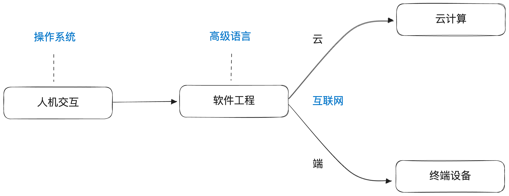

# a brief history of compute
> 计算简史 - 我对计算的全部理解（杂谈）

1943年，人类第一台电子计算机**ENIAC**诞生，自此之后计算机领域便开始了飞速的发展。80年后的今天，人类社会已经和计算息息相关，计算机和互联网几乎完全重塑了现代人类生活的方方面面。

从我第一次接触计算机编程至今，也已经过去10个年头，在此之际，很想回顾和总结一下自己对计算机行业诸多技术的理解和思考，以杂谈的方式聊一聊那些在计算机行业发展历史上举足轻重的技术是如何设计和实现的。

这便是这一系列文章的出发点，尝试将我对计算机技术的全部理解，以杂谈向文章的方式梳理出来，不会过分深入挖掘细节，而是着重把思路给讲清楚，让读者能够体会和感受到这一伟大时代的变革是如何一步步发生的。



## 目录

### Ch 1 人机交互

- [01: 人机交互历程：从纸带到操作系统](ch1/01-人机交互历程_从纸带到操作系统.md)

- [02: 现代操作系统的雏形](ch1/02-现代操作系统的雏形.md)

- [03: Linux的设计哲学-文件系统](ch1/03-Linux的设计哲学_文件系统.md)

- [04: Linux的设计哲学-内存管理](ch1/04-Linux的设计哲学_内存管理.md)

- [05: Linux的设计哲学-进程管理](ch1/05-Linux的设计哲学_进程管理.md)

### Ch 2 编程语言

- [01：高级语言的演进之路](ch2/01-高级语言的演进之路.md)

- [02：一门编程语言的自我修养：面向对象](ch2/02-高级语言的自我修养_面向对象.md)

- [03：一门编程语言的自我修养：内存管理](ch2/03-高级语言的自我修养_内存管理.md)

- [04：一门编程语言的自我修养：线程并发](ch2/04-高级语言的自我修养_线程并发.md)

### Ch 3 软件工程

- 01：极客时代的落幕

- 02：数据库 & 缓存

- 03：消息队列

- [04：分布式系统](ch3/04-分布式系统.md)

### Ch 4 云计算

- [01：楔子 - 从虚拟化到容器](ch4/01-楔子_从虚拟化到容器.md)

- [02：云计算的混沌时代](ch4/02-云计算的混沌时代.md)

- [03：Kubernetes - 基础概念与设计](ch4/03-Kubernetes_基础概念与设计.md)

- [04：Kubernetes - 基本实现分析](ch4/04-Kubernetes_基本实现分析.md)

- [05：Kubernetes - 运行机制与扩展](ch4/05-Kubernetes_运行机制与扩展.md)

- 06：展望

### Ch 5* 计算机的灵魂：算法与数据结构

## 交互式学习网站

本仓库可以作为交互式学习网站在本地运行。网站使用 Astro 生成静态页面，不需要后端服务。

### 本地运行

```bash
npm install
npm run generate:content
npm run validate:content
npm run dev
```

打开 Astro 输出的本地地址即可学习。

### 构建

```bash
npm run build
```

构建会先运行内容校验，确保课程 manifest、lesson、quiz 和 practice 数据一致。

### 本地学习进度

网站学习进度保存在浏览器 `localStorage` 中。Claude Code 老师的学习记录保存在 `.learning-cache/` 中。`.learning-cache/` 是个人本地缓存，不应提交到 git。

### Claude Code 老师

在 Claude Code 中可以使用项目技能进行带学：

```text
/teach-topic ch4-03
/review-answer "你的回答"
/practice-task ch2-04
/generate-lesson-page ch1-03
```

老师模式使用“讲解 → 提问 → 练习 → 点评 → 总结薄弱点”的学习流程。
